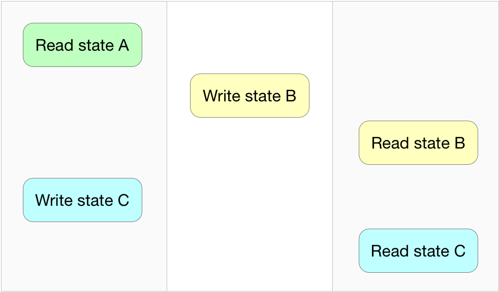
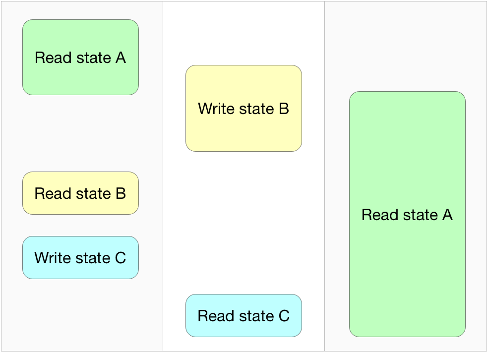

GRDB 3 [](https://developer.apple.com/swift/) [](https://developer.apple.com/swift/) [](/LICENSE) [](https://travis-ci.org/groue/GRDB.swift)
==========

### A toolkit for SQLite databases, with a focus on application development

**Latest release**: June 17, 2018 • version 3.1.0 • [CHANGELOG](CHANGELOG.md) • [Migrating From GRDB 2 to GRDB 3](Documentation/GRDB2MigrationGuide.md)

**Requirements**: iOS 8.0+ / OSX 10.9+ / watchOS 2.0+ &bull; Swift 4.1+ / Xcode 9.3+

| Swift version | GRDB version                                                |
| ------------- | ----------------------------------------------------------- |
| **Swift 4.1** | **v3.1.0**                                                 |
| Swift 4       | [v2.10.0](https://github.com/groue/GRDB.swift/tree/v2.10.0) |
| Swift 3.2     | [v1.3.0](https://github.com/groue/GRDB.swift/tree/v1.3.0)   |
| Swift 3.1     | [v1.3.0](https://github.com/groue/GRDB.swift/tree/v1.3.0)   |
| Swift 3       | [v1.0](https://github.com/groue/GRDB.swift/tree/v1.0)       |
| Swift 2.3     | [v0.81.2](https://github.com/groue/GRDB.swift/tree/v0.81.2) |
| Swift 2.2     | [v0.80.2](https://github.com/groue/GRDB.swift/tree/v0.80.2) |

**Contact**:

- Release announcements and usage tips: follow [@groue](http://twitter.com/groue) on Twitter.
- Report bugs in a [Github issue](https://github.com/groue/GRDB.swift/issues/new). Make sure you check the [existing issues](https://github.com/groue/GRDB.swift/issues?q=is%3Aopen) first.
- A question? Looking for advice? Do you wonder how to contribute? Fancy a chat? Go to the [GRDB forums](https://forums.swift.org/c/related-projects/grdb), or open a [Github issue](https://github.com/groue/GRDB.swift/issues/new).


## What is this?

GRDB provides raw access to SQL and advanced SQLite features, because one sometimes enjoys a sharp tool. It has robust concurrency primitives, so that multi-threaded applications can efficiently use their databases. It grants your application models with persistence and fetching methods, so that you don't have to deal with SQL and raw database rows when you don't want to.

Compared to [SQLite.swift](http://github.com/stephencelis/SQLite.swift) or [FMDB](http://github.com/ccgus/fmdb), GRDB can spare you a lot of glue code. Compared to [Core Data](https://developer.apple.com/library/content/documentation/Cocoa/Conceptual/CoreData/) or [Realm](http://realm.io), it can simplify your multi-threaded applications.

It comes with [up-to-date documentation](#documentation), [general guides](#general-guides--good-practices), and it is [fast](https://github.com/groue/GRDB.swift/wiki/Performance).

See [Why Adopt GRDB?](Documentation/WhyAdoptGRDB.md) if you are looking for your favorite database library.


---

<p align="center">
    <a href="#features">Features</a> &bull;
    <a href="#usage">Usage</a> &bull;
    <a href="#installation">Installation</a> &bull;
    <a href="#documentation">Documentation</a> &bull;
    <a href="#faq">FAQ</a>
</p>

---


## Features

GRDB ships with:

- [Access to raw SQL and SQLite](#sqlite-api)
- [Records](#records): fetching and persistence methods for your custom structs and class hierarchies
- [Query Interface](#the-query-interface): a swift way to avoid the SQL language
- [WAL Mode Support](#database-pools): extra performance for multi-threaded applications
- [Migrations](#migrations): transform your database as your application evolves
- [Database Observation](#database-changes-observation): track database transactions, get notified of database changes
- [Full-Text Search](#full-text-search)
- [Encryption](#encryption)
- [Support for Custom SQLite Builds](Documentation/CustomSQLiteBuilds.md)

Companion libraries that enhance and extend GRDB:

- [RxGRDB](http://github.com/RxSwiftCommunity/RxGRDB): track database changes in a reactive way, with [RxSwift](https://github.com/ReactiveX/RxSwift).
- [GRDBObjc](https://github.com/groue/GRDBObjc): FMDB-compatible bindings to GRDB.


## Usage

<details open>
  <summary>Connect to an SQLite database</summary>

```swift
import GRDB

// Simple database connection
let dbQueue = try DatabaseQueue(path: "/path/to/database.sqlite")

// Enhanced multithreading based on SQLite's WAL mode
let dbPool = try DatabasePool(path: "/path/to/database.sqlite")
```
    
See [Database Connections](#database-connections)

</details>

<details>
    <summary>Execute SQL statements</summary>

```swift
try dbQueue.write { db in
    try db.execute("""
        CREATE TABLE place (
          id INTEGER PRIMARY KEY AUTOINCREMENT,
          title TEXT NOT NULL,
          favorite BOOLEAN NOT NULL DEFAULT 0,
          latitude DOUBLE NOT NULL,
          longitude DOUBLE NOT NULL)
        """)

    try db.execute("""
        INSERT INTO place (title, favorite, latitude, longitude)
        VALUES (?, ?, ?, ?)
        """, arguments: ["Paris", true, 48.85341, 2.3488])
    
    let parisId = db.lastInsertedRowID
}
```

See [Executing Updates](#executing-updates)

</details>

<details>
    <summary>Fetch database rows and values</summary>

```swift
try dbQueue.read { db in
    // Fetch database rows
    let rows = try Row.fetchCursor(db, "SELECT * FROM place")
    while let row = try rows.next() {
        let title: String = row["title"]
        let isFavorite: Bool = row["favorite"]
        let coordinate = CLLocationCoordinate2D(
            latitude: row["latitude"],
            longitude: row["longitude"])
    }
    
    // Fetch values
    let placeCount = try Int.fetchOne(db, "SELECT COUNT(*) FROM place")! // Int
    let placeTitles = try String.fetchAll(db, "SELECT title FROM place") // [String]
}

let placeCount = try dbQueue.read { db in
    try Int.fetchOne(db, "SELECT COUNT(*) FROM place")!
}
```

See [Fetch Queries](#fetch-queries)

</details>

<details>
    <summary>Store custom models aka "records"</summary>

```swift
struct Place {
    var id: Int64?
    var title: String
    var isFavorite: Bool
    var coordinate: CLLocationCoordinate2D
}

// snip: turn Place into a "record" by adopting the protocols that
// provide fetching and persistence methods.

try dbQueue.write { db in
    // Create database table
    try db.create(table: "place") { t in
        t.autoIncrementedPrimaryKey("id")
        t.column("title", .text).notNull()
        t.column("favorite", .boolean).notNull().defaults(to: false)
        t.column("longitude", .double).notNull()
        t.column("latitude", .double).notNull()
    }
    
    var berlin = Place(
        id: nil,
        title: "Berlin",
        isFavorite: false,
        coordinate: CLLocationCoordinate2D(latitude: 52.52437, longitude: 13.41053))
    
    try berlin.insert(db)
    berlin.id // some value
    
    berlin.isFavorite = true
    try berlin.update(db)
}
```

See [Records](#records)

</details>

<details>
    <summary>Fetch records and values with the Swift query interface</summary>

```swift
try dbQueue.write { db in
    // Place?
    let paris = try Place.fetchOne(db, key: 1)
    
    // Place?
    let berlin = try Place.filter(Column("title") == "Berlin").fetchOne(db)
    
    // [Place]
    let favoritePlaces = try Place
        .filter(Column("favorite") == true)
        .order(Column("title"))
        .fetchAll(db)
    
    // Int
    let favoriteCount = try Place.filter(Column("favorite")).fetchCount(db)
    
    // SQL is always welcome
    let places = try Place.fetchAll(db, "SELECT * FROM place")
}
```

See the [Query Interface](#the-query-interface)

</details>

<details>
    <summary>Be notified of database changes</summary>

```swift
// Track query interface requests
Place.filter(key: 1)
    .rx
    .fetchOne(in: dbQueue)
    .subscribe(onNext: { place: Place? in
        print("Place 1 has changed")
    })

// Track SQL requests
SQLRequest<Place>("SELECT * FROM place WHERE favorite ORDER BY title")
    .rx
    .fetchAll(in: dbQueue)
    .subscribe(onNext: { places: [Place] in
        print("Favorite places have changed")
    })
```

See [Database Changes Observation](#database-changes-observation), and [RxGRDB](http://github.com/RxSwiftCommunity/RxGRDB)

</details>


Documentation
=============

**GRDB runs on top of SQLite**: you should get familiar with the [SQLite FAQ](http://www.sqlite.org/faq.html). For general and detailed information, jump to the [SQLite Documentation](http://www.sqlite.org/docs.html).

#### Reference

- [GRDB Reference](http://groue.github.io/GRDB.swift/docs/3.1/index.html) (generated by [Jazzy](https://github.com/realm/jazzy))

#### Getting Started

- [Installation](#installation)
- [Database Connections](#database-connections): Connect to SQLite databases

#### SQLite and SQL

- [SQLite API](#sqlite-api): The low-level SQLite API &bull; [executing updates](#executing-updates) &bull; [fetch queries](#fetch-queries)

#### Records and the Query Interface

- [Records](#records): Fetching and persistence methods for your custom structs and class hierarchies.
- [Query Interface](#the-query-interface): A swift way to generate SQL &bull; [table creation](#database-schema) &bull; [requests](#requests)

#### Application Tools

- [Migrations](#migrations): Transform your database as your application evolves.
- [Full-Text Search](#full-text-search): Perform efficient and customizable full-text searches.
- [Joined Queries Support](#joined-queries-support): Consume complex joined queries.
- [Database Changes Observation](#database-changes-observation): Perform post-commit and post-rollback actions.
- [FetchedRecordsController](#fetchedrecordscontroller): Automated tracking of changes in a query results, plus UITableView animations.
- [Encryption](#encryption): Encrypt your database with SQLCipher.
- [Backup](#backup): Dump the content of a database to another.

#### Good to Know

- [Avoiding SQL Injection](#avoiding-sql-injection)
- [Error Handling](#error-handling)
- [Unicode](#unicode)
- [Memory Management](#memory-management)
- [Data Protection](#data-protection)
- [Concurrency](#concurrency)
- [Performance](#performance)

#### General Guides & Good Practices

- :bulb: [Good Practices for Designing Record Types](Documentation/GoodPracticesForDesigningRecordTypes.md)
- :bulb: [Migrating From GRDB 2 to GRDB 3](Documentation/GRDB2MigrationGuide.md)
- :bulb: [Issues tagged "best practices"](https://github.com/groue/GRDB.swift/issues?q=is%3Aissue+label%3A%22best+practices%22)
- :question: [Issues tagged "question"](https://github.com/groue/GRDB.swift/issues?utf8=✓&q=is%3Aissue%20label%3Aquestion)
- :blue_book: [Why Adopt GRDB?](Documentation/WhyAdoptGRDB.md)
- :blue_book: [How to build an iOS application with SQLite and GRDB.swift](https://medium.com/@gwendal.roue/how-to-build-an-ios-application-with-sqlite-and-grdb-swift-d023a06c29b3)
- :blue_book: [Four different ways to handle SQLite concurrency](https://medium.com/@gwendal.roue/four-different-ways-to-handle-sqlite-concurrency-db3bcc74d00e)
- :blue_book: [Unexpected SQLite with Swift](https://hackernoon.com/unexpected-sqlite-with-swift-ddc6343bcbfc)


**[FAQ](#faq)**

**[Sample Code](#sample-code)**


Installation
============

**The installation procedures below have GRDB use the version of SQLite that ships with the target operating system.**

See [Encryption](#encryption) for the installation procedure of GRDB with SQLCipher.

See [Custom SQLite builds](Documentation/CustomSQLiteBuilds.md) for the installation procedure of GRDB with a customized build of SQLite 3.24.0.


## CocoaPods

[CocoaPods](http://cocoapods.org/) is a dependency manager for Xcode projects. To use GRDB with CocoaPods (version 1.2 or higher), specify in your `Podfile`:

```ruby
use_frameworks!
pod 'GRDB.swift'
```


## Swift Package Manager

The [Swift Package Manager](https://swift.org/package-manager/) automates the distribution of Swift code. To use GRDB with SPM, add a dependency to your `Package.swift` file:

```swift
let package = Package(
    dependencies: [
        .package(url: "https://github.com/groue/GRDB.swift.git", from: "3.1.0")
    ]
)
```

Note that Linux is not currently supported.


## Carthage

Carthage can build GRDB frameworks, but it can also inexplicably fail. This installation method is thus *unsupported*.

If you decide to use Carthage despite this warning, and get any Carthage-related error, please open an issue in the [Carthage repo](https://github.com/Carthage/Carthage/issues), ask [Stack Overflow](http://stackoverflow.com), summon your local Xcode guru, or submit a pull request that has the `make test_CarthageBuild` command succeed 100% of the time (one time is not enough). See [#262](https://github.com/groue/GRDB.swift/pull/262) for more information.


## Manually

1. [Download](https://github.com/groue/GRDB.swift/releases/tag/v3.1.0) a copy of GRDB, or clone its repository and make sure you use the latest tagged version with the `git checkout v3.1.0` command.

2. Embed the `GRDB.xcodeproj` project in your own project.

3. Add the `GRDBOSX`, `GRDBiOS`, or `GRDBWatchOS` target in the **Target Dependencies** section of the **Build Phases** tab of your application target (extension target for WatchOS).

4. Add the `GRDB.framework` from the targetted platform to the **Embedded Binaries** section of the **General**  tab of your application target (extension target for WatchOS).

See [GRDBDemoiOS](DemoApps/GRDBDemoiOS/GRDBDemoiOS) for an example of such integration.


Database Connections
====================

GRDB provides two classes for accessing SQLite databases: `DatabaseQueue` and `DatabasePool`:

```swift
import GRDB

// Pick one:
let dbQueue = try DatabaseQueue(path: "/path/to/database.sqlite")
let dbPool = try DatabasePool(path: "/path/to/database.sqlite")
```

The differences are:

- Database pools allow concurrent database accesses (this can improve the performance of multithreaded applications).
- Database pools open your SQLite database in the [WAL mode](https://www.sqlite.org/wal.html) (unless read-only).
- Database queues support [in-memory databases](https://www.sqlite.org/inmemorydb.html).

**If you are not sure, choose DatabaseQueue.** You will always be able to switch to DatabasePool later.

- [Database Queues](#database-queues)
- [Database Pools](#database-pools)


## Database Queues

**Open a database queue** with the path to a database file:

```swift
import GRDB

let dbQueue = try DatabaseQueue(path: "/path/to/database.sqlite")
let inMemoryDBQueue = DatabaseQueue()
```

SQLite creates the database file if it does not already exist. The connection is closed when the database queue gets deallocated.

**A database queue can be used from any thread.** The `write` and `read` methods are synchronous, and block the current thread until your database statements are executed in a protected dispatch queue:

```swift
// Modify the database:
try dbQueue.write { db in
    try db.create(table: "place") { ... }
    try Place(...).insert(db)
}

// Read values:
try dbQueue.read { db in
    let places = try Place.fetchAll(db)
    let placeCount = try Place.fetchCount(db)
}
```

Database access methods can return values:

```swift
let placeCount = try dbQueue.read { db in
    try Place.fetchCount(db)
}

let newPlaceCount = try dbQueue.write { db -> Int in
    try Place(...).insert(db)
    return try Place.fetchCount(db)
}
```

**A database queue needs your application to follow rules in order to deliver its safety guarantees.** Please refer to the [Concurrency](#concurrency) chapter.

See [DemoApps/GRDBDemoiOS/AppDatabase.swift](DemoApps/GRDBDemoiOS/GRDBDemoiOS/AppDatabase.swift) for a sample code that sets up a database queue on iOS.

> :muscle: **Note to database experts**: The `write` and `read` database access methods generally help enforcing the [GRDB concurrency guarantees](#concurrency), and are highly recommended, even for skilled developers, because they lift most of the mental burden related to explicit SQLite transactions:
>
> - `DatabaseQueue.write` wraps your database statements in a transaction that commits if and only if no error occurs. On the first unhandled error, the whole transaction is rollbacked, and the error is rethrown.
> - `DatabaseQueue.read` does not open any transaction, but enforces read-only access.
>
> When precise transaction handling is required, see [Transactions and Savepoints](#transactions-and-savepoints).


### DatabaseQueue Configuration

```swift
var config = Configuration()
config.readonly = true
config.foreignKeysEnabled = true // Default is already true
config.trace = { print($0) }     // Prints all SQL statements
config.label = "MyDatabase"      // Useful when your app opens multiple databases

let dbQueue = try DatabaseQueue(
    path: "/path/to/database.sqlite",
    configuration: config)
```

See [Configuration](http://groue.github.io/GRDB.swift/docs/3.1/Structs/Configuration.html) for more details.


## Database Pools

**A database pool allows concurrent database accesses.**

```swift
import GRDB
let dbPool = try DatabasePool(path: "/path/to/database.sqlite")
```

SQLite creates the database file if it does not already exist. The connection is closed when the database pool gets deallocated.

> :point_up: **Note**: unless read-only, a database pool opens your database in the SQLite "WAL mode". The WAL mode does not fit all situations. Please have a look at https://www.sqlite.org/wal.html.

**A database pool can be used from any thread.** The `write` and `read` methods are synchronous, and block the current thread until your database statements are executed in a protected dispatch queue:

```swift
// Modify the database:
try dbPool.write { db in
    try db.create(table: "place") { ... }
    try Place(...).insert(db)
}

// Read values:
try dbPool.read { db in
    let places = try Place.fetchAll(db)
    let placeCount = try Place.fetchCount(db)
}
```

Database access methods can return values:

```swift
let placeCount = try dbPool.read { db in
    try Place.fetchCount(db)
}

let newPlaceCount = try dbPool.write { db -> Int in
    try Place(...).insert(db)
    return try Place.fetchCount(db)
}
```

**A database pool needs your application to follow rules in order to deliver its safety guarantees.** Please refer to the [Concurrency](#concurrency) chapter.

For a sample code that sets up a database pool on iOS, see [DemoApps/GRDBDemoiOS/AppDatabase.swift](DemoApps/GRDBDemoiOS/GRDBDemoiOS/AppDatabase.swift), and replace DatabaseQueue with DatabasePool.


### Database Pool Concurrency

Unlike [database queues](#database-queues), pools allow several threads to access the database at the same time:

- When you don't need to modify the database, prefer the `read` method, because several threads can perform reads in parallel.
    
    Reads are generally non-blocking, unless the maximum number of concurrent reads has been reached. In this case, a read has to wait for another read to complete. That maximum number can be [configured](#databasepool-configuration).

- Reads are guaranteed an immutable view of the last committed state of the database, regardless of concurrent writes. This kind of isolation is called [snapshot isolation](https://sqlite.org/isolation.html).

- Unlike reads, writes are serialized. There is never more than a single thread that is writing into the database.

- The `write` method wraps your database statements in a transaction that commits if and only if no error occurs. On the first unhandled error, the whole transaction is rollbacked, and the error is rethrown.
    
    When precise transaction handling is required, see [Transactions and Savepoints](#transactions-and-savepoints) for more information.

- Database pools can take [snapshots](#database-snapshots) of the database.

See the [Concurrency](#concurrency) chapter for more details about database pools, how they differ from database queues, and advanced use cases.


### DatabasePool Configuration

```swift
var config = Configuration()
config.readonly = true
config.foreignKeysEnabled = true // Default is already true
config.trace = { print($0) }     // Prints all SQL statements
config.label = "MyDatabase"      // Useful when your app opens multiple databases
config.maximumReaderCount = 10   // The default is 5

let dbPool = try DatabasePool(
    path: "/path/to/database.sqlite",
    configuration: config)
```

See [Configuration](http://groue.github.io/GRDB.swift/docs/3.1/Structs/Configuration.html) for more details.


Database pools are more memory-hungry than database queues. See [Memory Management](#memory-management) for more information.


SQLite API
==========

**In this section of the documentation, we will talk SQL.** Jump to the [query interface](#the-query-interface) if SQL is not your cup of tea.

- [Executing Updates](#executing-updates)
- [Fetch Queries](#fetch-queries)
    - [Fetching Methods](#fetching-methods)
    - [Row Queries](#row-queries)
    - [Value Queries](#value-queries)
- [Values](#values)
    - [Data](#data-and-memory-savings)
    - [Date and DateComponents](#date-and-datecomponents)
    - [NSNumber and NSDecimalNumber](#nsnumber-and-nsdecimalnumber)
    - [Swift enums](#swift-enums)
    - [Custom Value Types](#custom-value-types)
- [Transactions and Savepoints](#transactions-and-savepoints)

Advanced topics:

- [Prepared Statements](#prepared-statements)
- [Custom SQL Functions and Aggregates](#custom-sql-functions-and-aggregates)
- [Database Schema Introspection](#database-schema-introspection)
- [Row Adapters](#row-adapters)
- [Raw SQLite Pointers](#raw-sqlite-pointers)


## Executing Updates

Once granted with a [database connection](#database-connections), the `execute` method executes the SQL statements that do not return any database row, such as `CREATE TABLE`, `INSERT`, `DELETE`, `ALTER`, etc.

For example:

```swift
try dbQueue.write { db in
    try db.execute("""
        CREATE TABLE player (
            id INTEGER PRIMARY KEY AUTOINCREMENT,
            name TEXT NOT NULL,
            score INT)
        """)
    
    try db.execute(
        "INSERT INTO player (name, score) VALUES (:name, :score)",
        arguments: ["name": "Barbara", "score": 1000])
    
    // Join multiple statements with a semicolon:
    try db.execute("""
        INSERT INTO player (name, score) VALUES (?, ?);
        INSERT INTO player (name, score) VALUES (?, ?)
        """, arguments: ["Arthur", 750, "Barbara", 1000])
}
```

The `?` and colon-prefixed keys like `:name` in the SQL query are the **statements arguments**. You pass arguments with arrays or dictionaries, as in the example above. See [Values](#values) for more information on supported arguments types (Bool, Int, String, Date, Swift enums, etc.).

Never ever embed values directly in your SQL strings, and always use arguments instead. See [Avoiding SQL Injection](#avoiding-sql-injection) for more information.

**After an INSERT statement**, you can get the row ID of the inserted row:

```swift
try db.execute(
    "INSERT INTO player (name, score) VALUES (?, ?)",
    arguments: ["Arthur", 1000])
let playerId = db.lastInsertedRowID
```

Don't miss [Records](#records), that provide classic **persistence methods**:

```swift
let player = Player(name: "Arthur", score: 1000)
try player.insert(db)
let playerId = player.id
```


## Fetch Queries

[Database connections](#database-connections) let you fetch database rows, plain values, and custom models aka "records".

**Rows** are the raw results of SQL queries:

```swift
try dbQueue.read { db in
    if let row = try Row.fetchOne(db, "SELECT * FROM wine WHERE id = ?", arguments: [1]) {
        let name: String = row["name"]
        let color: Color = row["color"]
        print(name, color)
    }
}
```


**Values** are the Bool, Int, String, Date, Swift enums, etc. stored in row columns:

```swift
try dbQueue.read { db in
    let urls = try URL.fetchCursor(db, "SELECT url FROM wine")
    while let url = try urls.next() {
        print(url)
    }
}
```


**Records** are your application objects that can initialize themselves from rows:

```swift
let wines = try dbQueue.read { db in
    try Wine.fetchAll(db, "SELECT * FROM wine")
}
```

- [Fetching Methods](#fetching-methods) and [Cursors](#cursors)
- [Row Queries](#row-queries)
- [Value Queries](#value-queries)
- [Records](#records)


### Fetching Methods

**Throughout GRDB**, you can always fetch *cursors*, *arrays*, or *single values* of any fetchable type (database [row](#row-queries), simple [value](#value-queries), or custom [record](#records)):

```swift
try Row.fetchCursor(...) // A Cursor of Row
try Row.fetchAll(...)    // [Row]
try Row.fetchOne(...)    // Row?
```

- `fetchCursor` returns a **[cursor](#cursors)** over fetched values:
    
    ```swift
    let rows = try Row.fetchCursor(db, "SELECT ...") // A Cursor of Row
    ```
    
- `fetchAll` returns an **array**:
    
    ```swift
    let players = try Player.fetchAll(db, "SELECT ...") // [Player]
    ```

- `fetchOne` returns a **single optional value**, and consumes a single database row (if any).
    
    ```swift
    let count = try Int.fetchOne(db, "SELECT COUNT(*) ...") // Int?
    ```


### Cursors

**Whenever you consume several rows from the database, you can fetch a Cursor, or an Array**.

The `fetchAll()` method returns a regular Swift array, that you iterate like all other arrays:

```swift
try dbQueue.read { db in
    // [Player]
    let players = try Player.fetchAll(db, "SELECT ...")
    for player in players {
        // use player
    }
}
```

Unlike arrays, cursors returned by `fetchCursor()` load their results step after step:

```swift
try dbQueue.read { db in
    // Cursor of Player
    let players = try Player.fetchCursor(db, "SELECT ...")
    while let player = try players.next() {
        // use player
    }
}
```

Both arrays and cursors can iterate over database results. How do you choose one or the other? Look at the differences:

- **Cursors can not be used on any thread**: you must consume a cursor on the dispatch queue it was created in, and you must not extract it. Arrays may be consumed on any thread:
    
    ```swift
    // Wrong
    let cursor = try dbQueue.read { try Player.fetchCursor($0, ...) }
    while let player = try players.next() { ... }
    
    // OK
    let array = try dbQueue.read { try Player.fetchAll($0, ...) }
    for player in players { // use player }
    ```
    
- **Cursors can be iterated only one time.** Arrays can be iterated many times.
- **Cursors iterate database results in a lazy fashion**, and don't consume much memory. Arrays contain copies of database values, and may take a lot of memory when there are many fetched results.
- **Cursors are granted with direct access to SQLite,** unlike arrays that have to take the time to copy database values. When you really care about performance, you may want to deal with cursors of raw rows at the lowest possible level: `Row.fetchCursor(...)`.
- **Cursors require a little care**:
    
    - Don't modify the results during a cursor iteration:
        
        ```swift
        // Undefined behavior
        while let player = try players.next() {
            try db.execute("DELETE ...")
        }
        ```
    
    - Don't turn a cursor of `Row` into an array. You would not get the distinct rows you expect. To get a array of rows, use `Row.fetchAll(...)`. Generally speaking, make sure you copy a row whenever you extract it from a cursor for later use: `row.copy()`.


If you don't see, or don't care about the difference, use arrays. If you care about memory and performance, use cursors when appropriate.

**All GRDB cursors adopt the [Cursor](http://groue.github.io/GRDB.swift/docs/3.1/Protocols/Cursor.html) protocol, which looks a lot like standard [lazy sequences](https://developer.apple.com/reference/swift/lazysequenceprotocol) of Swift.** As such, cursors come with many convenience methods: `compactMap`, `contains`, `dropFirst`, `dropLast`, `drop(while:)`, `enumerated`, `filter`, `first`, `flatMap`, `forEach`, `joined`, `joined(separator:)`, `max`, `max(by:)`, `min`, `min(by:)`, `map`, `prefix`, `prefix(while:)`, `reduce`, `reduce(into:)`, `suffix`:

```swift
// All URL hosts
let hosts = try URL
    .fetchCursor(db, "SELECT url FROM link")
    .map { url in url.host }

// Prints all Github links
try URL
    .fetchCursor(db, "SELECT url FROM link")
    .filter { url in url.host == "github.com" }
    .forEach { url in print(url) }

// Turn a cursor into an array:
let cursor = URL
    .fetchCursor(db, "SELECT url FROM link")
    .filter { url in url.host == "github.com" }
let githubURLs = try Array(cursor) // [URL]

// Turn a cursor into a set:
let cursor = URL
    .fetchCursor(db, "SELECT url FROM link")
    .flatMap { url in url.host }
let hosts = try Set(cursor) // Set<String>
```

**Cursors are not Swift sequences, though.** That's because Swift sequences can't handle iteration errors, when reading SQLite results may fail at any time. SQL functions may throw errors. On iOS, [data protection](#data-protection) may block access to the database file in the background. On MacOS, your application users may mess with the file system.


### Row Queries

- [Fetching Rows](#fetching-rows)
- [Column Values](#column-values)
- [DatabaseValue](#databasevalue)
- [Rows as Dictionaries](#rows-as-dictionaries)


#### Fetching Rows

Fetch **cursors** of rows, **arrays**, or **single** rows (see [fetching methods](#fetching-methods)):

```swift
try dbQueue.read { db in
    try Row.fetchCursor(db, "SELECT ...", arguments: ...) // A Cursor of Row
    try Row.fetchAll(db, "SELECT ...", arguments: ...)    // [Row]
    try Row.fetchOne(db, "SELECT ...", arguments: ...)    // Row?
    
    let rows = try Row.fetchCursor(db, "SELECT * FROM wine")
    while let row = try rows.next() {
        let name: String = row["name"]
        let color: Color = row["color"]
        print(name, color)
    }
}

let rows = try dbQueue.read { db in
    try Row.fetchAll(db, "SELECT * FROM player")
}
```

Arguments are optional arrays or dictionaries that fill the positional `?` and colon-prefixed keys like `:name` in the query:

```swift
let rows = try Row.fetchAll(db,
    "SELECT * FROM player WHERE name = ?",
    arguments: ["Arthur"])

let rows = try Row.fetchAll(db,
    "SELECT * FROM player WHERE name = :name",
    arguments: ["name": "Arthur"])
```

See [Values](#values) for more information on supported arguments types (Bool, Int, String, Date, Swift enums, etc.), and [StatementArguments](http://groue.github.io/GRDB.swift/docs/3.1/Structs/StatementArguments.html) for a detailed documentation of SQLite arguments.

Unlike row arrays that contain copies of the database rows, row cursors are close to the SQLite metal, and require a little care:

> :point_up: **Don't turn a cursor of `Row` into an array**. You would not get the distinct rows you expect. To get a array of rows, use `Row.fetchAll(...)`. Generally speaking, make sure you copy a row whenever you extract it from a cursor for later use: `row.copy()`.


#### Column Values

**Read column values** by index or column name:

```swift
let name: String = row[0]      // 0 is the leftmost column
let name: String = row["name"] // Leftmost matching column - lookup is case-insensitive
let name: String = row[Column("name")] // Using query interface's Column
```

Make sure to ask for an optional when the value may be NULL:

```swift
let name: String? = row["name"]
```

The `row[]` subscript returns the type you ask for. See [Values](#values) for more information on supported value types:

```swift
let bookCount: Int     = row["bookCount"]
let bookCount64: Int64 = row["bookCount"]
let hasBooks: Bool     = row["bookCount"] // false when 0

let string: String     = row["date"]      // "2015-09-11 18:14:15.123"
let date: Date         = row["date"]      // Date
self.date = row["date"] // Depends on the type of the property.
```

You can also use the `as` type casting operator:

```swift
row[...] as Int
row[...] as Int?
```

> :warning: **Warning**: avoid the `as!` and `as?` operators, because they misbehave in the context of type inference (see [rdar://21676393](http://openradar.appspot.com/radar?id=4951414862249984)):
> 
> ```swift
> if let int = row[...] as? Int { ... } // BAD - doesn't work
> if let int = row[...] as Int? { ... } // GOOD
> ```

Generally speaking, you can extract the type you need, *provided it can be converted from the underlying SQLite value*:

- **Successful conversions include:**
    
    - All numeric SQLite values to all numeric Swift types, and Bool (zero is the only false boolean).
    - Text SQLite values to Swift String.
    - Blob SQLite values to Foundation Data.
    
    See [Values](#values) for more information on supported types (Bool, Int, String, Date, Swift enums, etc.)

- **NULL returns nil.**

    ```swift
    let row = try Row.fetchOne(db, "SELECT NULL")!
    row[0] as Int? // nil
    row[0] as Int  // fatal error: could not convert NULL to Int.
    ```
    
    There is one exception, though: the [DatabaseValue](#databasevalue) type:
    
    ```swift
    row[0] as DatabaseValue // DatabaseValue.null
    ```
    
- **Missing columns return nil.**
    
    ```swift
    let row = try Row.fetchOne(db, "SELECT 'foo' AS foo")!
    row["missing"] as String? // nil
    row["missing"] as String  // fatal error: no such column: missing
    ```
    
    You can explicitly check for a column presence with the `hasColumn` method.

- **Invalid conversions throw a fatal error.**
    
    ```swift
    let row = try Row.fetchOne(db, "SELECT 'Mom’s birthday'")!
    row[0] as String // "Mom’s birthday"
    row[0] as Date?  // fatal error: could not convert "Mom’s birthday" to Date.
    row[0] as Date   // fatal error: could not convert "Mom’s birthday" to Date.
    ```
    
    This fatal error can be avoided: see [Fatal Errors](#fatal-errors).
    
- **SQLite has a weak type system, and provides [convenience conversions](https://www.sqlite.org/c3ref/column_blob.html) that can turn Blob to String, String to Int, etc.**
    
    GRDB will sometimes let those conversions go through:
    
    ```swift
    let rows = try Row.fetchCursor(db, "SELECT '20 small cigars'")
    while let row = try rows.next() {
        row[0] as Int   // 20
    }
    ```
    
    Don't freak out: those conversions did not prevent SQLite from becoming the immensely successful database engine you want to use. And GRDB adds safety checks described just above. You can also prevent those convenience conversions altogether by using the [DatabaseValue](#databasevalue) type.


#### DatabaseValue

**DatabaseValue is an intermediate type between SQLite and your values, which gives information about the raw value stored in the database.**

You get DatabaseValue just like other value types:

```swift
let dbValue: DatabaseValue = row[0]
let dbValue: DatabaseValue = row["name"]

// Check for NULL:
dbValue.isNull // Bool

// The stored value:
dbValue.storage.value // Int64, Double, String, Data, or nil

// All the five storage classes supported by SQLite:
switch dbValue.storage {
case .null:                 print("NULL")
case .int64(let int64):     print("Int64: \(int64)")
case .double(let double):   print("Double: \(double)")
case .string(let string):   print("String: \(string)")
case .blob(let data):       print("Data: \(data)")
}
```

You can extract regular [values](#values) (Bool, Int, String, Date, Swift enums, etc.) from DatabaseValue with the [DatabaseValueConvertible.fromDatabaseValue()](#custom-value-types) method:

```swift
let dbValue: DatabaseValue = row["bookCount"]
let bookCount   = Int.fromDatabaseValue(dbValue)   // Int?
let bookCount64 = Int64.fromDatabaseValue(dbValue) // Int64?
let hasBooks    = Bool.fromDatabaseValue(dbValue)  // Bool?, false when 0

let dbValue: DatabaseValue = row["date"]
let string = String.fromDatabaseValue(dbValue)     // "2015-09-11 18:14:15.123"
let date   = Date.fromDatabaseValue(dbValue)       // Date?
```

`fromDatabaseValue` returns nil for invalid conversions:

```swift
let row = try Row.fetchOne(db, "SELECT 'Mom’s birthday'")!
let dbValue: DatabaseValue = row[0]
let string = String.fromDatabaseValue(dbValue) // "Mom’s birthday"
let int    = Int.fromDatabaseValue(dbValue)    // nil
let date   = Date.fromDatabaseValue(dbValue)   // nil
```

This turns out useful when you process untrusted databases. Compare:

```swift
let date: Date? = row[0]  // fatal error: could not convert "Mom’s birthday" to Date.
let date = Date.fromDatabaseValue(row[0]) // nil
```


#### Rows as Dictionaries

Row adopts the standard [Collection](https://developer.apple.com/reference/swift/collection) protocol, and can be seen as a dictionary of [DatabaseValue](#databasevalue):

```swift
// All the (columnName, dbValue) tuples, from left to right:
for (columnName, dbValue) in row {
    ...
}
```

**You can build rows from dictionaries** (standard Swift dictionaries and NSDictionary). See [Values](#values) for more information on supported types:

```swift
let row: Row = ["name": "foo", "date": nil]
let row = Row(["name": "foo", "date": nil])
let row = Row(/* [AnyHashable: Any] */) // nil if invalid dictionary
```

Yet rows are not real dictionaries: they may contain duplicate columns:

```swift
let row = try Row.fetchOne(db, "SELECT 1 AS foo, 2 AS foo")!
row.columnNames    // ["foo", "foo"]
row.databaseValues // [1, 2]
row["foo"]         // 1 (leftmost matching column)
for (columnName, dbValue) in row { ... } // ("foo", 1), ("foo", 2)
```

**When you build a dictionary from a row**, you have to disambiguate identical columns, and choose how to present database values. For example:

- A `[String: DatabaseValue]` dictionary that keeps leftmost value in case of duplicated column name:

    ```swift
    let dict = Dictionary(row, uniquingKeysWith: { (left, _) in left })
    ```

- A `[String: AnyObject]` dictionary which keeps rightmost value in case of duplicated column name. This dictionary is identical to FMResultSet's resultDictionary from FMDB. It contains NSNull values for null columns, and can be shared with Objective-C:

    ```swift
    let dict = Dictionary(
        row.map { (column, dbValue) in
            (column, dbValue.storage.value as AnyObject)
        },
        uniquingKeysWith: { (_, right) in right })
    ```

- A `[String: Any]` dictionary that can feed, for example, JSONSerialization:
    
    ```swift
    let dict = Dictionary(
        row.map { (column, dbValue) in
            (column, dbValue.storage.value)
        },
        uniquingKeysWith: { (left, _) in left })
    ```

See the documentation of [`Dictionary.init(_:uniquingKeysWith:)`](https://developer.apple.com/documentation/swift/dictionary/2892961-init) for more information.


### Value Queries

Instead of rows, you can directly fetch **[values](#values)**. Like rows, fetch them as **cursors**, **arrays**, or **single** values (see [fetching methods](#fetching-methods)). Values are extracted from the leftmost column of the SQL queries:

```swift
try dbQueue.read { db in
    try Int.fetchCursor(db, "SELECT ...", arguments: ...) // A Cursor of Int
    try Int.fetchAll(db, "SELECT ...", arguments: ...)    // [Int]
    try Int.fetchOne(db, "SELECT ...", arguments: ...)    // Int?
    
    // When database may contain NULL:
    try Optional<Int>.fetchCursor(db, "SELECT ...", arguments: ...) // A Cursor of Int?
    try Optional<Int>.fetchAll(db, "SELECT ...", arguments: ...)    // [Int?]
}

let playerCount = try dbQueue.read { db in
    try Int.fetchOne(db, "SELECT COUNT(*) FROM player")!
}
```

`fetchOne` returns an optional value which is nil in two cases: either the SELECT statement yielded no row, or one row with a NULL value.

There are many supported value types (Bool, Int, String, Date, Swift enums, etc.). See [Values](#values) for more information:

```swift
let count = try Int.fetchOne(db, "SELECT COUNT(*) FROM player")! // Int
let urls = try URL.fetchAll(db, "SELECT url FROM link")          // [URL]
```


## Values

GRDB ships with built-in support for the following value types:

- **Swift Standard Library**: Bool, Double, Float, all signed and unsigned integer types, String, [Swift enums](#swift-enums).
    
- **Foundation**: [Data](#data-and-memory-savings), [Date](#date-and-datecomponents), [DateComponents](#date-and-datecomponents), NSNull, [NSNumber](#nsnumber-and-nsdecimalnumber), NSString, URL, [UUID](#uuid).
    
- **CoreGraphics**: CGFloat.

- **[DatabaseValue](#databasevalue)**, the type which gives information about the raw value stored in the database.

- **Full-Text Patterns**: [FTS3Pattern](#fts3pattern) and [FTS5Pattern](#fts5pattern).

- Generally speaking, all types that adopt the [DatabaseValueConvertible](#custom-value-types) protocol.

Values can be used as [statement arguments](http://groue.github.io/GRDB.swift/docs/3.1/Structs/StatementArguments.html):

```swift
let url: URL = ...
let verified: Bool = ...
try db.execute(
    "INSERT INTO link (url, verified) VALUES (?, ?)",
    arguments: [url, verified])
```

Values can be [extracted from rows](#column-values):

```swift
let rows = try Row.fetchCursor(db, "SELECT * FROM link")
while let row = try rows.next() {
    let url: URL = row["url"]
    let verified: Bool = row["verified"]
}
```

Values can be [directly fetched](#value-queries):

```swift
let urls = try URL.fetchAll(db, "SELECT url FROM link")  // [URL]
```

Use values in [Records](#records):

```swift
class Link : Record {
    var url: URL
    var isVerified: Bool
    
    required init(row: Row) {
        url = row["url"]
        isVerified = row["verified"]
        super.init(row: row)
    }
    
    override func encode(to container: inout PersistenceContainer) {
        container["url"] = url
        container["verified"] = isVerified
    }
}
```

Use values in the [query interface](#the-query-interface):

```swift
let url: URL = ...
let link = try Link.filter(urlColumn == url).fetchOne(db)
```


### Data (and Memory Savings)

**Data** suits the BLOB SQLite columns. It can be stored and fetched from the database just like other [values](#values):

```swift
let rows = try Row.fetchCursor(db, "SELECT data, ...")
while let row = try rows.next() {
    let data: Data = row["data"]
}
```

At each step of the request iteration, the `row[]` subscript creates *two copies* of the database bytes: one fetched by SQLite, and another, stored in the Swift Data value.

**You have the opportunity to save memory** by not copying the data fetched by SQLite:

```swift
while let row = try rows.next() {
    let data = row.dataNoCopy(named: "data") // Data?
}
```

The non-copied data does not live longer than the iteration step: make sure that you do not use it past this point.


### Date and DateComponents

[**Date**](#date) and [**DateComponents**](#datecomponents) can be stored and fetched from the database.

Here is the support provided by GRDB for the various [date formats](https://www.sqlite.org/lang_datefunc.html) supported by SQLite:

| SQLite format                | Date         | DateComponents |
|:---------------------------- |:------------:|:--------------:|
| YYYY-MM-DD                   |     Read ¹   |   Read/Write   |
| YYYY-MM-DD HH:MM             |     Read ¹   |   Read/Write   |
| YYYY-MM-DD HH:MM:SS          |     Read ¹   |   Read/Write   |
| YYYY-MM-DD HH:MM:SS.SSS      | Read/Write ¹ |   Read/Write   |
| YYYY-MM-DD**T**HH:MM         |     Read ¹   |      Read      |
| YYYY-MM-DD**T**HH:MM:SS      |     Read ¹   |      Read      |
| YYYY-MM-DD**T**HH:MM:SS.SSS  |     Read ¹   |      Read      |
| HH:MM                        |              |   Read/Write   |
| HH:MM:SS                     |              |   Read/Write   |
| HH:MM:SS.SSS                 |              |   Read/Write   |
| Timestamps since unix epoch  |     Read ²   |                |
| `now`                        |              |                |

¹ Dates are stored and read in the UTC time zone. Missing components are assumed to be zero.

² GRDB 2.0 interprets numerical values as timestamps that fuel `Date(timeIntervalSince1970:)`. Previous GRDB versions used to interpret numbers as [julian days](https://en.wikipedia.org/wiki/Julian_day). GRDB 2.0 still supports julian days, with the `Date(julianDay:)` initializer.


#### Date

**Date** can be stored and fetched from the database just like other [values](#values):

```swift
try db.execute(
    "INSERT INTO player (creationDate, ...) VALUES (?, ...)",
    arguments: [Date(), ...])

let creationDate: Date = row["creationDate"]
```

Dates are stored using the format "YYYY-MM-DD HH:MM:SS.SSS" in the UTC time zone. It is precise to the millisecond.

> :point_up: **Note**: this format was chosen because it is the only format that is:
> 
> - Comparable (`ORDER BY date` works)
> - Comparable with the SQLite keyword CURRENT_TIMESTAMP (`WHERE date > CURRENT_TIMESTAMP` works)
> - Able to feed [SQLite date & time functions](https://www.sqlite.org/lang_datefunc.html)
> - Precise enough
> 
> Yet this format may not fit your needs. For example, you may want to store dates as timestamps. In this case, store and load Doubles instead of Date, and perform the required conversions.


#### DateComponents

DateComponents is indirectly supported, through the **DatabaseDateComponents** helper type.

DatabaseDateComponents reads date components from all [date formats supported by SQLite](https://www.sqlite.org/lang_datefunc.html), and stores them in the format of your choice, from HH:MM to YYYY-MM-DD HH:MM:SS.SSS.

DatabaseDateComponents can be stored and fetched from the database just like other [values](#values):

```swift
let components = DateComponents()
components.year = 1973
components.month = 9
components.day = 18

// Store "1973-09-18"
let dbComponents = DatabaseDateComponents(components, format: .YMD)
try db.execute(
    "INSERT INTO player (birthDate, ...) VALUES (?, ...)",
    arguments: [dbComponents, ...])

// Read "1973-09-18"
let row = try Row.fetchOne(db, "SELECT birthDate ...")!
let dbComponents: DatabaseDateComponents = row["birthDate"]
dbComponents.format         // .YMD (the actual format found in the database)
dbComponents.dateComponents // DateComponents
```


### NSNumber and NSDecimalNumber

**NSNumber** can be stored and fetched from the database just like other [values](#values). Floating point NSNumbers are stored as Double. Integer and boolean, as Int64. Integers that don't fit Int64 won't be stored: you'll get a fatal error instead. Be cautious when an NSNumber contains an UInt64, for example.

NSDecimalNumber deserves a longer discussion:

**SQLite has no support for decimal numbers.** Given the table below, SQLite will actually store integers or doubles:

```sql
CREATE TABLE transfer (
    amount DECIMAL(10,5) -- will store integer or double, actually
)
```

This means that computations will not be exact:

```swift
try db.execute("INSERT INTO transfer (amount) VALUES (0.1)")
try db.execute("INSERT INTO transfer (amount) VALUES (0.2)")
let sum = try NSDecimalNumber.fetchOne(db, "SELECT SUM(amount) FROM transfer")!

// Yikes! 0.3000000000000000512
print(sum)
```

Don't blame SQLite or GRDB, and instead store your decimal numbers differently.

A classic technique is to store *integers* instead, since SQLite performs exact computations of integers. For example, don't store Euros, but store cents instead:

```swift
// Write
let amount = NSDecimalNumber(string: "0.10")
let integerAmount = amount.multiplying(byPowerOf10: 2).int64Value
try db.execute("INSERT INTO transfer (amount) VALUES (?)", arguments: [integerAmount])

// Read
let integerAmount = try Int64.fetchOne(db, "SELECT SUM(amount) FROM transfer")!
let amount = NSDecimalNumber(value: integerAmount).multiplying(byPowerOf10: -2) // 0.10
```


### UUID

**UUID** can be stored and fetched from the database just like other [values](#values). GRDB stores uuids as 16-bytes data blobs.


### Swift Enums

**Swift enums** and generally all types that adopt the [RawRepresentable](https://developer.apple.com/library/tvos/documentation/Swift/Reference/Swift_RawRepresentable_Protocol/index.html) protocol can be stored and fetched from the database just like their raw [values](#values):

```swift
enum Color : Int {
    case red, white, rose
}

enum Grape : String {
    case chardonnay, merlot, riesling
}

// Declare empty DatabaseValueConvertible adoption
extension Color : DatabaseValueConvertible { }
extension Grape : DatabaseValueConvertible { }

// Store
try db.execute(
    "INSERT INTO wine (grape, color) VALUES (?, ?)",
    arguments: [Grape.merlot, Color.red])

// Read
let rows = try Row.fetchCursor(db, "SELECT * FROM wine")
while let row = try rows.next() {
    let grape: Grape = row["grape"]
    let color: Color = row["color"]
}
```

**When a database value does not match any enum case**, you get a fatal error. This fatal error can be avoided with the [DatabaseValueConvertible.fromDatabaseValue()](#custom-value-types) method:

```swift
let row = try Row.fetchOne(db, "SELECT 'syrah'")!

row[0] as String  // "syrah"
row[0] as Grape?  // fatal error: could not convert "syrah" to Grape.
row[0] as Grape   // fatal error: could not convert "syrah" to Grape.
Grape.fromDatabaseValue(row[0])  // nil
```


### Custom Value Types

Conversion to and from the database is based on the `DatabaseValueConvertible` protocol:

```swift
protocol DatabaseValueConvertible {
    /// Returns a value that can be stored in the database.
    var databaseValue: DatabaseValue { get }
    
    /// Returns a value initialized from dbValue, if possible.
    static func fromDatabaseValue(_ dbValue: DatabaseValue) -> Self?
}
```

All types that adopt this protocol can be used like all other [values](#values) (Bool, Int, String, Date, Swift enums, etc.)

The `databaseValue` property returns [DatabaseValue](#databasevalue), a type that wraps the five values supported by SQLite: NULL, Int64, Double, String and Data. Since DatabaseValue has no public initializer, use `DatabaseValue.null`, or another type that already adopts the protocol: `1.databaseValue`, `"foo".databaseValue`, etc. Conversion to DatabaseValue *must not* fail.

The `fromDatabaseValue()` factory method returns an instance of your custom type if the database value contains a suitable value. If the database value does not contain a suitable value, such as "foo" for Date, `fromDatabaseValue` *must* return nil (GRDB will interpret this nil result as a conversion error, and react accordingly).


## Transactions and Savepoints

- [Transactions and Safety](#transactions-and-safety)
- [Explicit Transactions](#explicit-transactions)
- [Savepoints](#savepoints)
- [Transaction Kinds](#transaction-kinds)


### Transactions and Safety

**A transaction** is a fundamental tool of SQLite that guarantees [data consistency](https://www.sqlite.org/transactional.html) as well as [proper isolation](https://sqlite.org/isolation.html) between application threads and database connections.

GRDB generally opens transactions for you, as a way to enforce its [concurrency guarantees](#concurrency), and provide maximal security for both your application data and application logic:

```swift
// BEGIN TRANSACTION
// INSERT INTO credit ...
// INSERT INTO debit ...
// COMMIT
try dbQueue.write { db in
    try Credit(destinationAccout, amount).insert(db)
    try Debit(sourceAccount, amount).insert(db)
}

// BEGIN TRANSACTION
// INSERT INTO credit ...
// INSERT INTO debit ...
// COMMIT
try dbPool.write { db in
    try Credit(destinationAccout, amount).insert(db)
    try Debit(sourceAccount, amount).insert(db)
}
```

Yet you may need to exactly control when transactions take place:


### Explicit Transactions

`DatabaseQueue.inDatabase()` and `DatabasePool.writeWithoutTransaction()` execute your database statements outside of any transaction:

```swift
// INSERT INTO credit ...
// INSERT INTO debit ...
try dbQueue.inDatabase { db in
    try Credit(destinationAccout, amount).insert(db)
    try Debit(sourceAccount, amount).insert(db)
}

// INSERT INTO credit ...
// INSERT INTO debit ...
try dbPool.writeWithoutTransaction { db in
    try Credit(destinationAccout, amount).insert(db)
    try Debit(sourceAccount, amount).insert(db)
}
```

**Writing outside of any transaction can be dangerous.** In our credit/debit example, you may successfully insert a credit, but fail inserting the debit, and end up with unbalanced accounts (oops).

Furthermore, outside of any transaction, database pool concurrent reads may see an inconsistent state of the database:

```swift
// UNSAFE CONCURRENCY
try dbPool.writeWithoutTransaction { db in
    try Credit(destinationAccout, amount).insert(db)
    // <- Concurrent dbPool.read sees a partial db update here
    try Debit(sourceAccount, amount).insert(db)
}
```

To open explicit transactions, use one of the `Database.inTransaction`, `DatabaseQueue.inTransaction`, or `DatabasePool.writeInTransaction` methods:

```swift
// BEGIN TRANSACTION
// INSERT INTO credit ...
// INSERT INTO debit ...
// COMMIT
try dbQueue.inDatabase { db in  // or dbPool.writeWithoutTransaction
    try db.inTransaction {
        try Credit(destinationAccout, amount).insert(db)
        try Debit(sourceAccount, amount).insert(db)
        return .commit
    }
}

// BEGIN TRANSACTION
// INSERT INTO credit ...
// INSERT INTO debit ...
// COMMIT
try dbQueue.inTransaction { db in  // or dbPool.writeInTransaction
    try Credit(destinationAccout, amount).insert(db)
    try Debit(sourceAccount, amount).insert(db)
    return .commit
}
```

If an error is thrown from the transaction block, the transaction is rollbacked and the error is rethrown by the `inTransaction` method. If you return `.rollback` instead of `.commit`, the transaction is also rollbacked, but no error is thrown.

You can also perform manual transaction management:

```swift
try dbQueue.inDatabase { db in  // or dbPool.writeWithoutTransaction
    try db.beginTransaction()
    ...
    try db.commit()
    
    try db.execute("BEGIN TRANSACTION")
    ...
    try db.execute("ROLLBACK")
}
```

Transactions can't be left opened unless you set the [allowsUnsafeTransactions](http://groue.github.io/GRDB.swift/docs/3.1/Structs/Configuration.html) configuration flag:

```swift
// fatal error: A transaction has been left opened at the end of a database access
try dbQueue.inDatabase { db in
    try db.execute("BEGIN TRANSACTION")
    // <- no commit or rollback
}
```

You can ask if a transaction is currently opened:

```swift
func myCriticalMethod(_ db: Database) throws {
    precondition(db.isInsideTransaction, "This method requires a transaction")
    try ...
}
```

Yet, you have a better option than checking for transactions: critical database sections should use savepoints, described below:

```swift
func myCriticalMethod(_ db: Database) throws {
    try db.inSavepoint {
        // Here the database is guaranteed to be inside a transaction.
        try ...
    }
}
```


### Savepoints

**Statements grouped in a savepoint can be rollbacked without invalidating a whole transaction:**

```swift
try dbQueue.write { db in
    // Makes sure both inserts succeed, or none:
    try db.inSavepoint {
        try Credit(destinationAccout, amount).insert(db)
        try Debit(sourceAccount, amount).insert(db)
        return .commit
    }
    
    // Other savepoints, etc...
}
```

If an error is thrown from the savepoint block, the savepoint is rollbacked and the error is rethrown by the `inSavepoint` method. If you return `.rollback` instead of `.commit`, the savepoint is also rollbacked, but no error is thrown.

**Unlike transactions, savepoints can be nested.** They implicitly open a transaction if no one was opened when the savepoint begins. As such, they behave just like nested transactions. Yet the database changes are only written to disk when the outermost transaction is committed:

```swift
try dbQueue.inDatabase { db in
    try db.inSavepoint {
        ...
        try db.inSavepoint {
            ...
            return .commit
        }
        ...
        return .commit  // writes changes to disk
    }
}
```

SQLite savepoints are more than nested transactions, though. For advanced uses, use [SQLite savepoint documentation](https://www.sqlite.org/lang_savepoint.html).


### Transaction Kinds

SQLite supports [three kinds of transactions](https://www.sqlite.org/lang_transaction.html): deferred (the default), immediate, and exclusive.

The transaction kind can be changed in the database configuration, or for each transaction:

```swift
// 1) Default configuration:
let dbQueue = try DatabaseQueue(path: "...")

// BEGIN DEFERED TRANSACTION ...
dbQueue.write { db in ... }

// BEGIN EXCLUSIVE TRANSACTION ...
dbQueue.inTransaction(.exclusive) { db in ... }

// 2) Customized default transaction kind:
var config = Configuration()
config.defaultTransactionKind = .immediate
let dbQueue = try DatabaseQueue(path: "...", configuration: config)

// BEGIN IMMEDIATE TRANSACTION ...
dbQueue.write { db in ... }

// BEGIN EXCLUSIVE TRANSACTION ...
dbQueue.inTransaction(.exclusive) { db in ... }
```


## Prepared Statements

**Prepared Statements** let you prepare an SQL query and execute it later, several times if you need, with different arguments.

There are two kinds of prepared statements: **select statements**, and **update statements**:

```swift
try dbQueue.write { db in
    let updateSQL = "INSERT INTO player (name, score) VALUES (:name, :score)"
    let updateStatement = try db.makeUpdateStatement(updateSQL)
    
    let selectSQL = "SELECT * FROM player WHERE name = ?"
    let selectStatement = try db.makeSelectStatement(selectSQL)
}
```

The `?` and colon-prefixed keys like `:name` in the SQL query are the statement arguments. You set them with arrays or dictionaries (arguments are actually of type [StatementArguments](http://groue.github.io/GRDB.swift/docs/3.1/Structs/StatementArguments.html), which happens to adopt the ExpressibleByArrayLiteral and ExpressibleByDictionaryLiteral protocols).

```swift
updateStatement.arguments = ["name": "Arthur", "score": 1000]
selectStatement.arguments = ["Arthur"]
```

After arguments are set, you can execute the prepared statement:

```swift
try updateStatement.execute()
```

Select statements can be used wherever a raw SQL query string would fit (see [fetch queries](#fetch-queries)):

```swift
let rows = try Row.fetchCursor(selectStatement)    // A Cursor of Row
let players = try Player.fetchAll(selectStatement) // [Player]
let player = try Player.fetchOne(selectStatement)  // Player?
```

You can set the arguments at the moment of the statement execution:

```swift
try updateStatement.execute(arguments: ["name": "Arthur", "score": 1000])
let player = try Player.fetchOne(selectStatement, arguments: ["Arthur"])
```

> :point_up: **Note**: it is a programmer error to reuse a prepared statement that has failed: GRDB may crash if you do so.

See [row queries](#row-queries), [value queries](#value-queries), and [Records](#records) for more information.


### Prepared Statements Cache

When the same query will be used several times in the lifetime of your application, you may feel a natural desire to cache prepared statements.

**Don't cache statements yourself.**

> :point_up: **Note**: This is because you don't have the necessary tools. Statements are tied to specific SQLite connections and dispatch queues which you don't manage yourself, especially when you use [database pools](#database-pools). A change in the database schema [may, or may not](https://www.sqlite.org/compile.html#max_schema_retry) invalidate a statement. On systems earlier than iOS 8.2 and OSX 10.10 that don't have the [sqlite3_close_v2 function](https://www.sqlite.org/c3ref/close.html), SQLite connections won't close properly if statements have been kept alive.

Instead, use the `cachedUpdateStatement` and `cachedSelectStatement` methods. GRDB does all the hard caching and [memory management](#memory-management) stuff for you:

```swift
let updateStatement = try db.cachedUpdateStatement(sql)
let selectStatement = try db.cachedSelectStatement(sql)
```

Should a cached prepared statement throw an error, don't reuse it (it is a programmer error). Instead, reload it from the cache.


## Custom SQL Functions and Aggregates

**SQLite lets you define SQL functions and aggregates.**

A custom SQL function or aggregate extends SQLite:

```sql
SELECT reverse(name) FROM player;   -- custom function
SELECT maxLength(name) FROM player; -- custom aggregate
```

- [Custom SQL Functions](#custom-sql-functions)
- [Custom Aggregates](#custom-aggregates)


### Custom SQL Functions

```swift
let reverse = DatabaseFunction("reverse", argumentCount: 1, pure: true) { (values: [DatabaseValue]) in
    // Extract string value, if any...
    guard let string = String.fromDatabaseValue(values[0]) else {
        return nil
    }
    // ... and return reversed string:
    return String(string.reversed())
}
dbQueue.add(function: reverse)   // Or dbPool.add(function: ...)

try dbQueue.read { db in
    // "oof"
    try String.fetchOne(db, "SELECT reverse('foo')")!
}
```

The *function* argument takes an array of [DatabaseValue](#databasevalue), and returns any valid [value](#values) (Bool, Int, String, Date, Swift enums, etc.) The number of database values is guaranteed to be *argumentCount*.

SQLite has the opportunity to perform additional optimizations when functions are "pure", which means that their result only depends on their arguments. So make sure to set the *pure* argument to true when possible.


**Functions can take a variable number of arguments:**

When you don't provide any explicit *argumentCount*, the function can take any number of arguments:

```swift
let averageOf = DatabaseFunction("averageOf", pure: true) { (values: [DatabaseValue]) in
    let doubles = values.compactMap { Double.fromDatabaseValue($0) }
    return doubles.reduce(0, +) / Double(doubles.count)
}
dbQueue.add(function: averageOf)

try dbQueue.read { db in
    // 2.0
    try Double.fetchOne(db, "SELECT averageOf(1, 2, 3)")!
}
```


**Functions can throw:**

```swift
let sqrt = DatabaseFunction("sqrt", argumentCount: 1, pure: true) { (values: [DatabaseValue]) in
    guard let double = Double.fromDatabaseValue(values[0]) else {
        return nil
    }
    guard double >= 0 else {
        throw DatabaseError(message: "invalid negative number")
    }
    return sqrt(double)
}
dbQueue.add(function: sqrt)

// SQLite error 1 with statement `SELECT sqrt(-1)`: invalid negative number
try dbQueue.read { db in
    try Double.fetchOne(db, "SELECT sqrt(-1)")!
}
```


**Use custom functions in the [query interface](#the-query-interface):**

```swift
// SELECT reverseString("name") FROM player
Player.select(reverseString.apply(nameColumn))
```


**GRDB ships with built-in SQL functions that perform unicode-aware string transformations.** See [Unicode](#unicode).


### Custom Aggregates

Before registering a custom aggregate, you need to define a type that adopts the `DatabaseAggregate` protocol:

```swift
protocol DatabaseAggregate {
    // Initializes an aggregate
    init()
    
    // Called at each step of the aggregation
    mutating func step(_ dbValues: [DatabaseValue]) throws
    
    // Returns the final result
    func finalize() throws -> DatabaseValueConvertible?
}
```

For example:

```swift
struct MaxLength : DatabaseAggregate {
    var maxLength: Int = 0
    
    mutating func step(_ dbValues: [DatabaseValue]) {
        // At each step, extract string value, if any...
        guard let string = String.fromDatabaseValue(dbValues[0]) else {
            return
        }
        // ... and update the result
        let length = string.count
        if length > maxLength {
            maxLength = length
        }
    }
    
    func finalize() -> DatabaseValueConvertible? {
        return maxLength
    }
}

let maxLength = DatabaseFunction(
    "maxLength",
    argumentCount: 1,
    pure: true,
    aggregate: MaxLength.self)

dbQueue.add(function: maxLength)   // Or dbPool.add(function: ...)

try dbQueue.read { db in
    // Some Int
    try Int.fetchOne(db, "SELECT maxLength(name) FROM player")!
}
```

The `step` method of the aggregate takes an array of [DatabaseValue](#databasevalue). This array contains as many values as the *argumentCount* parameter (or any number of values, when *argumentCount* is omitted).

The `finalize` method of the aggregate returns the final aggregated [value](#values) (Bool, Int, String, Date, Swift enums, etc.).

SQLite has the opportunity to perform additional optimizations when aggregates are "pure", which means that their result only depends on their inputs. So make sure to set the *pure* argument to true when possible.


**Use custom aggregates in the [query interface](#the-query-interface):**

```swift
// SELECT maxLength("name") FROM player
Int.fetchOne(db, Player.select(maxLength.apply(nameColumn))) // Int?
```


## Database Schema Introspection

GRDB comes with a set of schema introspection methods:

```swift
try dbQueue.read { db in
    // Bool, true if the table exists
    try db.tableExists("player")
    
    // [ColumnInfo], the columns in the table
    try db.columns(in: "player")
    
    // PrimaryKeyInfo
    try db.primaryKey("player")
    
    // [ForeignKeyInfo], the foreign keys defined on the table
    try db.foreignKeys(on: "player")
    
    // [IndexInfo], the indexes defined on the table
    try db.indexes(on: "player")
    
    // Bool, true if column(s) is a unique key
    try db.table("player", hasUniqueKey: ["email"])
}

// Bool, true if argument is the name of an internal SQLite table
Database.isSQLiteInternalTable(...)

// Bool, true if argument is the name of an internal GRDB table
Database.isGRDBInternalTable(...)
```


## Row Adapters

**Row adapters let you present database rows in the way expected by the row consumers.**

They basically help two incompatible row interfaces to work together. For example, a row consumer expects a column named "consumed", but the produced row has a column named "produced".

In this case, the `ColumnMapping` row adapter comes in handy:

```swift
// Fetch a 'produced' column, and consume a 'consumed' column:
let adapter = ColumnMapping(["consumed": "produced"])
let row = try Row.fetchOne(db, "SELECT 'Hello' AS produced", adapter: adapter)!
row["consumed"] // "Hello"
row["produced"] // nil
```

Row adapters are values that adopt the [RowAdapter](http://groue.github.io/GRDB.swift/docs/3.1/Protocols/RowAdapter.html) protocol. You can implement your own custom adapters ([**:fire: EXPERIMENTAL**](#what-are-experimental-features)), or use one of the four built-in adapters, described below.

To see how row adapters can be used, see [Joined Queries Support](#joined-queries-support).


### ColumnMapping

ColumnMapping renames columns. Build one with a dictionary whose keys are adapted column names, and values the column names in the raw row:

```swift
// [newName:"Hello"]
let adapter = ColumnMapping(["newName": "oldName"])
let row = try Row.fetchOne(db, "SELECT 'Hello' AS oldName", adapter: adapter)!
```

### SuffixRowAdapter

`SuffixRowAdapter` hides the first columns in a row:

```swift
// [b:1 c:2]
let adapter = SuffixRowAdapter(fromIndex: 1)
let row = try Row.fetchOne(db, "SELECT 0 AS a, 1 AS b, 2 AS c", adapter: adapter)!
```

### RangeRowAdapter

`RangeRowAdapter` only exposes a range of columns.

```swift
// [b:1]
let adapter = RangeRowAdapter(1..<2)
let row = try Row.fetchOne(db, "SELECT 0 AS a, 1 AS b, 2 AS c", adapter: adapter)!
```

### EmptyRowAdapter

`EmptyRowAdapter` hides all columns.

```swift
let adapter = EmptyRowAdapter()
let row = try Row.fetchOne(db, "SELECT 0 AS a, 1 AS b, 2 AS c", adapter: adapter)!
row.isEmpty // true
```

This limit adapter may turn out useful in some narrow use cases. You'll be happy to find it when you need it.


### ScopeAdapter

`ScopeAdapter` defines *row scopes*:

```swift
let adapter = ScopeAdapter([
    "left": RangeRowAdapter(0..<2),
    "right": RangeRowAdapter(2..<4)])
let row = try Row.fetchOne(db, "SELECT 0 AS a, 1 AS b, 2 AS c, 3 AS d", adapter: adapter)!
```

ScopeAdapter does not change the columns and values of the fetched row. Instead, it defines *scopes*, which you access through the `Row.scopes` property:

```swift
row                   // [a:0 b:1 c:2 d:3]
row.scopes["left"]    // [a:0 b:1]
row.scopes["right"]   // [c:2 d:3]
row.scopes["missing"] // nil
```

Scopes can be nested:

```swift
let adapter = ScopeAdapter([
    "left": ScopeAdapter([
        "left": RangeRowAdapter(0..<1),
        "right": RangeRowAdapter(1..<2)]),
    "right": ScopeAdapter([
        "left": RangeRowAdapter(2..<3),
        "right": RangeRowAdapter(3..<4)])
    ])
let row = try Row.fetchOne(db, "SELECT 0 AS a, 1 AS b, 2 AS c, 3 AS d", adapter: adapter)!

let leftRow = row.scopes["left"]!
leftRow.scopes["left"]  // [a:0]
leftRow.scopes["right"] // [b:1]

let rightRow = row.scopes["right"]!
rightRow.scopes["left"]  // [c:2]
rightRow.scopes["right"] // [d:3]
```

Any adapter can be extended with scopes:

```swift
let baseAdapter = RangeRowAdapter(0..<2)
let adapter = ScopeAdapter(base: baseAdapter, scopes: [
    "remainder": SuffixRowAdapter(fromIndex: 2)])
let row = try Row.fetchOne(db, "SELECT 0 AS a, 1 AS b, 2 AS c, 3 AS d", adapter: adapter)!

row // [a:0 b:1]
row.scopes["remainder"] // [c:2 d:3]
```


## Raw SQLite Pointers

**If not all SQLite APIs are exposed in GRDB, you can still use the [SQLite C Interface](https://www.sqlite.org/c3ref/intro.html) and call [SQLite C functions](https://www.sqlite.org/c3ref/funclist.html).**

Those functions are embedded right into the GRDBCustom and GRCBCipher modules. For the "regular" GRDB framework: you'll need to import `SQLite3`, or `CSQLite`, depending on whether you use the Swift Package Manager or not:

```swift
#if SWIFT_PACKAGE
    import CSQLite // For Swift Package Manager
#else
    import SQLite3 // Otherwise
#endif

let sqliteVersion = String(cString: sqlite3_libversion())
```

Raw pointers to database connections and statements are available through the `Database.sqliteConnection` and `Statement.sqliteStatement` properties:

```swift
try dbQueue.read { db in
    // The raw pointer to a database connection:
    let sqliteConnection = db.sqliteConnection

    // The raw pointer to a statement:
    let statement = try db.makeSelectStatement("SELECT ...")
    let sqliteStatement = statement.sqliteStatement
}
```

> :point_up: **Notes**
>
> - Those pointers are owned by GRDB: don't close connections or finalize statements created by GRDB.
> - GRDB opens SQLite connections in the "[multi-thread mode](https://www.sqlite.org/threadsafe.html)", which (oddly) means that **they are not thread-safe**. Make sure you touch raw databases and statements inside their dedicated dispatch queues.
> - Use the raw SQLite C Interface at your own risk. GRDB won't prevent you from shooting yourself in the foot.

Before jumping in the low-level wagon, here is the list of all SQLite APIs used by GRDB:

- `sqlite3_aggregate_context`, `sqlite3_create_function_v2`, `sqlite3_result_blob`, `sqlite3_result_double`, `sqlite3_result_error`, `sqlite3_result_error_code`, `sqlite3_result_int64`, `sqlite3_result_null`, `sqlite3_result_text`, `sqlite3_user_data`, `sqlite3_value_blob`, `sqlite3_value_bytes`, `sqlite3_value_double`, `sqlite3_value_int64`, `sqlite3_value_text`, `sqlite3_value_type`: see [Custom SQL Functions and Aggregates](#custom-sql-functions-and-aggregates)
- `sqlite3_backup_finish`, `sqlite3_backup_init`, `sqlite3_backup_step`: see [Backup](#backup)
- `sqlite3_bind_blob`, `sqlite3_bind_double`, `sqlite3_bind_int64`, `sqlite3_bind_null`, `sqlite3_bind_parameter_count`, `sqlite3_bind_parameter_name`, `sqlite3_bind_text`, `sqlite3_clear_bindings`, `sqlite3_column_blob`, `sqlite3_column_bytes`, `sqlite3_column_count`, `sqlite3_column_double`, `sqlite3_column_int64`, `sqlite3_column_name`, `sqlite3_column_text`, `sqlite3_column_type`, `sqlite3_exec`, `sqlite3_finalize`, `sqlite3_prepare_v2`, `sqlite3_reset`, `sqlite3_step`: see [Executing Updates](#executing-updates), [Fetch Queries](#fetch-queries), [Prepared Statements](#prepared-statements), [Values](#values)
- `sqlite3_busy_handler`, `sqlite3_busy_timeout`: see [Configuration.busyMode](http://groue.github.io/GRDB.swift/docs/3.1/Structs/Configuration.html)
- `sqlite3_changes`, `sqlite3_total_changes`: see [Database.changesCount and Database.totalChangesCount](http://groue.github.io/GRDB.swift/docs/3.1/Classes/Database.html)
- `sqlite3_close`, `sqlite3_close_v2`, `sqlite3_next_stmt`, `sqlite3_open_v2`: see [Database Connections](#database-connections)
- `sqlite3_commit_hook`, `sqlite3_rollback_hook`, `sqlite3_update_hook`: see [TransactionObserver Protocol](#transactionobserver-protocol), [FetchedRecordsController](#fetchedrecordscontroller)
- `sqlite3_config`: see [Error Log](#error-log)
- `sqlite3_create_collation_v2`: see [String Comparison](#string-comparison)
- `sqlite3_db_release_memory`: see [Memory Management](#memory-management)
- `sqlite3_errcode`, `sqlite3_errmsg`, `sqlite3_errstr`, `sqlite3_extended_result_codes`: see [Error Handling](#error-handling)
- `sqlite3_key`, `sqlite3_rekey`: see [Encryption](#encryption)
- `sqlite3_last_insert_rowid`: see [Executing Updates](#executing-updates)
- `sqlite3_preupdate_count`, `sqlite3_preupdate_depth`, `sqlite3_preupdate_hook`, `sqlite3_preupdate_new`, `sqlite3_preupdate_old`: see [Support for SQLite Pre-Update Hooks](#support-for-sqlite-pre-update-hooks)
- `sqlite3_set_authorizer`: **reserved by GRDB**
- `sqlite3_sql`: see [Statement.sql](http://groue.github.io/GRDB.swift/docs/3.1/Classes/Statement.html)
- `sqlite3_trace`: see [Configuration.trace](http://groue.github.io/GRDB.swift/docs/3.1/Structs/Configuration.html)
- `sqlite3_wal_checkpoint_v2`: see [DatabasePool.checkpoint](http://groue.github.io/GRDB.swift/docs/3.1/Classes/DatabasePool.html)


Records
=======

**On top of the [SQLite API](#sqlite-api), GRDB provides protocols and a class** that help manipulating database rows as regular objects named "records":

```swift
try dbQueue.write { db in
    if let place = try Place.fetchOne(db, key: 1) {
        place.isFavorite = true
        try place.update(db)
    }
}
```

Of course, you need to open a [database connection](#database-connections), and [create a database table](#database-schema) first.

Your custom structs and classes can adopt each protocol individually, and opt in to focused sets of features. Or you can subclass the `Record` class, and get the full toolkit in one go: fetching methods, persistence methods, and record comparison. See the [list of record methods](#list-of-record-methods) for an overview.

> :point_up: **Note**: if you are familiar with Core Data's NSManagedObject or Realm's Object, you may experience a cultural shock: GRDB records are not uniqued, and do not auto-update. This is both a purpose, and a consequence of protocol-oriented programming. You should read [How to build an iOS application with SQLite and GRDB.swift](https://medium.com/@gwendal.roue/how-to-build-an-ios-application-with-sqlite-and-grdb-swift-d023a06c29b3) for a general introduction.
>
> :bulb: **Tip**: after you have read this chapter, check the [Good Practices for Designing Record Types](Documentation/GoodPracticesForDesigningRecordTypes.md) Guide.

**Overview**

- [Inserting Records](#inserting-records)
- [Fetching Records](#fetching-records)
- [Updating Records](#updating-records)
- [Deleting Records](#deleting-records)
- [Counting Records](#counting-records)

**Protocols and the Record Class**

- [Record Protocols Overview](#record-protocols-overview)
- [FetchableRecord Protocol](#fetchablerecord-protocol)
- [TableRecord Protocol](#tablerecord-protocol)
- [PersistableRecord Protocol](#persistablerecord-protocol)
    - [Persistence Methods](#persistence-methods)
    - [Customizing the Persistence Methods](#customizing-the-persistence-methods)
- [Codable Records](#codable-records)
- [Record Class](#record-class)
- [Record Comparison]
- [Conflict Resolution](#conflict-resolution)
- [The Implicit RowID Primary Key](#the-implicit-rowid-primary-key)
- [Customized Decoding of Database Rows](#customized-decoding-of-database-rows)

**Records in a Glance**

- [Examples of Record Definitions](#examples-of-record-definitions)
- [List of Record Methods](#list-of-record-methods)


### Inserting Records

To insert a record in the database, subclass the [Record](#record-class) class or adopt the [PersistableRecord] protocol, and call the `insert` method:

```swift
class Player : Record { ... }

let player = Player(name: "Arthur", email: "arthur@example.com")
try player.insert(db)
```


### Fetching Records

[Record](#record-class) subclasses and types that adopt the [FetchableRecord] protocol can be fetched from the database:

```swift
class Player : Record { ... }
let players = try Player.fetchAll(db, "SELECT ...", arguments: ...) // [Player]
```

Add the [TableRecord] protocol and you can stop writing SQL:

```swift
let spain = try Country.fetchOne(db, key: "ES") // Country?
let players = try Player                        // [Player]
    .filter(Column("email") != nil)
    .order(Column("name"))
    .fetchAll(db)
```

See [fetching methods](#fetching-methods), and the [query interface](#the-query-interface).


### Updating Records

[Record](#record-class) subclasses and types that adopt the [PersistableRecord] protocol can be updated in the database:

```swift
let player = try Player.fetchOne(db, key: 1)!
player.score = 1000
try player.update(db)
```

It is possible to [avoid useless updates](#record-comparison):

```swift
let player = try Player.fetchOne(db, key: 1)!
player.score = 1000
try player.updateChanges(db) // does nothing if score has not changed
```

For batch updates, execute an [SQL query](#executing-updates):

```swift
try db.execute("UPDATE player SET synchronized = 1")
```


### Deleting Records

[Record](#record-class) subclasses and types that adopt the [PersistableRecord] protocol can be deleted from the database:

```swift
let player = try Player.fetchOne(db, key: 1)!
try player.delete(db)
```

Such records can also delete according to primary key or any unique index:

```swift
try Player.deleteOne(db, key: 1)
try Player.deleteOne(db, key: ["email": "arthur@example.com"])
try Country.deleteAll(db, keys: ["FR", "US"])
```

For batch deletes, execute an [SQL query](#executing-updates), or see the [query interface](#the-query-interface):

```swift
try Player.filter(emailColumn == nil).deleteAll(db)
```


### Counting Records

[Record](#record-class) subclasses and types that adopt the [TableRecord] protocol can be counted:

```swift
let playerWithEmailCount = try Player.filter(emailColumn != nil).fetchCount(db)  // Int
```


Details follow:

- [Record Protocols Overview](#record-protocols-overview)
- [FetchableRecord Protocol](#fetchablerecord-protocol)
- [TableRecord Protocol](#tablerecord-protocol)
- [PersistableRecord Protocol](#persistablerecord-protocol)
- [Codable Records](#codable-records)
- [Record Class](#record-class)
- [Record Comparison]
- [Conflict Resolution](#conflict-resolution)
- [The Implicit RowID Primary Key](#the-implicit-rowid-primary-key)
- [Customized Decoding of Database Rows](#customized-decoding-of-database-rows)
- [Examples of Record Definitions](#examples-of-record-definitions)
- [List of Record Methods](#list-of-record-methods)


## Record Protocols Overview

**GRDB ships with three record protocols**. Your own types will adopt one or several of them, according to the abilities you want to extend your types with.

- [FetchableRecord] is able to **decode database rows**.
    
    It is always possible to decode rows without this protocol:
    
    ```swift
    struct Place { ... }
    try dbQueue.read { db in
        let rows = try Row.fetchAll(db, "SELECT * FROM place")
        let places: [Place] = rows.map { row in
            return Place(
                id: row["id"],
                title: row["title"],
                coordinate: CLLocationCoordinate2D(
                    latitude: row["latitude"],
                    longitude: row["longitude"]))
            )
        }
    }
    ```
    
    But FetchableRecord lets you write code that is easier to read, and more efficient as well, both in terms of performance and memory usage:
    
    ```swift
    struct Place: FetchableRecord { ... }
    try dbQueue.read { db in
        let places = try Place.fetchAll(db, "SELECT * FROM place")
    }
    ```
    
    FetchableRecord is not able to build SQL requests for you, though. For that, you also need TableRecord:
    
- [TableRecord] is able to **generate SQL queries**:
    
    ```swift
    struct Place: TableRecord { ... }
    // SELECT * FROM place ORDER BY title
    let request = Place.order(Column("title"))
    ```
    
    When a type adopts both TableRecord and FetchableRecord, it can load from those requests:
    
    ```swift
    struct Place: TableRecord, FetchableRecord { ... }
    try dbQueue.read { db in
        let places = try Place.order(Column("title")).fetchAll(db)
        let paris = try Place.fetchOne(key: 1)
    }
    ```

- [PersistableRecord] is able to **write**: it can create, update, and delete rows in the database:
    
    ```swift
    struct Place : PersistableRecord { ... }
    try dbQueue.write { db in
        try Place.delete(db, key: 1)
        try Place(...).insert(db)
    }
    ```
    
    A persistable record can also [compare](#record-comparison) itself against other records, and avoid useless database updates.


## FetchableRecord Protocol

**The FetchableRecord protocol grants fetching methods to any type** that can be built from a database row:

```swift
protocol FetchableRecord {
    /// Row initializer
    init(row: Row)
}
```

**To use FetchableRecord**, subclass the [Record](#record-class) class, or adopt it explicitly. For example:

```swift
struct Place {
    var id: Int64?
    var title: String
    var coordinate: CLLocationCoordinate2D
}

extension Place : FetchableRecord {
    init(row: Row) {
        id = row["id"]
        title = row["title"]
        coordinate = CLLocationCoordinate2D(
            latitude: row["latitude"],
            longitude: row["longitude"])
    }
}
```

Rows also accept columns:

```swift
extension Place : FetchableRecord {
    enum Columns: String, ColumnExpression {
        case id, title, latitude, longitude
    }
    
    init(row: Row) {
        id = row[Columns.id]
        title = row[Columns.title]
        coordinate = CLLocationCoordinate2D(
            latitude: row[Columns.latitude],
            longitude: row[Columns.longitude])
    }
}
```

See [column values](#column-values) for more information about the `row[]` subscript.

> :point_up: **Note**: for performance reasons, the same row argument to `init(row:)` is reused during the iteration of a fetch query. If you want to keep the row for later use, make sure to store a copy: `self.row = row.copy()`.
>
> :bulb: **Tip**: the `init(row:)` initializer can be automatically generated when your type adopts the standard `Decodable` protocol. See [Codable Records](#codable-records) for more information.

FetchableRecord allows adopting types to be fetched from SQL queries:

```swift
try Place.fetchCursor(db, "SELECT ...", arguments:...) // A Cursor of Place
try Place.fetchAll(db, "SELECT ...", arguments:...)    // [Place]
try Place.fetchOne(db, "SELECT ...", arguments:...)    // Place?
```

See [fetching methods](#fetching-methods) for information about the `fetchCursor`, `fetchAll` and `fetchOne` methods. See [StatementArguments](http://groue.github.io/GRDB.swift/docs/3.1/Structs/StatementArguments.html) for more information about the query arguments.

> :point_up: **Note**: The `FetchableRecord.init(row:)` initializer fits the needs of most applications. But some application are more demanding than others. When FetchableRecord does not exactly provide the support you need, have a look at the [Customized Decoding of Database Rows](#customized-decoding-of-database-rows) chapter.


## TableRecord Protocol

**The TableRecord protocol** generates SQL for you. To use TableRecord, subclass the [Record](#record-class) class, or adopt it explicitly:

```swift
protocol TableRecord {
    static var databaseTableName: String { get }
    static var databaseSelection: [SQLSelectable] { get }
}
```

- The `databaseTableName` type property is the name of a database table. By default, it is derived from the type name:
    
    ```swift
    struct Place: TableRecord { }
    print(Place.databaseTableName) // prints "place"
    ```
    
    For example:
    
    - Place: `place`
    - Country: `country`
    - PostalAddress: `postalAddress`
    - HTTPRequest: `httpRequest`
    - TOEFL: `toefl`
    
    You can still provide a custom table name:
    
    ```swift
    struct Place: TableRecord {
        static let databaseTableName = "location"
    }
    print(Place.databaseTableName) // prints "location"
    ```
    
    Subclasses of the [Record](#record-class) class must always override their superclass's `databaseTableName` property:
    
    ```swift
    class Place: Record {
        override class var databaseTableName: String {
            return "place"
        }
    }
    print(Place.databaseTableName) // prints "place"
    ```
    
- The `databaseSelection` type property is optional, and documented in the [Columns Selected by a Request](#columns-selected-by-a-request) chapter.

When a type adopts both TableRecord and [FetchableRecord](#fetchablerecord-protocol), it can be fetched using the [query interface](#the-query-interface):

```swift
// SELECT * FROM place WHERE name = 'Paris'
let paris = try Place.filter(nameColumn == "Paris").fetchOne(db)
```

TableRecord can also fetch records by primary key:

```swift
try Player.fetchOne(db, key: 1)              // Player?
try Player.fetchAll(db, keys: [1, 2, 3])     // [Player]

try Country.fetchOne(db, key: "FR")          // Country?
try Country.fetchAll(db, keys: ["FR", "US"]) // [Country]
```

When the table has no explicit primary key, GRDB uses the [hidden "rowid" column](#the-implicit-rowid-primary-key):

```swift
// SELECT * FROM document WHERE rowid = 1
try Document.fetchOne(db, key: 1)            // Document?
```

For multiple-column primary keys and unique keys defined by unique indexes, provide a dictionary:

```swift
// SELECT * FROM citizenship WHERE citizenId = 1 AND countryCode = 'FR'
try Citizenship.fetchOne(db, key: ["citizenId": 1, "countryCode": "FR"]) // Citizenship?
```


## PersistableRecord Protocol

**GRDB provides two protocols that let adopting types create, update, and delete rows in the database:**

```swift
protocol MutablePersistableRecord : TableRecord {
    /// Defines the values persisted in the database
    func encode(to container: inout PersistenceContainer)
    
    /// Optional method that lets your adopting type store its rowID upon
    /// successful insertion. Don't call it directly: it is called for you.
    mutating func didInsert(with rowID: Int64, for column: String?)
}
```

```swift
protocol PersistableRecord : MutablePersistableRecord {
    /// Non-mutating version of the optional didInsert(with:for:)
    func didInsert(with rowID: Int64, for column: String?)
}
```

Yes, two protocols instead of one. Both grant exactly the same advantages. Here is how you pick one or the other:

- **If your type is a class**, choose `PersistableRecord`. On top of that, implement `didInsert(with:for:)` if the database table has an auto-incremented primary key.

- **If your type is a struct, and the database table has an auto-incremented primary key**, choose `MutablePersistableRecord`, and implement `didInsert(with:for:)`.

- **Otherwise**, choose `PersistableRecord`, and ignore `didInsert(with:for:)`.

The `encode(to:)` method defines which [values](#values) (Bool, Int, String, Date, Swift enums, etc.) are assigned to database columns.

> :bulb: **Tip**: `encode(to:)` can be automatically generated when your type adopts the standard `Encodable` protocol. See [Codable Records](#codable-records) for more information.

The optional `didInsert` method lets the adopting type store its rowID after successful insertion, and is only useful for tables that have an auto-incremented primary key. It is called from a protected dispatch queue, and serialized with all database updates.

**To use the persistable protocols**, subclass the [Record](#record-class) class, or adopt one of them explicitly. For example:

```swift
extension Place : MutablePersistableRecord {
    /// The values persisted in the database
    func encode(to container: inout PersistenceContainer) {
        container["id"] = id
        container["title"] = title
        container["latitude"] = coordinate.latitude
        container["longitude"] = coordinate.longitude
    }
    
    // Update id upon successful insertion:
    mutating func didInsert(with rowID: Int64, for column: String?) {
        id = rowID
    }
}

var paris = Place(
    id: nil,
    title: "Paris",
    coordinate: CLLocationCoordinate2D(latitude: 48.8534100, longitude: 2.3488000))

try paris.insert(db)
paris.id   // some value
```

Persistence containers also accept columns:

```swift
extension Place : MutablePersistableRecord {
    enum Columns: String, ColumnExpression {
        case id, title, latitude, longitude
    }
    
    func encode(to container: inout PersistenceContainer) {
        container[Columns.id] = id
        container[Columns.title] = title
        container[Columns.latitude] = coordinate.latitude
        container[Columns.longitude] = coordinate.longitude
    }
}
```


### Persistence Methods

[Record](#record-class) subclasses and types that adopt [PersistableRecord] are given default implementations for methods that insert, update, and delete:

```swift
// Instance methods
try place.save(db)                     // Inserts or updates
try place.insert(db)                   // INSERT
try place.update(db)                   // UPDATE
try place.update(db, columns: ...)     // UPDATE
try place.updateChanges(db, from: ...) // Maybe UPDATE
try place.updateChanges(db)            // Maybe UPDATE (Record class only)
try place.delete(db)                   // DELETE
place.exists(db)

// Type methods
Place.deleteAll(db)                    // DELETE
Place.deleteAll(db, keys:...)          // DELETE
Place.deleteOne(db, key:...)           // DELETE
```

- `insert`, `update`, `save` and `delete` can throw a [DatabaseError](#error-handling).

- `update` and `updateChanges` can also throw a [PersistenceError](#persistenceerror), should the update fail because there is no matching row in the database.
    
    When saving an object that may or may not already exist in the database, prefer the `save` method:

- `save` makes sure your values are stored in the database.

    It performs an UPDATE if the record has a non-null primary key, and then, if no row was modified, an INSERT. It directly perfoms an INSERT if the record has no primary key, or a null primary key.
    
    Despite the fact that it may execute two SQL statements, `save` behaves as an atomic operation: GRDB won't allow any concurrent thread to sneak in (see [concurrency](#concurrency)).

- `delete` returns whether a database row was deleted or not.

**All primary keys are supported**, including composite primary keys that span several columns, and the [implicit rowid primary key](#the-implicit-rowid-primary-key).


### Customizing the Persistence Methods

Your custom type may want to perform extra work when the persistence methods are invoked.

For example, it may want to have its UUID automatically set before inserting. Or it may want to validate its values before saving.

When you subclass [Record](#record-class), you simply have to override the customized method, and call `super`:

```swift
class Player : Record {
    var uuid: UUID?
    
    override func insert(_ db: Database) throws {
        if uuid == nil {
            uuid = UUID()
        }
        try super.insert(db)
    }
}
```

If you use the raw [PersistableRecord] protocol, use one of the *special methods* `performInsert`, `performUpdate`, `performSave`, `performDelete`, or `performExists`:

```swift
struct Link : PersistableRecord {
    var url: URL
    
    func insert(_ db: Database) throws {
        try validate()
        try performInsert(db)
    }
    
    func update(_ db: Database, columns: Set<String>) throws {
        try validate()
        try performUpdate(db, columns: columns)
    }
    
    func validate() throws {
        if url.host == nil {
            throw ValidationError("url must be absolute.")
        }
    }
}
```

> :point_up: **Note**: the special methods `performInsert`, `performUpdate`, etc. are reserved for your custom implementations. Do not use them elsewhere. Do not provide another implementation for those methods.
>
> :point_up: **Note**: it is recommended that you do not implement your own version of the `save` method. Its default implementation forwards the job to `update` or `insert`: these are the methods that may need customization, not `save`.


## Codable Records

[Swift Archival & Serialization](https://github.com/apple/swift-evolution/blob/master/proposals/0166-swift-archival-serialization.md) was introduced with Swift 4.

GRDB provides default implementations for [`FetchableRecord.init(row:)`](#fetchablerecord-protocol) and [`PersistableRecord.encode(to:)`](#persistablerecord-protocol) for record types that also adopt an archival protocol (`Codable`, `Encodable` or `Decodable`). When all their properties are themselves codable, Swift generates the archiving methods, and you don't need to write them down:

```swift
// Declare a plain Codable struct or class...
struct Player: Codable {
    let name: String
    let score: Int
}

// Adopt Record protocols...
extension Player: FetchableRecord, PersistableRecord { }

// ...and you can save and fetch players:
try dbQueue.write { db in
    try Player(name: "Arthur", score: 100).insert(db)
    let players = try Player.fetchAll(db)
}
```

GRDB support for Codable works well with "flat" records, whose stored properties are all simple [values](#values) (Bool, Int, String, Date, Swift enums, etc.) For example, the following record is not flat:

```swift
// Can't take profit from Codable code generation:
struct Place: FetchableRecord, PersistableRecord, Codable {
    var title: String
    var coordinate: CLLocationCoordinate2D // <- Not a simple value!
}
```

Make it flat, as below, and you'll be granted with all Codable and GRDB advantages:

```swift
struct Place: Codable {
    // Stored properties are plain values:
    var title: String
    var latitude: CLLocationDegrees
    var longitude: CLLocationDegrees
    
    // Complex property is computed:
    var coordinate: CLLocationCoordinate2D {
        get {
            return CLLocationCoordinate2D(
                latitude: latitude,
                longitude: longitude)
        }
        set {
            latitude = newValue.latitude
            longitude = newValue.longitude
        }
    }
}

// Free database support!
extension Place: FetchableRecord, PersistableRecord { }
```

GRDB ships with support for nested codable records, but this is a more complex topic. See [Associations](Documentation/AssociationsBasics.md) for more information.

As documented with the [PersistableRecord] protocol, have your struct records use MutablePersistableRecord instead of PersistableRecord when they store their automatically incremented row id:

```swift
struct Place: Codable {
    var id: Int64?      // <- the row id
    var title: String
    var latitude: CLLocationDegrees
    var longitude: CLLocationDegrees
    var coordinate: CLLocationCoordinate2D { ... }
}

extension Place: FetchableRecord, MutablePersistableRecord {
    mutating func didInsert(with rowID: Int64, for column: String?) {
        // Update id after insertion
        id = rowID
    }
}

var place = Place(id: nil, ...)
try place.insert(db)
place.id // A unique id
```


> :point_up: **Note**: Some values have a different way to encode and decode themselves in a standard archive vs. the database. For example, [Date](#date-and-datecomponents) saves itself as a numerical timestamp (archive) or a string (database). When such an ambiguity happens, GRDB always favors customized database encoding and decoding.


## Record Class

**Record** is a class that is designed to be subclassed. It inherits its features from the [FetchableRecord, TableRecord, and PersistableRecord](#record-protocols-overview) protocols. On top of that, Record instances can compare against previous versions of themselves in order to [avoid useless updates](#record-comparison).

Record subclasses define their custom database relationship by overriding database methods. For example:

```swift
class Place: Record {
    var id: Int64?
    var title: String
    var isFavorite: Bool
    var coordinate: CLLocationCoordinate2D
    
    init(id: Int64?, title: String, isFavorite: Bool, coordinate: CLLocationCoordinate2D) {
        self.id = id
        self.title = title
        self.isFavorite = isFavorite
        self.coordinate = coordinate
        super.init()
    }
    
    /// The table name
    override class var databaseTableName: String {
        return "place"
    }
    
    /// The table columns
    enum Columns: String, ColumnExpression {
        case id, title, favorite, latitude, longitude
    }
    
    /// Creates a record from a database row
    required init(row: Row) {
        id = row[Columns.id]
        title = row[Columns.title]
        isFavorite = row[Columns.favorite]
        coordinate = CLLocationCoordinate2D(
            latitude: row[Columns.latitude],
            longitude: row[Columns.longitude])
        super.init(row: row)
    }
    
    /// The values persisted in the database
    override func encode(to container: inout PersistenceContainer) {
        container[Columns.id] = id
        container[Columns.title] = title
        container[Columns.favorite] = isFavorite
        container[Columns.latitude] = coordinate.latitude
        container[Columns.longitude] = coordinate.longitude
    }
    
    /// Update record ID after a successful insertion
    override func didInsert(with rowID: Int64, for column: String?) {
        id = rowID
    }
}
```


## Record Comparison

**Records can compare against other records, or against previous versions of themselves.**

This helps avoiding costly UPDATE statements when a record has not been edited.

You can use the `updateChanges` method, available on the [PersistableRecord] protocol, which performs an update of the changed columns only (and does nothing if record has no change):

```swift
let oldPlayer = try Player.fetchOne(db, ...)
var newPlayer = oldPlayer
newPlayer.score = 100
if try newPlayer.updateChanges(db, from: oldPlayer) {
    print("player was modified, and updated in the database")
} else {
    print("player was not modified")
}
```

> :point_up: **Note**: The comparison is performed of the database representation of records. As long as your record type adopts a PersistableRecord protocol, you don't need to care about Equatable.

The [Record](#record-class) class is able to compare against itself, and knows if it has changes that have not been saved since it was last fetched or persisted:

```swift
// Record class only
let player = try Player.fetchOne(db, ...)
player.score = 100
if try player.updateChanges(db) {
    print("player was modified, and updated in the database")
} else {
    print("player was not modified")
}
```

You can also use the `databaseEquals` method, which returns whether two records have the same database representation:

```swift
let oldPlayer: Player = ...
var newPlayer: Player = ...
if newPlayer.databaseEquals(oldPlayer) == false {
    try newPlayer.save(db)
}
```

Again, [Record](#record-class) instances can compare against themselves, with the `hasDatabaseChanges` property:

```swift
// Record class only
player.score = 100
if player.hasDatabaseChanges {
    try player.save(db)
}
```

`Record.hasDatabaseChanges` is false after a Record instance has been fetched or saved into the database. Subsequent modifications may set it, or not: `hasDatabaseChanges` is based on value comparison. **Setting a property to the same value does not set the changed flag**:

```swift
let player = Player(name: "Barbara", score: 750)
player.hasDatabaseChanges // true

try player.insert(db)
player.hasDatabaseChanges // false

player.name = "Barbara"
player.hasDatabaseChanges // false

player.score = 1000
player.hasDatabaseChanges // true
player.databaseChanges    // ["score": 750]
```

For an efficient algorithm which synchronizes the content of a database table with a JSON payload, check [JSONSynchronization.playground](Playgrounds/JSONSynchronization.playground/Contents.swift).


## Conflict Resolution

**Insertions and updates can create conflicts**: for example, a query may attempt to insert a duplicate row that violates a unique index.

Those conflicts normally end with an error. Yet SQLite let you alter the default behavior, and handle conflicts with specific policies. For example, the `INSERT OR REPLACE` statement handles conflicts with the "replace" policy which replaces the conflicting row instead of throwing an error.

The [five different policies](https://www.sqlite.org/lang_conflict.html) are: abort (the default), replace, rollback, fail, and ignore.

**SQLite let you specify conflict policies at two different places:**

- At the table level
    
    ```swift
    // CREATE TABLE player (
    //     id INTEGER PRIMARY KEY AUTOINCREMENT,
    //     email TEXT UNIQUE ON CONFLICT REPLACE
    // )
    try db.create(table: "player") { t in
        t.autoIncrementedPrimaryKey("id")
        t.column("email", .text).unique(onConflict: .replace) // <--
    }
    
    // Despite the unique index on email, both inserts succeed.
    // The second insert replaces the first row:
    try db.execute("INSERT INTO player (email) VALUES (?)", arguments: ["arthur@example.com"])
    try db.execute("INSERT INTO player (email) VALUES (?)", arguments: ["arthur@example.com"])
    ```
    
- At the query level:
    
    ```swift
    // CREATE TABLE player (
    //     id INTEGER PRIMARY KEY AUTOINCREMENT,
    //     email TEXT UNIQUE
    // )
    try db.create(table: "player") { t in
        t.autoIncrementedPrimaryKey("id")
        t.column("email", .text).unique()
    }
    
    // Again, despite the unique index on email, both inserts succeed.
    try db.execute("INSERT OR REPLACE INTO player (email) VALUES (?)", arguments: ["arthur@example.com"])
    try db.execute("INSERT OR REPLACE INTO player (email) VALUES (?)", arguments: ["arthur@example.com"])
    ```

When you want to handle conflicts at the query level, specify a custom `persistenceConflictPolicy` in your type that adopts the MutablePersistableRecord or PersistableRecord protocol. It will alter the INSERT and UPDATE queries run by the `insert`, `update` and `save` [persistence methods](#persistence-methods):

```swift
protocol MutablePersistableRecord {
    /// The policy that handles SQLite conflicts when records are inserted
    /// or updated.
    ///
    /// This property is optional: its default value uses the ABORT policy
    /// for both insertions and updates, and has GRDB generate regular
    /// INSERT and UPDATE queries.
    static var persistenceConflictPolicy: PersistenceConflictPolicy { get }
}

struct Player : MutablePersistableRecord {
    static let persistenceConflictPolicy = PersistenceConflictPolicy(
        insert: .replace,
        update: .replace)
}

// INSERT OR REPLACE INTO player (...) VALUES (...)
try player.insert(db)
```

> :point_up: **Note**: the `ignore` policy does not play well at all with the `didInsert` method which notifies the rowID of inserted records. Choose your poison:
>
> - if you specify the `ignore` policy at the table level, don't implement the `didInsert` method: it will be called with some random id in case of failed insert.
> - if you specify the `ignore` policy at the query level, the `didInsert` method is never called.
>
> :warning: **Warning**: [`ON CONFLICT REPLACE`](https://www.sqlite.org/lang_conflict.html) may delete rows so that inserts and updates can succeed. Those deletions are not reported to [transaction observers](#transactionobserver-protocol) (this might change in a future release of SQLite).


## The Implicit RowID Primary Key

**All SQLite tables have a primary key.** Even when the primary key is not explicit:

```swift
// No explicit primary key
try db.create(table: "event") { t in
    t.column("message", .text)
    t.column("date", .datetime)
}

// No way to define an explicit primary key
try db.create(virtualTable: "book", using: FTS4()) { t in
    t.column("title")
    t.column("author")
    t.column("body")
}
```

The implicit primary key is stored in the hidden column `rowid`. Hidden means that `SELECT *` does not select it, and yet it can be selected and queried: `SELECT *, rowid ... WHERE rowid = 1`.

Some GRDB methods will automatically use this hidden column when a table has no explicit primary key:

```swift
// SELECT * FROM event WHERE rowid = 1
let event = try Event.fetchOne(db, key: 1)

// DELETE FROM book WHERE rowid = 1
try Book.deleteOne(db, key: 1)
```


### Exposing the RowID Column

**By default, a record type that wraps a table without any explicit primary key doesn't know about the hidden rowid column.**

Without primary key, records don't have any identity, and the [persistence method](#persistence-methods) can behave in undesired fashion: `update()` throws errors, `save()` always performs insertions and may break constraints, `exists()` is always false.

When SQLite won't let you provide an explicit primary key (as in [full-text](#full-text-search) tables, for example), you may want to make your record type fully aware of the hidden rowid column:

1. Have the `databaseSelection` static property (from the [TableRecord] protocol) return the hidden rowid column:
    
    ```swift
    struct Event : TableRecord {
        static let databaseSelection: [SQLSelectable] = [AllColumns(), Column.rowID]
    }
    
    // When you subclass Record, you need an override:
    class Book : Record {
        override class var databaseSelection: [SQLSelectable] {
            return [AllColums(), Column.rowID]
        }
    }
    ```
    
    GRDB will then select the `rowid` column by default:
    
    ```swift
    // SELECT *, rowid FROM event
    let events = try Event.fetchAll(db)
    ```

2. Have `init(row:)` from the [FetchableRecord] protocol consume the "rowid" column:
    
    ```swift
    struct Event : FetchableRecord {
        var id: Int64?
        
        init(row: Row) {
            id = row[Column.rowID]
        }
    }
    ```
    
    Your fetched records will then know their ids:
    
    ```swift
    let event = try Event.fetchOne(db)!
    event.id // some value
    ```

3. Encode the rowid in `encode(to:)`, and keep it in the `didInsert(with:for:)` method (both from the [PersistableRecord and MutablePersistableRecord](#persistablerecord-protocol) protocols):
    
    ```swift
    struct Event : MutablePersistableRecord {
        var id: Int64?
        
        func encode(to container: inout PersistenceContainer) {
            container[Column.rowID] = id
            container["message"] = message
            container["date"] = date
        }
        
        mutating func didInsert(with rowID: Int64, for column: String?) {
            id = rowID
        }
    }
    ```
    
    You will then be able to track your record ids, update them, or check for their existence:
    
    ```swift
    let event = Event(message: "foo", date: Date())
    
    // Insertion sets the record id:
    try event.insert(db)
    event.id // some value
    
    // Record can be updated:
    event.message = "bar"
    try event.update(db)
    
    // Record knows if it exists:
    event.exists(db) // true
    ```


## Customized Decoding of Database Rows

**Some GRDB users eventually discover that the [FetchableRecord] protocol does not fit all situations.** Use cases that are not well handled by FetchableRecord include:

- Your application needs polymorphic row decoding: it decodes some class or another, depending on the values contained in a database row.

- Your application needs to decode rows with a context: each decoded value should be initialized with some extra value that does not come from the database.

- Your application needs a record type that supports untrusted databases, and may fail at decoding database rows (throw an error when a row contains invalid values).

Since those use cases are not well handled by FetchableRecord, don't try to implement them on top of this protocol: you'll just fight the framework.

Instead, please have a look at the [CustomizedDecodingOfDatabaseRows](Playgrounds/CustomizedDecodingOfDatabaseRows.playground/Contents.swift) playground. You'll run some sample code, and learn how to escape FetchableRecord when you need. And remember that leaving FetchableRecord will not deprive you of [query interface requests](#requests) and generally all SQL generation features of the [TableRecord] and [PersistableRecord] protocols.


## Examples of Record Definitions

We will show below how to declare a record type for the following database table:

```swift
try dbQueue.write { db in
    try db.create(table: "place") { t in
        t.autoIncrementedPrimaryKey("id")
        t.column("title", .text).notNull()
        t.column("favorite", .boolean).notNull().defaults(to: false)
        t.column("longitude", .double).notNull()
        t.column("latitude", .double).notNull()
    }
}
```

Each one of the three examples below is correct. You will pick one or the other depending on your personal preferences and the requirements of your application:

<details>
  <summary>Define a Codable struct, and adopt the record protocols you need</summary>

This is the shortest way to define a record type.

See the [Record Protocols Overview](#record-protocols-overview), and [Codable Records](#codable-records) for more information.

```swift
struct Place: Codable {
    var id: Int64?
    var title: String
    var favorite: Bool
    var latitude: CLLocationDegrees
    var longitude: CLLocationDegrees
    
    var coordinate: CLLocationCoordinate2D {
        get {
            return CLLocationCoordinate2D(
                latitude: latitude,
                longitude: longitude)
        }
        set {
            latitude = newValue.latitude
            longitude = newValue.longitude
        }
    }
}

// SQL generation
extension Place: TableRecord { }

// Fetching methods
extension Place: FetchableRecord { }

// Persistence methods
extension Place: MutablePersistableRecord {
    /// Update record ID after a successful insertion
    mutating func didInsert(with rowID: Int64, for column: String?) {
        id = rowID
    }
}
```

</details>

<details>
  <summary>Define a plain struct, and adopt the record protocols you need</summary>

See the [Record Protocols Overview](#record-protocols-overview) for more information.
    
```swift
struct Place {
    var id: Int64?
    var title: String
    var isFavorite: Bool
    var coordinate: CLLocationCoordinate2D
}

// SQL generation
extension Place: TableRecord {
    /// The table columns
    enum Columns: String, ColumnExpression {
        case id, title, favorite, latitude, longitude
    }
}

// Fetching methods
extension Place: FetchableRecord {
    /// Creates a record from a database row
    init(row: Row) {
        id = row[Columns.id]
        title = row[Columns.title]
        isFavorite = row[Columns.favorite]
        coordinate = CLLocationCoordinate2D(
            latitude: row[Columns.latitude],
            longitude: row[Columns.longitude])
    }
}

// Persistence methods
extension Place: MutablePersistableRecord {
    /// The values persisted in the database
    func encode(to container: inout PersistenceContainer) {
        container[Columns.id] = id
        container[Columns.title] = title
        container[Columns.favorite] = isFavorite
        container[Columns.latitude] = coordinate.latitude
        container[Columns.longitude] = coordinate.longitude
    }
    
    /// Update record ID after a successful insertion
    mutating func didInsert(with rowID: Int64, for column: String?) {
        id = rowID
    }
}
```

</details>

<details>
  <summary>Subclass the <code>Record</code> class</summary>

See the [Record class](#record-class) for more information.
    
```swift
class Place: Record {
    var id: Int64?
    var title: String
    var isFavorite: Bool
    var coordinate: CLLocationCoordinate2D
    
    init(id: Int64?, title: String, isFavorite: Bool, coordinate: CLLocationCoordinate2D) {
        self.id = id
        self.title = title
        self.isFavorite = isFavorite
        self.coordinate = coordinate
        super.init()
    }
    
    /// The table name
    override class var databaseTableName: String {
        return "place"
    }
    
    /// The table columns
    enum Columns: String, ColumnExpression {
        case id, title, favorite, latitude, longitude
    }
    
    /// Creates a record from a database row
    required init(row: Row) {
        id = row[Columns.id]
        title = row[Columns.title]
        isFavorite = row[Columns.favorite]
        coordinate = CLLocationCoordinate2D(
            latitude: row[Columns.latitude],
            longitude: row[Columns.longitude])
        super.init(row: row)
    }
    
    /// The values persisted in the database
    override func encode(to container: inout PersistenceContainer) {
        container[Columns.id] = id
        container[Columns.title] = title
        container[Columns.favorite] = isFavorite
        container[Columns.latitude] = coordinate.latitude
        container[Columns.longitude] = coordinate.longitude
    }
    
    /// Update record ID after a successful insertion
    override func didInsert(with rowID: Int64, for column: String?) {
        id = rowID
    }
}
```

</details>


## List of Record Methods

This is the list of record methods, along with their required protocols. The [Record](#record-class) class adopts all these protocols, and adds a few extra methods.

| Method | Protocols | Notes |
| ------ | --------- | :---: |
| **Core Methods** | | |
| `init(row:)` | [FetchableRecord] | |
| `Type.databaseTableName` | [TableRecord] | |
| `Type.databaseSelection` | [TableRecord] | [*](#columns-selected-by-a-request) |
| `Type.persistenceConflictPolicy` | [PersistableRecord] | [*](#conflict-resolution) |
| `record.encode(to:)` | [PersistableRecord] | |
| `record.didInsert(with:for:)` | [PersistableRecord] | |
| **Insert and Update Records** | | |
| `record.insert(db)` | [PersistableRecord] | |
| `record.save(db)` | [PersistableRecord] | |
| `record.update(db)` | [PersistableRecord] | |
| `record.update(db, columns:...)` | [PersistableRecord] | |
| `record.updateChanges(db, from:...)` | [PersistableRecord] | [*](#record-comparison) |
| `record.updateChanges(db)` | [Record](#record-class) | [*](#record-comparison) |
| **Delete Records** | | |
| `record.delete(db)` | [PersistableRecord] | |
| `Type.deleteOne(db, key:...)` | [PersistableRecord] | <a href="#list-of-record-methods-1">¹</a> |
| `Type.deleteAll(db)` | [PersistableRecord] | |
| `Type.deleteAll(db, keys:...)` | [PersistableRecord] | <a href="#list-of-record-methods-1">¹</a> |
| `Type.filter(...).deleteAll(db)` | [PersistableRecord] | <a href="#list-of-record-methods-2">²</a> |
| **Check Record Existence** | | |
| `record.exists(db)` | [PersistableRecord] | |
| **Convert Record to Dictionary** | | |
| `record.databaseDictionary` | [PersistableRecord] | |
| **Count Records** | | |
| `Type.fetchCount(db)` | [TableRecord] | |
| `Type.filter(...).fetchCount(db)` | [TableRecord] | <a href="#list-of-record-methods-2">²</a> |
| **Fetch Record [Cursors](#cursors)** | | |
| `Type.fetchCursor(db)` | [FetchableRecord] & [TableRecord] | |
| `Type.fetchCursor(db, keys:...)` | [FetchableRecord] & [TableRecord] | <a href="#list-of-record-methods-1">¹</a> |
| `Type.fetchCursor(db, sql)` | [FetchableRecord] | <a href="#list-of-record-methods-3">³</a> |
| `Type.fetchCursor(statement)` | [FetchableRecord] | <a href="#list-of-record-methods-4">⁴</a> |
| `Type.filter(...).fetchCursor(db)` | [FetchableRecord] & [TableRecord] | <a href="#list-of-record-methods-2">²</a> |
| **Fetch Record Arrays** | | |
| `Type.fetchAll(db)` | [FetchableRecord] & [TableRecord] | |
| `Type.fetchAll(db, keys:...)` | [FetchableRecord] & [TableRecord] | <a href="#list-of-record-methods-1">¹</a> |
| `Type.fetchAll(db, sql)` | [FetchableRecord] | <a href="#list-of-record-methods-3">³</a> |
| `Type.fetchAll(statement)` | [FetchableRecord] | <a href="#list-of-record-methods-4">⁴</a> |
| `Type.filter(...).fetchAll(db)` | [FetchableRecord] & [TableRecord] | <a href="#list-of-record-methods-2">²</a> |
| **Fetch Individual Records** | | |
| `Type.fetchOne(db)` | [FetchableRecord] & [TableRecord] | |
| `Type.fetchOne(db, key:...)` | [FetchableRecord] & [TableRecord] | <a href="#list-of-record-methods-1">¹</a> |
| `Type.fetchOne(db, sql)` | [FetchableRecord] | <a href="#list-of-record-methods-3">³</a> |
| `Type.fetchOne(statement)` | [FetchableRecord] | <a href="#list-of-record-methods-4">⁴</a> |
| `Type.filter(...).fetchOne(db)` | [FetchableRecord] & [TableRecord] | <a href="#list-of-record-methods-2">²</a> |
| **[Record Comparison]** | | |
| `record.databaseEquals(...)` | [PersistableRecord] | |
| `record.databaseChanges(from:...)` | [PersistableRecord] | |
| `record.updateChanges(db, from:...)` | [PersistableRecord] | |
| `record.hasDatabaseChanges` | [Record](#record-class) | |
| `record.databaseChanges` | [Record](#record-class) | |
| `record.updateChanges(db)` | [Record](#record-class) | |

<a name="list-of-record-methods-1">¹</a> All unique keys are supported: primary keys (single-column, composite, [implicit RowID](#the-implicit-rowid-primary-key)) and unique indexes:

```swift
try Player.fetchOne(db, key: 1)                               // Player?
try Player.fetchOne(db, key: ["email": "arthur@example.com"]) // Player?
try Country.fetchAll(db, keys: ["FR", "US"])                  // [Country]
```

<a name="list-of-record-methods-2">²</a> See [Fetch Requests](#requests):

```swift
let request = Player.filter(emailColumn != nil).order(nameColumn)
let players = try request.fetchAll(db)  // [Player]
let count = try request.fetchCount(db)  // Int
```

<a name="list-of-record-methods-3">³</a> See [SQL queries](#fetch-queries):

```swift
let player = try Player.fetchOne("SELECT * FROM player WHERE id = ?", arguments: [1]) // Player?
```

<a name="list-of-record-methods-4">⁴</a> See [Prepared Statements](#prepared-statements):

```swift
let statement = try db.makeSelectStatement("SELECT * FROM player WHERE id = ?")
let player = try Player.fetchOne(statement, arguments: [1])  // Player?
```


The Query Interface
===================

**The query interface lets you write pure Swift instead of SQL:**

```swift
try dbQueue.write { db in
    // Update database schema
    try db.create(table: "wine") { t in ... }
    
    // Fetch records
    let wines = try Wine.filter(origin == "Burgundy").order(price).fetchAll(db)
    
    // Count
    let count = try Wine.filter(color == Color.red).fetchCount(db)
    
    // Delete
    try Wine.filter(corked == true).deleteAll(db)
}
```

You need to open a [database connection](#database-connections) before you can query the database.

Please bear in mind that the query interface can not generate all possible SQL queries. You may also *prefer* writing SQL, and this is just OK. From little snippets to full queries, your SQL skills are welcome:

```swift
try dbQueue.write { db in
    // Update database schema (with SQL)
    try db.execute("CREATE TABLE wine (...)")
    
    // Fetch records (with SQL)
    let wines = try Wine.fetchAll(db,
        "SELECT * FROM wine WHERE origin = ? ORDER BY price",
        arguments: ["Burgundy"])
    
    // Count (with an SQL snippet)
    let count = try Wine
        .filter(sql: "color = ?", arguments: [Color.red])
        .fetchCount(db)
    
    // Delete (with SQL)
    try db.execute("DELETE FROM wine WHERE corked")
}
```

So don't miss the [SQL API](#sqlite-api).

- [Database Schema](#database-schema)
- [Requests](#requests)
    - [Columns Selected by a Request](#columns-selected-by-a-request)
- [Expressions](#expressions)
    - [SQL Operators](#sql-operators)
    - [SQL Functions](#sql-functions)
- [Fetching from Requests](#fetching-from-requests)
- [Fetching by Key](#fetching-by-key)
- [Fetching Aggregated Values](#fetching-aggregated-values)
- [Delete Requests](#delete-requests)
- [Custom Requests](#custom-requests)
- [Associations and Joins](Documentation/AssociationsBasics.md)


## Database Schema

Once granted with a [database connection](#database-connections), you can setup your database schema without writing SQL:

- [Create Tables](#create-tables)
- [Modify Tables](#modify-tables)
- [Drop Tables](#drop-tables)
- [Create Indexes](#create-indexes)


### Create Tables

```swift
// CREATE TABLE place (
//   id INTEGER PRIMARY KEY AUTOINCREMENT,
//   title TEXT,
//   favorite BOOLEAN NOT NULL DEFAULT 0,
//   latitude DOUBLE NOT NULL,
//   longitude DOUBLE NOT NULL
// )
try db.create(table: "place") { t in
    t.autoIncrementedPrimaryKey("id")
    t.column("title", .text)
    t.column("favorite", .boolean).notNull().defaults(to: false)
    t.column("longitude", .double).notNull()
    t.column("latitude", .double).notNull()
}
```

The `create(table:)` method covers nearly all SQLite table creation features. For virtual tables, see [Full-Text Search](#full-text-search), or use raw SQL.

SQLite itself has many reference documents about table creation: [CREATE TABLE](https://www.sqlite.org/lang_createtable.html), [Datatypes In SQLite Version 3](https://www.sqlite.org/datatype3.html), [SQLite Foreign Key Support](https://www.sqlite.org/foreignkeys.html), [ON CONFLICT](https://www.sqlite.org/lang_conflict.html), [The WITHOUT ROWID Optimization](https://www.sqlite.org/withoutrowid.html).

**Configure table creation**:

```swift
// CREATE TABLE example ( ... )
try db.create(table: "example") { t in ... }
    
// CREATE TEMPORARY TABLE example IF NOT EXISTS (
try db.create(table: "example", temporary: true, ifNotExists: true) { t in
```

> :bulb: **Tip**: database table names should be singular, and camel-cased. Make them look like Swift identifiers: `place`, `country`, `postalAddress`, 'httpRequest'.
>
> This will help you using [Associations](Documentation/AssociationsBasics.md) when you need them. Database table names that follow another naming convention are totally OK, but you will need to perform extra configuration.

**Add regular columns** with their name and eventual type (text, integer, double, numeric, boolean, blob, date and datetime) - see [SQLite data types](https://www.sqlite.org/datatype3.html):

```swift
// CREATE TABLE example (
//   a,
//   name TEXT,
//   creationDate DATETIME,
try db.create(table: "example") { t in
    t.column("a")
    t.column("name", .text)
    t.column("creationDate", .datetime)
```

Define **not null** columns, and set **default** values:

```swift
    // email TEXT NOT NULL,
    t.column("email", .text).notNull()
    
    // name TEXT NOT NULL DEFAULT 'Anonymous',
    t.column("name", .text).notNull().defaults(to: "Anonymous")
```
    
Use an individual column as **primary**, **unique**, or **foreign key**. When defining a foreign key, the referenced column is the primary key of the referenced table (unless you specify otherwise):

```swift
    // id INTEGER PRIMARY KEY AUTOINCREMENT,
    t.autoIncrementedPrimaryKey("id")
    
    // uuid TEXT PRIMARY KEY,
    t.column("uuid", .text).primaryKey()
    
    // email TEXT UNIQUE,
    t.column("email", .text).unique()
    
    // countryCode TEXT REFERENCES country(code) ON DELETE CASCADE,
    t.column("countryCode", .text).references("country", onDelete: .cascade)
```

> :bulb: **Tip**: when you need an integer primary key that automatically generates unique values, it is highly recommended that you use the `autoIncrementedPrimaryKey` method:
>
> ```swift
> try db.create(table: "example") { t in
>     t.autoIncrementedPrimaryKey("id")
>     ...
> }
> ```
>
> The reason for this recommendation is that auto-incremented primary keys prevent the reuse of ids. This prevents your app or [database observation tools](#database-changes-observation) to think that a row was updated, when it was actually deleted, then replaced. Depending on your application needs, this may be OK. Or not.

**Create an index** on the column:

```swift
    t.column("score", .integer).indexed()
```

For extra index options, see [Create Indexes](#create-indexes) below.

**Perform integrity checks** on individual columns, and SQLite will only let conforming rows in. In the example below, the `$0` closure variable is a column which lets you build any SQL [expression](#expressions).

```swift
    // name TEXT CHECK (LENGTH(name) > 0)
    // score INTEGER CHECK (score > 0)
    t.column("name", .text).check { length($0) > 0 }
    t.column("score", .integer).check(sql: "score > 0")
```

Other **table constraints** can involve several columns:

```swift
    // PRIMARY KEY (a, b),
    t.primaryKey(["a", "b"])
    
    // UNIQUE (a, b) ON CONFLICT REPLACE,
    t.uniqueKey(["a", "b"], onConfict: .replace)
    
    // FOREIGN KEY (a, b) REFERENCES parents(c, d),
    t.foreignKey(["a", "b"], references: "parents")
    
    // CHECK (a + b < 10),
    t.check(Column("a") + Column("b") < 10)
    
    // CHECK (a + b < 10)
    t.check(sql: "a + b < 10")
}
```

### Modify Tables

SQLite lets you rename tables, and add columns to existing tables:

```swift
// ALTER TABLE referers RENAME TO referrers
try db.rename(table: "referer", to: "referrer")

// ALTER TABLE player ADD COLUMN url TEXT
try db.alter(table: "player") { t in
    t.add(column: "url", .text)
}
```

> :point_up: **Note**: SQLite restricts the possible table alterations, and may require you to recreate dependent triggers or views. See the documentation of the [ALTER TABLE](https://www.sqlite.org/lang_altertable.html) for details. See [Advanced Database Schema Changes](#advanced-database-schema-changes) for a way to lift restrictions.


### Drop Tables

Drop tables with the `drop(table:)` method:

```swift
try db.drop(table: "obsolete")
```

### Create Indexes

Create indexes with the `create(index:)` method:

```swift
// CREATE UNIQUE INDEX byEmail ON users(email)
try db.create(index: "byEmail", on: "users", columns: ["email"], unique: true)
```

Relevant SQLite documentation:

- [CREATE INDEX](https://www.sqlite.org/lang_createindex.html)
- [Indexes On Expressions](https://www.sqlite.org/expridx.html)
- [Partial Indexes](https://www.sqlite.org/partialindex.html)


## Requests

**The query interface requests** let you fetch values from the database:

```swift
let request = Player.filter(emailColumn != nil).order(nameColumn)
let players = try request.fetchAll(db)  // [Player]
let count = try request.fetchCount(db)  // Int
```

All requests start from **a type** that adopts the `TableRecord` protocol, such as a `Record` subclass (see [Records](#records)):

```swift
class Player : Record { ... }
```

Declare the table **columns** that you want to use for filtering, or sorting:

```swift
let idColumn = Column("id")
let nameColumn = Column("name")
```

You can also declare column enums, if you prefer:

```swift
// Columns.id and Columns.name can be used just as
// idColumn and nameColumn declared above.
enum Columns: String, ColumnExpression {
    case id
    case name
}
```

You can now build requests with the following methods: `all`, `none`, `select`, `distinct`, `filter`, `matching`, `group`, `having`, `order`, `reversed`, `limit`. All those methods return another request, which you can further refine by applying another method: `Player.select(...).filter(...).order(...)`.

- `all()`, `none()`: the requests for all rows, or no row.

    ```swift
    // SELECT * FROM player
    Player.all()
    ```
    
    The hidden `rowid` column can be selected as well [when you need it](#the-implicit-rowid-primary-key).

- `select(expression, ...)` defines the selected columns.
    
    ```swift
    // SELECT id, name FROM player
    Player.select(idColumn, nameColumn)
    
    // SELECT MAX(score) AS maxScore FROM player
    Player.select(max(scoreColumn).aliased("maxScore"))
    ```

- `distinct()` performs uniquing.
    
    ```swift
    // SELECT DISTINCT name FROM player
    Player.select(nameColumn).distinct()
    ```

- `filter(expression)` applies conditions.
    
    ```swift
    // SELECT * FROM player WHERE id IN (1, 2, 3)
    Player.filter([1,2,3].contains(idColumn))
    
    // SELECT * FROM player WHERE (name IS NOT NULL) AND (height > 1.75)
    Player.filter(nameColumn != nil && heightColumn > 1.75)
    ```

- `filter(key:)` and `filter(keys:)` apply conditions on primary keys and unique keys:
    
    ```swift
    // SELECT * FROM player WHERE id = 1
    Player.filter(key: 1)
    
    // SELECT * FROM country WHERE isoCode IN ('FR', 'US')
    Country.filter(keys: ["FR", "US"])
    
    // SELECT * FROM citizenship WHERE citizenId = 1 AND countryCode = 'FR'
    Citizenship.filter(key: ["citizenId": 1, "countryCode": "FR"])
    
    // SELECT * FROM player WHERE email = 'arthur@example.com'
    Player.filter(key: ["email": "arthur@example.com"])
    ```

- `matching(pattern)` performs [full-text search](#full-text-search).
    
    ```swift
    // SELECT * FROM document WHERE document MATCH 'sqlite database'
    let pattern = FTS3Pattern(matchingAllTokensIn: "SQLite database")
    Document.matching(pattern)
    ```
    
    When the pattern is nil, no row will match.

- `group(expression, ...)` groups rows.
    
    ```swift
    // SELECT name, MAX(score) FROM player GROUP BY name
    Player
        .select(nameColumn, max(scoreColumn))
        .group(nameColumn)
    ```

- `having(expression)` applies conditions on grouped rows.
    
    ```swift
    // SELECT team, MAX(score) FROM player GROUP BY team HAVING MIN(score) >= 1000
    Player
        .select(teamColumn, max(scoreColumn))
        .group(teamColumn)
        .having(min(scoreColumn) >= 1000)
    ```

- `order(ordering, ...)` sorts.
    
    ```swift
    // SELECT * FROM player ORDER BY name
    Player.order(nameColumn)
    
    // SELECT * FROM player ORDER BY score DESC, name
    Player.order(scoreColumn.desc, nameColumn)
    ```
    
    Each `order` call clears any previous ordering:
    
    ```swift
    // SELECT * FROM player ORDER BY name
    Player.order(scoreColumn).order(nameColumn)
    ```

    `orderByPrimaryKey()` sorts by primary key:
    
    ```swift
    // SELECT * FROM player ORDER BY id
    Player.orderByPrimaryKey()
    
    // SELECT * FROM country ORDER BY code
    Country.orderByPrimaryKey()
    
    // SELECT * FROM citizenship ORDER BY citizenId, countryCode
    Citizenship.orderByPrimaryKey()
    ```

- `reversed()` reverses the eventual orderings.
    
    ```swift
    // SELECT * FROM player ORDER BY score ASC, name DESC
    Player.order(scoreColumn.desc, nameColumn).reversed()
    ```
    
    If no ordering was already specified, this method has no effect:
    
    ```swift
    // SELECT * FROM player
    Player.all().reversed()
    ```

- `limit(limit, offset: offset)` limits and pages results.
    
    ```swift
    // SELECT * FROM player LIMIT 5
    Player.limit(5)
    
    // SELECT * FROM player LIMIT 5 OFFSET 10
    Player.limit(5, offset: 10)
    ```

You can refine requests by chaining those methods:

```swift
// SELECT * FROM player WHERE (email IS NOT NULL) ORDER BY name
Player.order(nameColumn).filter(emailColumn != nil)
```

The `select`, `order`, `group`, and `limit` methods ignore and replace previously applied selection, orderings, grouping, and limits. On the opposite, `filter`, `matching`, and `having` methods extend the query:

```swift
Player                          // SELECT * FROM player
    .filter(nameColumn != nil)  // WHERE (name IS NOT NULL)
    .filter(emailColumn != nil) //        AND (email IS NOT NULL)
    .order(nameColumn)          // - ignored -
    .reversed()                 // - ignored -
    .order(scoreColumn)         // ORDER BY score
    .limit(20, offset: 40)      // - ignored -
    .limit(10)                  // LIMIT 10
```


Raw SQL snippets are also accepted, with eventual [arguments](http://groue.github.io/GRDB.swift/docs/3.1/Structs/StatementArguments.html):

```swift
// SELECT DATE(creationDate), COUNT(*) FROM player WHERE name = 'Arthur' GROUP BY date(creationDate)
Player
    .select(sql: "DATE(creationDate), COUNT(*)")
    .filter(sql: "name = ?", arguments: ["Arthur"])
    .group(sql: "DATE(creationDate)")
```


### Columns Selected by a Request

By default, query interface requests select all columns:

```swift
// SELECT * FROM player
let request = Player.all()
```

**The selection can be changed for each individual requests, or for all requests built from a given type.**

To specify the selection of a specific request, use the `select` method:

```swift
// SELECT id, name FROM player
let request = Player.select(Column("id"), Column("name"))

// SELECT *, rowid FROM player
let request = Player.select(AllColumns(), Column.rowID)
```

To specify the default selection for all requests built from a type, define the `databaseSelection` property:

```swift
struct RestrictedPlayer : TableRecord {
    static let databaseTableName = "player"
    static let databaseSelection: [SQLSelectable] = [Column("id"), Column("name")]
}

struct ExtendedPlayer : TableRecord {
    static let databaseTableName = "player"
    static let databaseSelection: [SQLSelectable] = [AllColumns(), Column.rowID]
}

// SELECT id, name FROM player
let request = RestrictedPlayer.all()

// SELECT *, rowid FROM player
let request = ExtendedPlayer.all()
```

> :point_up: **Note**: make sure the `databaseSelection` property is explicitly declared as `[SQLSelectable]`. If it is not, the Swift compiler may infer a type which may silently miss the protocol requirement, resulting in sticky `SELECT *` requests. To verify your setup, see the [How do I print a request as SQL?](#how-do-i-print-a-request-as-sql) FAQ.


## Expressions

Feed [requests](#requests) with SQL expressions built from your Swift code:


### SQL Operators

- `=`, `<>`, `<`, `<=`, `>`, `>=`, `IS`, `IS NOT`
    
    Comparison operators are based on the Swift operators `==`, `!=`, `===`, `!==`, `<`, `<=`, `>`, `>=`:
    
    ```swift
    // SELECT * FROM player WHERE (name = 'Arthur')
    Player.filter(nameColumn == "Arthur")
    
    // SELECT * FROM player WHERE (name IS NULL)
    Player.filter(nameColumn == nil)
    
    // SELECT * FROM player WHERE (score IS 1000)
    Player.filter(scoreColumn === 1000)
    
    // SELECT * FROM rectangle WHERE width < height
    Rectangle.filter(widthColumn < heightColumn)
    ```
    
    > :point_up: **Note**: SQLite string comparison, by default, is case-sensitive and not Unicode-aware. See [string comparison](#string-comparison) if you need more control.

- `*`, `/`, `+`, `-`
    
    SQLite arithmetic operators are derived from their Swift equivalent:
    
    ```swift
    // SELECT ((temperature * 1.8) + 32) AS farenheit FROM planet
    Planet.select((temperatureColumn * 1.8 + 32).aliased("farenheit"))
    ```
    
    > :point_up: **Note**: an expression like `nameColumn + "rrr"` will be interpreted by SQLite as a numerical addition (with funny results), not as a string concatenation.

- `AND`, `OR`, `NOT`
    
    The SQL logical operators are derived from the Swift `&&`, `||` and `!`:
    
    ```swift
    // SELECT * FROM player WHERE ((NOT verified) OR (score < 1000))
    Player.filter(!verifiedColumn || scoreColumn < 1000)
    ```
    
    When you want to join a sequence of expressions with `AND` or `OR` operators, use `joined(operator:)`:
    
    ```swift
    // SELECT * FROM player WHERE (verified AND (score >= 1000) AND (name IS NOT NULL))
    let conditions = [
        verifiedColumn,
        scoreColumn >= 1000,
        nameColumn != nil]
    Player.filter(conditions.joined(operator: .and))
    ```
    
    When the sequence is empty, `joined(operator: .and)` returns true, and `joined(operator: .or)` returns false:
    
    ```swift
    // SELECT * FROM player WHERE 1
    Player.filter([].joined(operator: .and))
    
    // SELECT * FROM player WHERE 0
    Player.filter([].joined(operator: .or))
    ```

- `BETWEEN`, `IN`, `NOT IN`
    
    To check inclusion in a Swift sequence (array, set, range…), call the `contains` method:
    
    ```swift
    // SELECT * FROM player WHERE id IN (1, 2, 3)
    Player.filter([1, 2, 3].contains(idColumn))
    
    // SELECT * FROM player WHERE id NOT IN (1, 2, 3)
    Player.filter(![1, 2, 3].contains(idColumn))
    
    // SELECT * FROM player WHERE score BETWEEN 0 AND 1000
    Player.filter((0...1000).contains(scoreColumn))
    
    // SELECT * FROM player WHERE (score >= 0) AND (score < 1000)
    Player.filter((0..<1000).contains(scoreColumn))
    
    // SELECT * FROM player WHERE initial BETWEEN 'A' AND 'N'
    Player.filter(("A"..."N").contains(initialColumn))
    
    // SELECT * FROM player WHERE (initial >= 'A') AND (initial < 'N')
    Player.filter(("A"..<"N").contains(initialColumn))
    ```
    
    > :point_up: **Note**: SQLite string comparison, by default, is case-sensitive and not Unicode-aware. See [string comparison](#string-comparison) if you need more control.

- `LIKE`
    
    The SQLite LIKE operator is available as the `like` method:
    
    ```swift
    // SELECT * FROM player WHERE (email LIKE '%@example.com')
    Player.filter(emailColumn.like("%@example.com"))
    ```
    
    > :point_up: **Note**: the SQLite LIKE operator is case-insensitive but not Unicode-aware. For example, the expression `'a' LIKE 'A'` is true but `'æ' LIKE 'Æ'` is false.

- `MATCH`
    
    The full-text MATCH operator is available through [FTS3Pattern](#fts3pattern) (for FTS3 and FTS4 tables) and [FTS5Pattern](#fts5pattern) (for FTS5):
    
    FTS3 and FTS4:
    
    ```swift
    let pattern = FTS3Pattern(matchingAllTokensIn: "SQLite database")
    
    // SELECT * FROM document WHERE document MATCH 'sqlite database'
    Document.matching(pattern)
    
    // SELECT * FROM document WHERE content MATCH 'sqlite database'
    Document.filter(contentColumn.match(pattern))
    ```
    
    FTS5:
    
    ```swift
    let pattern = FTS5Pattern(matchingAllTokensIn: "SQLite database")
    
    // SELECT * FROM document WHERE document MATCH 'sqlite database'
    Document.matching(pattern)
    ```


### SQL Functions

- `ABS`, `AVG`, `COUNT`, `LENGTH`, `MAX`, `MIN`, `SUM`:
    
    Those are based on the `abs`, `average`, `count`, `length`, `max`, `min` and `sum` Swift functions:
    
    ```swift
    // SELECT MIN(score), MAX(score) FROM player
    Player.select(min(scoreColumn), max(scoreColumn))
    
    // SELECT COUNT(name) FROM player
    Player.select(count(nameColumn))
    
    // SELECT COUNT(DISTINCT name) FROM player
    Player.select(count(distinct: nameColumn))
    ```

- `IFNULL`
    
    Use the Swift `??` operator:
    
    ```swift
    // SELECT IFNULL(name, 'Anonymous') FROM player
    Player.select(nameColumn ?? "Anonymous")
    
    // SELECT IFNULL(name, email) FROM player
    Player.select(nameColumn ?? emailColumn)
    ```

- `LOWER`, `UPPER`
    
    The query interface does not give access to those SQLite functions. Nothing against them, but they are not unicode aware.
    
    Instead, GRDB extends SQLite with SQL functions that call the Swift built-in string functions `capitalized`, `lowercased`, `uppercased`, `localizedCapitalized`, `localizedLowercased` and `localizedUppercased`:
    
    ```swift
    Player.select(nameColumn.uppercased())
    ```
    
    > :point_up: **Note**: When *comparing* strings, you'd rather use a [collation](#string-comparison):
    >
    > ```swift
    > let name: String = ...
    >
    > // Not recommended
    > nameColumn.uppercased() == name.uppercased()
    >
    > // Better
    > nameColumn.collating(.caseInsensitiveCompare) == name
    > ```

- Custom SQL functions and aggregates
    
    You can apply your own [custom SQL functions and aggregates](#custom-functions-):
    
    ```swift
    let f = DatabaseFunction("f", ...)
    
    // SELECT f(name) FROM player
    Player.select(f.apply(nameColumn))
    ```

    
## Fetching from Requests

Once you have a request, you can fetch the records at the origin of the request:

```swift
// Some request based on `Player`
let request = Player.filter(...)... // QueryInterfaceRequest<Player>

// Fetch players:
try request.fetchCursor(db) // A Cursor of Player
try request.fetchAll(db)    // [Player]
try request.fetchOne(db)    // Player?
```

See [fetching methods](#fetching-methods) for information about the `fetchCursor`, `fetchAll` and `fetchOne` methods.

For example:

```swift
let allPlayers = try Player.fetchAll(db)                            // [Player]
let arthur = try Player.filter(nameColumn == "Arthur").fetchOne(db) // Player?
```


**When the selected columns don't fit the source type**, change your target: any other type that adopts the [FetchableRecord] protocol, plain [database rows](#fetching-rows), and even [values](#values):

```swift
let request = Player.select(max(scoreColumn))
let maxScore = try Int.fetchOne(db, request) // Int?

let request = Player.select(min(scoreColumn), max(scoreColumn))
let row = try Row.fetchOne(db, request)!     // Row
let minScore = row[0] as Int?
let maxScore = row[1] as Int?
```

You may also use the `asRequest(of:)` method, which lets you alter the type of the request itself, and feed database observation tools like [RxGRDB](http://github.com/RxSwiftCommunity/RxGRDB):

```swift
let request = Player.select(max(scoreColumn)).asRequest(of: Int.self)
request.rx
    .fetchOne(in: dbQueue)
    .subscribe(onNext: { maxScore: Int? in
        print("Maximum score has changed")
    })
```


## Fetching By Key

**Fetching records according to their primary key** is a very common task. It has a shortcut which accepts any single-column primary key:

```swift
// SELECT * FROM player WHERE id = 1
try Player.fetchOne(db, key: 1)              // Player?

// SELECT * FROM player WHERE id IN (1, 2, 3)
try Player.fetchAll(db, keys: [1, 2, 3])     // [Player]

// SELECT * FROM player WHERE isoCode = 'FR'
try Country.fetchOne(db, key: "FR")          // Country?

// SELECT * FROM country WHERE isoCode IN ('FR', 'US')
try Country.fetchAll(db, keys: ["FR", "US"]) // [Country]
```

When the table has no explicit primary key, GRDB uses the [hidden "rowid" column](#the-implicit-rowid-primary-key):

```swift
// SELECT * FROM document WHERE rowid = 1
try Document.fetchOne(db, key: 1)            // Document?
```

For multiple-column primary keys and unique keys defined by unique indexes, provide a dictionary:

```swift
// SELECT * FROM citizenship WHERE citizenId = 1 AND countryCode = 'FR'
try Citizenship.fetchOne(db, key: ["citizenId": 1, "countryCode": "FR"]) // Citizenship?

// SELECT * FROM player WHERE email = 'arthur@example.com'
try Player.fetchOne(db, key: ["email": "arthur@example.com"])              // Player?
```

**When you want to build a request and plan to fetch from it later**, use the `filter(key:)` and `filter(keys:)` methods:

```swift
// SELECT * FROM player WHERE id = 1
let request = Player.filter(key: 1)
let player = try request.fetchOne(db)    // Player?

// SELECT * FROM player WHERE id IN (1, 2, 3)
let request = Player.filter(keys: [1, 2, 3])
let players = try request.fetchAll(db)   // [Player]

// SELECT * FROM player WHERE isoCode = 'FR'
let request = Country.filter(key: "FR")
let country = try request.fetchOne(db)   // Country?

// SELECT * FROM country WHERE isoCode IN ('FR', 'US')
let request = Country.filter(keys: ["FR", "US"])
let countries = try request.fetchAll(db) // [Country]

// SELECT * FROM citizenship WHERE citizenId = 1 AND countryCode = 'FR'
let request = Citizenship.filter(key: ["citizenId": 1, "countryCode": "FR"])
let citizenship = request.fetchOne(db)   // Citizenship?

// SELECT * FROM player WHERE email = 'arthur@example.com'
let request = Player.filter(key: ["email": "arthur@example.com"])
let player = try request.fetchOne(db)    // Player?
```

Those requests help observing the database with [FetchedRecordsController](#fetchedrecordscontroller) or [RxGRDB](http://github.com/RxSwiftCommunity/RxGRDB):

```swift
Player.filter(key: 1).rx
    .fetchOne(in: dbQueue)
    .subscribe(onNext: { player: Player? in
        print("Player 1 has changed")
    })
```


## Fetching Aggregated Values

**Requests can count.** The `fetchCount()` method returns the number of rows that would be returned by a fetch request:

```swift
// SELECT COUNT(*) FROM player
let count = try Player.fetchCount(db) // Int

// SELECT COUNT(*) FROM player WHERE email IS NOT NULL
let count = try Player.filter(emailColumn != nil).fetchCount(db)

// SELECT COUNT(DISTINCT name) FROM player
let count = try Player.select(nameColumn).distinct().fetchCount(db)

// SELECT COUNT(*) FROM (SELECT DISTINCT name, score FROM player)
let count = try Player.select(nameColumn, scoreColumn).distinct().fetchCount(db)
```


**Other aggregated values** can also be selected and fetched (see [SQL Functions](#sql-functions)):

```swift
let request = Player.select(max(scoreColumn))
let maxScore = try Int.fetchOne(db, request) // Int?

let request = Player.select(min(scoreColumn), max(scoreColumn))
let row = try Row.fetchOne(db, request)!     // Row
let minScore = row[0] as Int?
let maxScore = row[1] as Int?
```


## Delete Requests

**Requests can delete records**, with the `deleteAll()` method:

```swift
// DELETE FROM player WHERE email IS NULL
let request = Player.filter(emailColumn == nil)
try request.deleteAll(db)
```

> :point_up: **Note** Deletion methods are only available for records that adopts the [PersistableRecord] protocol.

**Deleting records according to their primary key** is also quite common. It has a shortcut which accepts any single-column primary key:

```swift
// DELETE FROM player WHERE id = 1
try Player.deleteOne(db, key: 1)

// DELETE FROM player WHERE id IN (1, 2, 3)
try Player.deleteAll(db, keys: [1, 2, 3])

// DELETE FROM player WHERE isoCode = 'FR'
try Country.deleteOne(db, key: "FR")

// DELETE FROM country WHERE isoCode IN ('FR', 'US')
try Country.deleteAll(db, keys: ["FR", "US"])
```

When the table has no explicit primary key, GRDB uses the [hidden "rowid" column](#the-implicit-rowid-primary-key):

```swift
// DELETE FROM document WHERE rowid = 1
try Document.deleteOne(db, key: 1)
```

For multiple-column primary keys and unique keys defined by unique indexes, provide a dictionary:

```swift
// DELETE FROM citizenship WHERE citizenId = 1 AND countryCode = 'FR'
try Citizenship.deleteOne(db, key: ["citizenId": 1, "countryCode": "FR"])

// DELETE FROM player WHERE email = 'arthur@example.com'
Player.deleteOne(db, key: ["email": "arthur@example.com"])
```


## Custom Requests

Until now, we have seen [requests](#requests) created from any type that adopts the [TableRecord] protocol:

```swift
let request = Player.all()  // QueryInterfaceRequest<Player>
```

Those requests of type `QueryInterfaceRequest` can fetch and count:

```swift
try request.fetchCursor(db) // A Cursor of Player
try request.fetchAll(db)    // [Player]
try request.fetchOne(db)    // Player?
try request.fetchCount(db)  // Int
```

**When the query interface can not generate the SQL you need**, you can still fallback to [raw SQL](#fetch-queries):

```swift
// Custom SQL is always welcome
try Player.fetchAll(db, "SELECT ...")   // [Player]
```

But you may prefer to bring some elegance back in, and build custom requests:

```swift
// No custom SQL in sight
try Player.customRequest().fetchAll(db) // [Player]
```

Custom requests also grant [FetchedRecordsController](#fetchedrecordscontroller) and [RxGRDB](http://github.com/RxSwiftCommunity/RxGRDB) the ability to observe the database:

```swift
Player.customRequest(...).rx
    .fetchAll(in: dbQueue)
    .subscribe(onNext: { players: [Player] in
        print("Players have changed")
    })
```

- [FetchRequest Protocol](#fetchrequest-protocol)
- [Building Custom Requests](#building-custom-requests)
- [Fetching From Custom Requests](#fetching-from-custom-requests)


### FetchRequest Protocol

**FetchRequest** is the protocol for all requests that run from a single select statement, and know how fetched rows should be interpreted:

```swift
protocol FetchRequest {
    /// The type that tells how fetched rows should be decoded
    associatedtype RowDecoder
    
    /// A tuple that contains a prepared statement, and an eventual row adapter.
    func prepare(_ db: Database) throws -> (SelectStatement, RowAdapter?)
    
    /// The number of rows fetched by the request.
    func fetchCount(_ db: Database) throws -> Int
    
    /// The database region that the request looks into.
    func databaseRegion(_ db: Database) throws -> DatabaseRegion
}
```

When the `RowDecoder` associated type is [Row](#fetching-rows), or a [value](#value-queries), or a type that conforms to [FetchableRecord], the request can fetch: see [Fetching From Custom Requests](#fetching-from-custom-requests) below.

The `prepare` method returns a prepared statement and an optional row adapter. The [prepared statement](#prepared-statements) tells which SQL query should be executed. The row adapter helps presenting the fetched rows in the way expected by the row decoders (see [row adapter](#row-adapters)).

The `fetchCount` method has a default implementation that builds a correct but naive SQL query from the statement returned by `prepare`: `SELECT COUNT(*) FROM (...)`. Adopting types can refine the counting SQL by customizing their `fetchCount` implementation.

The `databaseRegion` method is involved in [database observation](#database-changes-observation). It is given a default implementation, based on the statement returned by `prepare`. For more information, see [DatabaseRegion](https://groue.github.io/GRDB.swift/docs/3.1/Structs/DatabaseRegion.html), and [RxGRDB](http://github.com/RxSwiftCommunity/RxGRDB).

The FetchRequest protocol is adopted, for example, by [query interface requests](#requests):

```swift
// A FetchRequest whose RowDecoder associated type is Player:
let request = Player.all()
```


### Building Custom Requests

**To build custom requests**, you can use one of the built-in requests, derive requests from other requests, or create your own request type that adopts the [FetchRequest](#fetchrequest-protocol) protocol. 

- [SQLRequest](http://groue.github.io/GRDB.swift/docs/3.1/Structs/SQLRequest.html) is a fetch request built from raw SQL. For example:
    
    ```swift
    extension Player {
        static func filter(color: Color) -> SQLRequest<Player> {
            return SQLRequest<Player>(
                "SELECT * FROM player WHERE color = ?"
                arguments: [color])
        }
    }
    
    // [Player]
    try Player.filter(color: .red).fetchAll(db)
    ```
    
- The `asRequest(of:)` method changes the type fetched by the request:

    ```swift
    // Int?
    let maxScore = Player.select(max(Column("score")))
        .asRequest(of: Int.self)
        .fetchOne(db)
    ```

- The `adapted(_:)` method eases the consumption of complex rows with [row adapters](#row-adapters). See [Joined Queries Support](#joined-queries-support) for some sample code that uses this method.

- [AnyFetchRequest](http://groue.github.io/GRDB.swift/docs/3.1/Structs/AnyFetchRequest.html): a [type-erased](http://chris.eidhof.nl/post/type-erasers-in-swift/) request.


### Fetching From Custom Requests

A type adopting [FetchRequest](#fetchrequest-protocol) knows exactly what it has to do when its RowDecoder associated type can decode database rows ([Row](#fetching-rows) itself, [values](#value-queries), or [FetchableRecord]):

```swift
let rowRequest = ...        // Some FetchRequest that fetches Row
try request.fetchCursor(db) // A cursor of rows

let playerRequest = ...     // Some FetchRequest that fetches Player
try request.fetchAll(db)    // [Player]

let intRequest = ...        // Some FetchRequest that fetches Int
try request.fetchOne(db)    // Int?
```

For example:

```swift
let playerRequest = SQLRequest<Player>(
    "SELECT * FROM player WHERE color = ?"
    arguments: [color])
try request.fetchAll(db)    // [Player]
```

See [fetching methods](#fetching-methods) for information about the `fetchCursor`, `fetchAll` and `fetchOne` methods.

The RowDecoder type associated with the FetchRequest does not have to be Row, DatabaseValueConvertible, or FetchableRecord. See the [Customized Decoding of Database Rows](#customized-decoding-of-database-rows) chapter for more information.


## Migrations

**Migrations** are a convenient way to alter your database schema over time in a consistent and easy way.

Migrations run in order, once and only once. When a user upgrades your application, only non-applied migrations are run.

Inside each migration, you typically [define and update your database tables](#database-schema) according to your evolving application needs:

```swift
var migrator = DatabaseMigrator()

// 1st migration
migrator.registerMigration("v1") { db in
    try db.create(table: "author") { t in ... }
    try db.create(table: "book") { t in ... }
    try db.create(index: ...)
}

// 2nd migration
migrator.registerMigration("v2") { db in
    try db.alter(table: "author") { t in ... }
}

// Migrations for future versions will be inserted here:
//
// // 3rd migration
// migrator.registerMigration("...") { db in
//     ...
// }
```

**Each migration runs in a separate transaction.** Should one throw an error, its transaction is rollbacked, subsequent migrations do not run, and the error is eventually thrown by `migrator.migrate(dbQueue)`.

**The memory of applied migrations is stored in the database itself** (in a reserved table).

You migrate the database up to the latest version with the `migrate(_:)` method:

```swift
try migrator.migrate(dbQueue) // or migrator.migrate(dbPool)
```

To migrate a database up to a specific version, use `migrate(_:upTo:)`:

```swift
try migrator.migrate(dbQueue, upTo: "v2")
```

Migrations can only run forward:

```swift
try migrator.migrate(dbQueue, upTo: "v2")
try migrator.migrate(dbQueue, upTo: "v1")
// fatal error: database is already migrated beyond migration "v1"
```

Check if a migration has been applied:

```swift
let appliedMigrations = try migrator.appliedMigrations(in: dbQueue)
if appliedMigrations.contains("v2") {
    // "v2" migration has been applied
}
```


### Advanced Database Schema Changes

SQLite does not support many schema changes, and won't let you drop a table column with "ALTER TABLE ... DROP COLUMN ...", for example.

Yet any kind of schema change is still possible. The SQLite documentation explains in detail how to do so: https://www.sqlite.org/lang_altertable.html#otheralter. This technique requires the temporary disabling of foreign key checks, and is supported by the `registerMigrationWithDeferredForeignKeyCheck` function:

```swift
// Add a NOT NULL constraint on player.name:
migrator.registerMigrationWithDeferredForeignKeyCheck("AddNotNullCheckOnName") { db in
    try db.create(table: "new_player") { t in
        t.autoIncrementedPrimaryKey("id")
        t.column("name", .text).notNull()
    }
    try db.execute("INSERT INTO new_player SELECT * FROM player")
    try db.drop(table: "player")
    try db.rename(table: "new_player", to: "player")
}
```

While your migration code runs with disabled foreign key checks, those are re-enabled and checked at the end of the migration, regardless of eventual errors.


## Full-Text Search

**Full-Text Search is an efficient way to search a corpus of textual documents.**

```swift
// Create full-text tables
try db.create(virtualTable: "book", using: FTS4()) { t in // or FTS3(), or FTS5()
    t.column("author")
    t.column("title")
    t.column("body")
}

// Populate full-text table with records or SQL
try Book(...).insert(db)
try db.execute(
    "INSERT INTO book (author, title, body) VALUES (?, ?, ?)",
    arguments: [...])

// Build search patterns
let pattern = FTS3Pattern(matchingPhrase: "Moby-Dick")

// Search with the query interface or SQL
let books = try Book.matching(pattern).fetchAll(db)
let books = try Book.fetchAll(db,
    "SELECT * FROM book WHERE book MATCH ?",
    arguments: [pattern])
```

- **[Choosing the Full-Text Engine](#choosing-the-full-text-engine)**
- **Create Full-Text Virtual Tables**: [FTS3/4](#create-fts3-and-fts4-virtual-tables), [FTS5](#create-fts5-virtual-tables)
- **Choosing a Tokenizer**: [FTS3/4](#fts3-and-fts4-tokenizers), [FTS5](#fts5-tokenizers)
- **Search Patterns**: [FTS3/4](#fts3pattern), [FTS5](#fts5pattern)
- **Sorting by Relevance**: [FTS5](#fts5-sorting-by-relevance)
- **External Content Full-Text Tables**: [FTS4/5](#external-content-full-text-tables)
- **Full-Text Record**s: [FTS3/4/5](#full-text-records)
- **Unicode Full-Text Gotchas**: [FTS3/4/5](#unicode-full-text-gotchas). Unicorns don't exist.
- **Custom Tokenizers**: [FTS5](Documentation/FTS5Tokenizers.md). Leverage extra full-text features such as synonyms or stop words. Avoid [unicode gotchas](#unicode-full-text-gotchas).
- **Sample Code**: [WWDC Companion](https://github.com/groue/WWDCCompanion), an iOS app that stores, displays, and lets the user search the WWDC 2016 sessions.


### Choosing the Full-Text Engine

**SQLite supports three full-text engines: [FTS3, FTS4](https://www.sqlite.org/fts3.html) and [FTS5](https://www.sqlite.org/fts5.html).**

Generally speaking, FTS5 is better than FTS4 which improves on FTS3. But this does not really tell which engine to choose for your application. Instead, make your choice depend on:

- **The full-text features needed by the application**:
    
    | Full-Text Needs                                                            | FTS3 | FTS4 | FTS5 |
    | -------------------------------------------------------------------------- | :--: | :--: | :--: |
    | :question: Queries                                                         |      |      |      |
    | **Words searches** (documents that contain "database")                     |  X   |  X   |  X   |
    | **Prefix searches** (documents that contain a word starting with "data")   |  X   |  X   |  X   |
    | **Phrases searches** (documents that contain the phrase "SQLite database") |  X   |  X   |  X   |
    | **Boolean searches** (documents that contain "SQLite" or "database")       |  X   |  X   |  X   |
    | **Proximity search** (documents that contain "SQLite" near "database")     |  X   |  X   |  X   |
    | :scissors: Tokenization                                                    |      |      |      |
    | **Ascii case insensitivity** (have "DATABASE" match "database")            |  X   |  X   |  X   |
    | **Unicode case insensitivity** (have "ÉLÉGANCE" match "élégance")          |  X   |  X   |  X   |
    | **Latin diacritics insensitivity** (have "elegance" match "élégance")      |  X   |  X   |  X   |
    | **English Stemming** (have "frustration" match "frustrated")               |  X   |  X   |  X   |
    | **English Stemming and Ascii case insensitivity**                          |  X   |  X   |  X   |
    | **English Stemming and Unicode case insensitivity**                        |      |      |  X   |
    | **English Stemming and Latin diacritics insensitivity**                    |      |      |  X   |
    | **Synonyms** (have "1st" match "first")                                    |  ¹   |  ¹   | X ²  |
    | **Pinyin and Romaji** (have "romaji" match "ローマ字")                         |  ¹   |  ¹   | X ²  |
    | **Stop words** (don't index, and don't match words like "and" and "the")   |  ¹   |  ¹   | X ²  |
    | **Spell checking** (have "alamaba" match "alabama")                        |  ¹   |  ¹   |  ¹   |
    | :bowtie: Other Features                                                    |      |      |      |
    | **Ranking** (sort results by relevance)                                    |  ¹   |  ¹   |  X   |
    | **Snippets** (display a few words around a match)                          |  X   |  X   |  X   |
    
    ¹ Requires extra setup, possibly hard to implement.
    
    ² Requires a [custom tokenizer](Documentation/FTS5Tokenizers.md).
    
    For a full feature list, read the SQLite documentation. Some missing features can be achieved with extra application code.
    
- **The speed versus disk space constraints.** Roughly speaking, FTS4 and FTS5 are faster than FTS3, but use more space. FTS4 only supports content compression.

- **The location of the indexed text in your database schema.** Only FTS4 and FTS5 support "contentless" and "external content" tables.

- **The SQLite library integrated in your application.** The version of SQLite that ships with iOS, macOS and watchOS support FTS3 and FTS4 out of the box, but not FTS5. To use FTS5, you'll need a [custom SQLite build](Documentation/CustomSQLiteBuilds.md) that activates the `SQLITE_ENABLE_FTS5` compilation option.

- See [FST3 vs. FTS4](https://www.sqlite.org/fts3.html#differences_between_fts3_and_fts4) and [FTS5 vs. FTS3/4](https://www.sqlite.org/fts5.html#appendix_a) for more differences.

> :point_up: **Note**: In case you were still wondering, it is recommended to read the SQLite documentation: [FTS3 & FTS4](https://www.sqlite.org/fts3.html) and [FTS5](https://www.sqlite.org/fts5.html).


### Create FTS3 and FTS4 Virtual Tables

**FTS3 and FTS4 full-text tables store and index textual content.**

Create tables with the `create(virtualTable:using:)` method:

```swift
// CREATE VIRTUAL TABLE document USING fts3(content)
try db.create(virtualTable: "document", using: FTS3()) { t in
    t.column("content")
}

// CREATE VIRTUAL TABLE document USING fts4(content)
try db.create(virtualTable: "document", using: FTS4()) { t in
    t.column("content")
}
```

**All columns in a full-text table contain text.** If you need to index a table that contains other kinds of values, you need an ["external content" full-text table](#external-content-full-text-tables).

You can specify a [tokenizer](#fts3-and-fts4-tokenizers):

```swift
// CREATE VIRTUAL TABLE book USING fts4(
//   tokenize=porter,
//   author,
//   title,
//   body
// )
try db.create(virtualTable: "book", using: FTS4()) { t in
    t.tokenizer = .porter
    t.column("author")
    t.column("title")
    t.column("body")
}
```

FTS4 supports [options](https://www.sqlite.org/fts3.html#fts4_options):

```swift
// CREATE VIRTUAL TABLE book USING fts4(
//   content,
//   uuid,
//   content="",
//   compress=zip,
//   uncompress=unzip,
//   prefix="2,4",
//   notindexed=uuid,
//   languageid=lid
// )
try db.create(virtualTable: "document", using: FTS4()) { t in
    t.content = ""
    t.compress = "zip"
    t.uncompress = "unzip"
    t.prefixes = [2, 4]
    t.column("content")
    t.column("uuid").notIndexed()
    t.column("lid").asLanguageId()
}
```

The `content` option is involved in "contentless" and "external content" full-text tables. GRDB can help you defining full-text tables that automatically synchronize with their content table. See [External Content Full-Text Tables](#external-content-full-text-tables).


See [SQLite documentation](https://www.sqlite.org/fts3.html) for more information.


### FTS3 and FTS4 Tokenizers

**A tokenizer defines what "matching" means.** Depending on the tokenizer you choose, full-text searches won't return the same results.

SQLite ships with three built-in FTS3/4 tokenizers: `simple`, `porter` and `unicode61` that use different algorithms to match queries with indexed content:

```swift
try db.create(virtualTable: "book", using: FTS4()) { t in
    // Pick one:
    t.tokenizer = .simple // default
    t.tokenizer = .porter
    t.tokenizer = .unicode61(...)
}
```

See below some examples of matches:

| content     | query      | simple | porter | unicode61 |
| ----------- | ---------- | :----: | :----: | :-------: |
| Foo         | Foo        |   X    |   X    |     X     |
| Foo         | FOO        |   X    |   X    |     X     |
| Jérôme      | Jérôme     |   X ¹  |   X ¹  |     X ¹   |
| Jérôme      | JÉRÔME     |        |        |     X ¹   |
| Jérôme      | Jerome     |        |        |     X ¹   |
| Database    | Databases  |        |   X    |           |
| Frustration | Frustrated |        |   X    |           |

¹ Don't miss [Unicode Full-Text Gotchas](#unicode-full-text-gotchas)

- **simple**
    
    ```swift
    try db.create(virtualTable: "book", using: FTS4()) { t in
        t.tokenizer = .simple   // default
    }
    ```
    
    The default "simple" tokenizer is case-insensitive for ASCII characters. It matches "foo" with "FOO", but not "Jérôme" with "JÉRÔME".
    
    It does not provide stemming, and won't match "databases" with "database".
    
    It does not strip diacritics from latin script characters, and won't match "jérôme" with "jerome".
    
- **porter**
    
    ```swift
    try db.create(virtualTable: "book", using: FTS4()) { t in
        t.tokenizer = .porter
    }
    ```
    
    The "porter" tokenizer compares English words according to their roots: it matches "database" with "databases", and "frustration" with "frustrated".
    
    It does not strip diacritics from latin script characters, and won't match "jérôme" with "jerome".

- **unicode61**
    
    ```swift
    try db.create(virtualTable: "book", using: FTS4()) { t in
        t.tokenizer = .unicode61()
        t.tokenizer = .unicode61(removeDiacritics: false)
    }
    ```
    
    The "unicode61" tokenizer is case-insensitive for unicode characters. It matches "Jérôme" with "JÉRÔME".
    
    It strips diacritics from latin script characters by default, and matches "jérôme" with "jerome". This behavior can be disabled, as in the example above.
    
    It does not provide stemming, and won't match "databases" with "database".

See [SQLite tokenizers](https://www.sqlite.org/fts3.html#tokenizer) for more information.


### FTS3Pattern

**Full-text search in FTS3 and FTS4 tables is performed with search patterns:**

- `database` matches all documents that contain "database"
- `data*` matches all documents that contain a word starting with "data"
- `SQLite database` matches all documents that contain both "SQLite" and "database"
- `SQLite OR database` matches all documents that contain "SQLite" or "database"
- `"SQLite database"` matches all documents that contain the "SQLite database" phrase

**Not all search patterns are valid**: they must follow the [Full-Text Index Queries Grammar](https://www.sqlite.org/fts3.html#full_text_index_queries).

The FTS3Pattern type helps you validating patterns, and building valid patterns from untrusted strings (such as strings typed by users):

```swift
struct FTS3Pattern {
    init(rawPattern: String) throws
    init?(matchingAnyTokenIn string: String)
    init?(matchingAllTokensIn string: String)
    init?(matchingPhrase string: String)
}
```

The first initializer validates your raw patterns against the query grammar, and may throw a [DatabaseError](#databaseerror):

```swift
// OK: FTS3Pattern
let pattern = try FTS3Pattern(rawPattern: "sqlite AND database")
// DatabaseError: malformed MATCH expression: [AND]
let pattern = try FTS3Pattern(rawPattern: "AND")
```

The three other initializers don't throw. They build a valid pattern from any string, **including strings provided by users of your application**. They let you find documents that match all given words, any given word, or a full phrase, depending on the needs of your application:

```swift
let query = "SQLite database"
// Matches documents that contain "SQLite" or "database"
let pattern = FTS3Pattern(matchingAnyTokenIn: query)
// Matches documents that contain both "SQLite" and "database"
let pattern = FTS3Pattern(matchingAllTokensIn: query)
// Matches documents that contain "SQLite database"
let pattern = FTS3Pattern(matchingPhrase: query)
```

They return nil when no pattern could be built from the input string:

```swift
let pattern = FTS3Pattern(matchingAnyTokenIn: "")  // nil
let pattern = FTS3Pattern(matchingAnyTokenIn: "*") // nil
```

FTS3Pattern are regular [values](#values). You can use them as query [arguments](http://groue.github.io/GRDB.swift/docs/3.1/Structs/StatementArguments.html):

```swift
let documents = try Document.fetchAll(db,
    "SELECT * FROM document WHERE content MATCH ?",
    arguments: [pattern])
```

Use them in the [query interface](#the-query-interface):

```swift
// Search in all columns
let documents = try Document.matching(pattern).fetchAll(db)

// Search in a specific column:
let documents = try Document.filter(Column("content").match(pattern)).fetchAll(db)
```


### Create FTS5 Virtual Tables

**FTS5 full-text tables store and index textual content.**

To use FTS5, you'll need a [custom SQLite build](Documentation/CustomSQLiteBuilds.md) that activates the `SQLITE_ENABLE_FTS5` compilation option.

Create FTS5 tables with the `create(virtualTable:using:)` method:

```swift
// CREATE VIRTUAL TABLE document USING fts5(content)
try db.create(virtualTable: "document", using: FTS5()) { t in
    t.column("content")
}
```

**All columns in a full-text table contain text.** If you need to index a table that contains other kinds of values, you need an ["external content" full-text table](#external-content-full-text-tables).

You can specify a [tokenizer](#fts5-tokenizers):

```swift
// CREATE VIRTUAL TABLE book USING fts5(
//   tokenize='porter',
//   author,
//   title,
//   body
// )
try db.create(virtualTable: "book", using: FTS5()) { t in
    t.tokenizer = .porter()
    t.column("author")
    t.column("title")
    t.column("body")
}
```

FTS5 supports [options](https://www.sqlite.org/fts5.html#fts5_table_creation_and_initialization):

```swift
// CREATE VIRTUAL TABLE book USING fts5(
//   content,
//   uuid UNINDEXED,
//   content='table',
//   content_rowid='id',
//   prefix='2 4',
//   columnsize=0,
//   detail=column
// )
try db.create(virtualTable: "document", using: FTS5()) { t in
    t.column("content")
    t.column("uuid").notIndexed()
    t.content = "table"
    t.contentRowID = "id"
    t.prefixes = [2, 4]
    t.columnSize = 0
    t.detail = "column"
}
```

The `content` and `contentRowID` options are involved in "contentless" and "external content" full-text tables. GRDB can help you defining full-text tables that automatically synchronize with their content table. See [External Content Full-Text Tables](#external-content-full-text-tables).

See [SQLite documentation](https://www.sqlite.org/fts5.html) for more information.


### FTS5 Tokenizers

**A tokenizer defines what "matching" means.** Depending on the tokenizer you choose, full-text searches won't return the same results.

SQLite ships with three built-in FTS5 tokenizers: `ascii`, `porter` and `unicode61` that use different algorithms to match queries with indexed content.

```swift
try db.create(virtualTable: "book", using: FTS5()) { t in
    // Pick one:
    t.tokenizer = .unicode61() // default
    t.tokenizer = .unicode61(...)
    t.tokenizer = .ascii
    t.tokenizer = .porter(...)
}
```

See below some examples of matches:

| content     | query      | ascii  | unicode61 | porter on ascii | porter on unicode61 |
| ----------- | ---------- | :----: | :-------: | :-------------: | :-----------------: |
| Foo         | Foo        |   X    |     X     |        X        |          X          |
| Foo         | FOO        |   X    |     X     |        X        |          X          |
| Jérôme      | Jérôme     |   X ¹  |     X ¹   |        X ¹      |          X ¹        |
| Jérôme      | JÉRÔME     |        |     X ¹   |                 |          X ¹        |
| Jérôme      | Jerome     |        |     X ¹   |                 |          X ¹        |
| Database    | Databases  |        |           |        X        |          X          |
| Frustration | Frustrated |        |           |        X        |          X          |

¹ Don't miss [Unicode Full-Text Gotchas](#unicode-full-text-gotchas)

- **unicode61**
    
    ```swift
    try db.create(virtualTable: "book", using: FTS5()) { t in
        t.tokenizer = .unicode61()
        t.tokenizer = .unicode61(removeDiacritics: false)
    }
    ```
    
    The default "unicode61" tokenizer is case-insensitive for unicode characters. It matches "Jérôme" with "JÉRÔME".
    
    It strips diacritics from latin script characters by default, and matches "jérôme" with "jerome". This behavior can be disabled, as in the example above.
    
    It does not provide stemming, and won't match "databases" with "database".

- **ascii**
    
    ```swift
    try db.create(virtualTable: "book", using: FTS5()) { t in
        t.tokenizer = .ascii
    }
    ```
    
    The "ascii" tokenizer is case-insensitive for ASCII characters. It matches "foo" with "FOO", but not "Jérôme" with "JÉRÔME".
    
    It does not provide stemming, and won't match "databases" with "database".
    
    It does not strip diacritics from latin script characters, and won't match "jérôme" with "jerome".
    
- **porter**
    
    ```swift
    try db.create(virtualTable: "book", using: FTS5()) { t in
        t.tokenizer = .porter()       // porter wrapping unicode61 (the default)
        t.tokenizer = .porter(.ascii) // porter wrapping ascii
        t.tokenizer = .porter(.unicode61(removeDiacritics: false)) // porter wrapping unicode61 without diacritics stripping
    }
    ```
    
    The porter tokenizer is a wrapper tokenizer which compares English words according to their roots: it matches "database" with "databases", and "frustration" with "frustrated".
    
    It strips diacritics from latin script characters if it wraps unicode61, and does not if it wraps ascii (see the example above).

See [SQLite tokenizers](https://www.sqlite.org/fts5.html#tokenizers) for more information, and [custom FTS5 tokenizers](Documentation/FTS5Tokenizers.md) in order to add your own tokenizers.


### FTS5Pattern

**Full-text search in FTS5 tables is performed with search patterns:**

- `database` matches all documents that contain "database"
- `data*` matches all documents that contain a word starting with "data"
- `SQLite database` matches all documents that contain both "SQLite" and "database"
- `SQLite OR database` matches all documents that contain "SQLite" or "database"
- `"SQLite database"` matches all documents that contain the "SQLite database" phrase

**Not all search patterns are valid**: they must follow the [Full-Text Query Syntax](https://www.sqlite.org/fts5.html#full_text_query_syntax).

The FTS5Pattern type helps you validating patterns, and building valid patterns from untrusted strings (such as strings typed by users):

```swift
extension Database {
    func makeFTS5Pattern(rawPattern: String, forTable table: String) throws -> FTS5Pattern
}

struct FTS5Pattern {
    init?(matchingAnyTokenIn string: String)
    init?(matchingAllTokensIn string: String)
    init?(matchingPhrase string: String)
}
```

The `Database.makeFTS5Pattern(rawPattern:forTable:)` method validates your raw patterns against the query grammar and the columns of the targeted table, and may throw a [DatabaseError](#databaseerror):

```swift
// OK: FTS5Pattern
try db.makeFTS5Pattern(rawPattern: "sqlite", forTable: "book")
// DatabaseError: syntax error near \"AND\"
try db.makeFTS5Pattern(rawPattern: "AND", forTable: "book")
// DatabaseError: no such column: missing
try db.makeFTS5Pattern(rawPattern: "missing: sqlite", forTable: "book")
```

The FTS5Pattern initializers don't throw. They build a valid pattern from any string, **including strings provided by users of your application**. They let you find documents that match all given words, any given word, or a full phrase, depending on the needs of your application:

```swift
let query = "SQLite database"
// Matches documents that contain "SQLite" or "database"
let pattern = FTS5Pattern(matchingAnyTokenIn: query)
// Matches documents that contain both "SQLite" and "database"
let pattern = FTS5Pattern(matchingAllTokensIn: query)
// Matches documents that contain "SQLite database"
let pattern = FTS5Pattern(matchingPhrase: query)
// Matches documents that start with "SQLite database"
let pattern = FTS5Pattern(matchingPrefixPhrase: query)
```

They return nil when no pattern could be built from the input string:

```swift
let pattern = FTS5Pattern(matchingAnyTokenIn: "")  // nil
let pattern = FTS5Pattern(matchingAnyTokenIn: "*") // nil
```

FTS5Pattern are regular [values](#values). You can use them as query [arguments](http://groue.github.io/GRDB.swift/docs/3.1/Structs/StatementArguments.html):

```swift
let documents = try Document.fetchAll(db,
    "SELECT * FROM document WHERE document MATCH ?",
    arguments: [pattern])
```

Use them in the [query interface](#the-query-interface):

```swift
let documents = try Document.matching(pattern).fetchAll(db)
```


### FTS5: Sorting by Relevance

**FTS5 can sort results by relevance** (most to least relevant):

```swift
// SQL
let documents = try Document.fetchAll(db,
    "SELECT * FROM document WHERE document MATCH ? ORDER BY rank",
    arguments: [pattern])

// Query Interface
let documents = try Document.matching(pattern).order(Column.rank).fetchAll(db)
```

For more information about the ranking algorithm, as well as extra options, read [Sorting by Auxiliary Function Results](https://www.sqlite.org/fts5.html#sorting_by_auxiliary_function_results)

GRDB does not provide any ranking for FTS3 and FTS4. See SQLite's [Search Application Tips](https://www.sqlite.org/fts3.html#appendix_a) if you really need it.


### External Content Full-Text Tables

**An external content table does not store the indexed text.** Instead, it indexes the text stored in another table.

This is very handy when you want to index a table that can not be declared as a full-text table (because it contains non-textual values, for example). You just have to define an external content full-text table that refers to the regular table.

The two tables must be kept up-to-date, so that the full-text index matches the content of the regular table. This synchronization happens automatically if you use the `synchronize(withTable:)` method in your full-text table definition:

```swift
// A regular table
try db.create(table: "book") { t in
    t.column("author", .text)
    t.column("title", .text)
    t.column("content", .text)
    ...
}

// A full-text table synchronized with the regular table
try db.create(virtualTable: "book_ft", using: FTS4()) { t in // or FTS5()
    t.synchronize(withTable: "book")
    t.column("author")
    t.column("title")
    t.column("content")
}
```

The eventual content already present in the regular table is indexed, and every insert, update or delete that happens in the regular table is automatically applied to the full-text index.

For more information, see the SQLite documentation about external content tables: [FTS4](https://www.sqlite.org/fts3.html#_external_content_fts4_tables_), [FTS5](https://sqlite.org/fts5.html#external_content_tables).

See also [WWDC Companion](https://github.com/groue/WWDCCompanion), a sample app that uses external content tables to store, display, and let the user search the WWDC sessions.


#### Deleting Synchronized Full-Text Tables

Synchronization of full-text tables with their content table happens by the mean of SQL triggers.

SQLite automatically deletes those triggers when the content (not full-text) table is dropped.

However, those triggers remain after the full-text table has been dropped. Unless they are dropped too, they will prevent future insertion, updates, and deletions in the content table, and the creation of a new full-text table.

To drop those triggers, use the `dropFTS4SynchronizationTriggers` or `dropFTS5SynchronizationTriggers` methods:

```swift
// Create tables
try db.create(table: "book") { t in
    ...
}
try db.create(virtualTable: "book_ft", using: FTS4()) { t in
    t.synchronize(withTable: "book")
    ...
}

// Drop full-text table
try db.drop(table: "book_ft")
try db.dropFTS4SynchronizationTriggers(forTable: "book_ft")
```

> :warning: **Warning**: there was a bug in GRDB up to version 2.3.1 included, which created triggers with a wrong name. If it is possible that the full-text table was created by an old version of GRDB, then delete the synchronization triggers **twice**: once with the name of the deleted full-text table, and once with the name of the content table:
>
> ```swift
> // Drop full-text table
> try db.drop(table: "book_ft")
> try db.dropFTS4SynchronizationTriggers(forTable: "book_ft")
> try db.dropFTS4SynchronizationTriggers(forTable: "book") // Support for GRDB <= 2.3.1
> ```


#### Querying External Content Full-Text Tables

When you need to perform a full-text search, and the external content table contains all the data you need, you can simply query the full-text table.

But if you need to load columns from the regular table, and in the same time perform a full-text search, then you will need to query both tables at the same time.

That is because SQLite will throw an error when you try to perform a full-text search on a regular table:

```swift
// SQLite error 1: unable to use function MATCH in the requested context
// SELECT * FROM book WHERE book MATCH '...'
let books = Book.matching(pattern).fetchAll(db)
```

The solution is to perform a joined request, using raw SQL:

```swift
let sql = """
    SELECT book.*
    FROM book
    JOIN book_ft
        ON book_ft.rowid = book.rowid
        AND book_ft MATCH ?
    """
let books = Book.fetchAll(db, sql, arguments: [pattern])
```


### Full-Text Records

**You can define [record](#records) types around the full-text virtual tables.**

However these tables don't have any explicit primary key. Instead, they use the [implicit rowid primary key](#the-implicit-rowid-primary-key): a special hidden column named `rowid`.

You will have to [expose this hidden column](#exposing-the-rowid-column) in order to fetch, delete, and update full-text records by primary key.


### Unicode Full-Text Gotchas

The SQLite built-in tokenizers for [FTS3, FTS4](#fts3-and-fts4-tokenizers) and [FTS5](#fts5-tokenizers) are generally unicode-aware, with a few caveats, and limitations.

Generally speaking, matches may fail when content and query don't use the same [unicode normalization](http://unicode.org/reports/tr15/). SQLite actually exhibits inconsistent behavior in this regard.

For example, for "aimé" to match "aimé", they better have the same normalization: the NFC "aim\u{00E9}" form may not match its NFD "aime\u{0301}" equivalent. Most strings that you get from Swift, UIKit and Cocoa use NFC, so be careful with NFD inputs (such as strings from the HFS+ file system, or strings that you can't trust like network inputs). Use [String.precomposedStringWithCanonicalMapping](https://developer.apple.com/reference/swift/string/1407210-precomposedstringwithcanonicalma) to turn a string into NFC.

Besides, if you want "fi" to match the ligature "&#xfb01;" (U+FB01), then you need to normalize your indexed contents and inputs to NFKC or NFKD. Use [String.precomposedStringWithCompatibilityMapping](https://developer.apple.com/reference/swift/string/1407834-precomposedstringwithcompatibili) to turn a string into NFKC.

Unicode normalization is not the end of the story, because it won't help "Encyclopaedia" match "Encyclopædia", "Mueller", "Müller", "Grossmann", "Großmann", or "Diyarbakır", "DIYARBAKIR". The [String.applyingTransform](https://developer.apple.com/reference/swift/string/1643133-applyingtransform) method can help.

GRDB lets you write [custom FTS5 tokenizers](Documentation/FTS5Tokenizers.md) that can transparently deal with all these issues. For FTS3 and FTS4, you'll need to pre-process your strings before injecting them in the full-text engine.

Happy indexing!


## Joined Queries Support

**GRDB helps consuming joined queries with complex selection.**

In this chapter, we will focus on the extraction of information from complex rows, such as the ones fetched by the query below:

```sql
-- How to consume the left, middle, and right parts of those rows?
SELECT player.*, team.*, MAX(round.score) AS maxScore
FROM player
LEFT JOIN team ON ...
LEFT JOIN round ON ...
GROUP BY ...
```

We will not talk about *generating* joined queries, which is covered in [Associations](Documentation/AssociationsBasics.md).

**So what are we talking about?**

It is difficult to consume rows fetched from complex joined queries, because they often contain several columns with the same name: `id` from table `player`, `id` from table `team`, etc.

When such ambiguity happens, GRDB row accessors always favor the leftmost matching column. This means that `row["id"]` would give a player id, whithout any obvious way to access the team id.

A classical technique to avoid this ambiguity is to give each column a unique name. For example:

```sql
-- A classical technique
SELECT player.id AS player_id, player.name AS player_name, team.id AS team_id, team.name AS team_name, team.color AS team_color, MAX(round.score) AS maxScore
FROM player
LEFT JOIN team ON ...
LEFT JOIN round ON ...
GROUP BY ...
```

This technique works pretty well, but it has three drawbacks:

1. The selection becomes hard to read and understand.
2. Such queries are difficult to write by hand.
3. The mangled names are a *very* bad fit for [FetchableRecord] types that expect specific column names. After all, if the `Team` record type can read `SELECT * FROM team ...`, it should be able to read `SELECT ..., team.*, ...` as well.

We thus need another technique. **Below we'll see how to split rows into slices, and preserve column names.**

`SELECT player.*, team.*, MAX(round.score) AS maxScore FROM ...` will be splitted into three slices: one that contains player's columns, one that contains team's columns, and a remaining slice that contains remaining column(s). The Player record type will be able to read the first slice, which contains the colums expected by the `Player.init(row:)` initializer. In the same way, the Team record type could read the second slice.

Unlike the name-mangling technique, splitting rows keeps SQL legible, accepts your hand-crafted SQL queries, and plays as nicely as possible with your existing [record types](#records).

- [Splitting Rows, an Introduction](#splitting-rows-an-introduction)
- [Splitting Rows, the Record Way](#splitting-rows-the-record-way)
- [Splitting Rows, the Request Way](#splitting-rows-the-request-way)
- [Splitting Rows, the Codable Way](#splitting-rows-the-codable-way)


### Splitting Rows, an Introduction

Let's first write some introductory code, hoping that this chapter will make you understand how pieces fall together. We'll see [later](#splitting-rows-the-record-way) how records will help us streamline the initial approach, how to track changes in joined requests, and how we can use the standard Decodable protocol.

To split rows, we will use [row adapters](#row-adapters). Row adapters adapt rows so that row consumers see exactly the columns they want. Among other things, row adapters can define several *row scopes* that give access to as many *row slices*. Sounds like a perfect match.

At the very beginning, there is an SQL query:

```swift
try dbQueue.read { db in
    let sql = """
        SELECT player.*, team.*, MAX(round.score) AS maxScore
        FROM player
        LEFT JOIN team ON ...
        LEFT JOIN round ON ...
        GROUP BY ...
        """
```

We need an adapter that extracts player columns, in a slice that has as many columns as there are columns in the player table. That's [RangeRowAdapter](#rangerowadapter):

```swift
    // SELECT player.*, team.*, ...
    //        <------>
    let playerWidth = try db.columns(in: "player").count
    let playerAdapter = RangeRowAdapter(0 ..< playerWidth)
```

We also need an adapter that extracts team columns:

```swift
    // SELECT player.*, team.*, ...
    //                  <---->
    let teamWidth = try db.columns(in: "team").count
    let teamAdapter = RangeRowAdapter(playerWidth ..< (playerWidth + teamWidth))
```

We merge those two adapters in a single [ScopeAdapter](#scopeadapter) that will allow us to access both sliced rows:

```swift
    let playerScope = "player"
    let teamScope = "team"
    let adapter = ScopeAdapter([
        playerScope: playerAdapter,
        teamScope: teamAdapter])
```

And now we can fetch, and start consuming our rows. You already know [row cursors](#fetching-rows):

```swift
    let rows = try Row.fetchCursor(db, sql, adapter: adapter)
    while let row = try rows.next() {
```

From a fetched row, we can build a player:

```swift
        let player: Player = row[playerScope]
```

In the SQL query, the team is joined with the `LEFT JOIN` operator. This means that the team may be missing: its slice may contain team values, or it may only contain NULLs. When this happens, we don't want to build a Team record, and we thus load an *optional* Team:

```swift
        let team: Team? = row[teamScope]
```

And finally, we can load the maximum score, assuming that the "maxScore" column is not ambiguous:

```swift
        let maxScore: Int = row["maxScore"]
        
        print("player: \(player)")
        print("team: \(team)")
        print("maxScore: \(maxScore)")
    }
}
```

> :bulb: In this chapter, we have learned:
> 
> - how to use `RangeRowAdapter` to extract a specific table's columns into a *row slice*.
> - how to use `ScopeAdapter` to gives access to several row slices through named scopes.
> - how to use Row subscripting to extract records from rows, or optional records in order to deal with left joins.


### Splitting Rows, the Record Way

Our introduction above has introduced important techniques. It uses [row adapters](#row-adapters) in order to split rows. It uses Row subscripting in order to extract records from row slices.

But we may want to make it more usable and robust:

1. It's generally easier to consume records than raw rows.
2. Joined records not always need all columns from a table (see `TableRecord.databaseSelection` in [Columns Selected by a Request](#columns-selected-by-a-request)).
3. Building row adapters is long and error prone.

To address the first bullet, let's define a record that holds our player, optional team, and maximum score. Since it can decode database rows, it adopts the [FetchableRecord] protocol:

```swift
struct PlayerInfo {
    var player: Player
    var team: Team?
    var maxScore: Int
}

/// PlayerInfo can decode rows:
extension PlayerInfo: FetchableRecord {
    private enum Scopes {
        static let player = "player"
        static let team = "team"
    }
    
    init(row: Row) {
        player = row[Scopes.player]
        team = row[Scopes.team]
        maxScore = row["maxScore"]
    }
}
```

Let's now write the method that fetches PlayerInfo records:

```swift
extension PlayerInfo {
    static func fetchAll(_ db: Database) throws -> [PlayerInfo] {
```

To acknowledge that both Player and Team records may customize their selection of the "player" and "team" columns, we'll write our SQL in a slightly different way:

```swift
        // Let Player and Team customize their selection:
        let sql = """
            SELECT
                \(Player.selectionSQL()), -- instead of player.*
                \(Team.selectionSQL()),   -- instead of team.*
                MAX(round.score) AS maxScore
            FROM player
            LEFT JOIN team ON ...
            LEFT JOIN round ON ...
            GROUP BY ...
            """
```

`Player.selectionSQL()` will output `player.*`, unless Player defines a [customized selection](#columns-selected-by-a-request).

> :point_up: **Note**: you may also use SQL table aliases:
>
> ```swift
> let sql = """
>     SELECT
>         \(Player.selectionSQL(alias: "p")),
>         \(Team.selectionSQL(alias: "t")),
>         MAX(r.score) AS maxScore
>     FROM player p
>     LEFT JOIN team t ON ...
>     LEFT JOIN round r ON ...
>     GROUP BY ...
>     """
> ```

Now is the time to build adapters (taking in account the customized selection of both player and team). We use the `splittingRowAdapters` global function, which builds row adapters of desired widths:

```swift
        let adapters = try splittingRowAdapters(columnCounts: [
            Player.numberOfSelectedColumns(db),
            Team.numberOfSelectedColumns(db)])
    
        let adapter = ScopeAdapter([
            Scopes.player: adapters[0],
            Scopes.team: adapters[1]])
```

> :point_up: **Note**: `splittingRowAdapters` returns as many adapters as necessary to fully split a row. In the example above, it returns *three* adapters: one for player, one for team, and one for the remaining columns.

And finally, we can fetch player infos:

```swift
        return try PlayerInfo.fetchAll(db, sql, adapter: adapter)
    }
}
```

And when your app needs to fetch player infos, it now reads:

```swift
// Fetch player infos
let playerInfos = try dbQueue.read { db in
    try PlayerInfo.fetchAll(db)
}
```


> :bulb: In this chapter, we have learned:
> 
> - how to define a `FetchableRecord` record that consumes rows fetched from a joined query.
> - how to use `selectionSQL` and `numberOfSelectedColumns` in order to deal with nested record types that define custom selection.
> - how to use `splittingRowAdapters` in order to streamline the definition of row slices.
> - how to gather all relevant methods and constants in a record type, fully responsible of its relationship with the database.


### Splitting Rows, the Request Way

The `PlayerInfo.fetchAll` method [above](#splitting-rows-the-record-way) directly fetches records. It's all good, but in order to profit from [database observation](#database-changes-observation) with [FetchedRecordsController](#fetchedrecordscontroller) or [RxGRDB](http://github.com/RxSwiftCommunity/RxGRDB), you'll need a [custom request](#custom-requests) that defines a database query.

It is recommended that you read the previous paragraphs before you dive in this sample code. We start with the same PlayerInfo record as above:

```swift
struct PlayerInfo {
    var player: Player
    var team: Team?
    var maxScore: Int
}

/// PlayerInfo can decode rows:
extension PlayerInfo: FetchableRecord {
    private enum Scopes {
        static let player = "player"
        static let team = "team"
    }
    
    init(row: Row) {
        player = row[Scopes.player]
        team = row[Scopes.team]
        maxScore = row["maxScore"]
    }
}
```

Now we write a method that returns a request, and build the fetching method on top of that request:

```swift
extension PlayerInfo {
    /// The request for all player infos
    static func all() -> AdaptedFetchRequest<SQLRequest<PlayerInfo>> {
        let sql = """
            SELECT
                \(Player.selectionSQL()),
                \(Team.selectionSQL()),
                MAX(round.score) AS maxScore
            FROM player
            LEFT JOIN team ON ...
            LEFT JOIN round ON ...
            GROUP BY ...
            """
        return SQLRequest<PlayerInfo>(sql).adapted { db in
            let adapters = try splittingRowAdapters(columnCounts: [
                Player.numberOfSelectedColumns(db),
                Team.numberOfSelectedColumns(db)])
            return ScopeAdapter([
                Scopes.player: adapters[0],
                Scopes.team: adapters[1]])
        }
    }
    
    /// Fetches all player infos
    static func fetchAll(_ db: Database) throws -> [PlayerInfo] {
        return try all().fetchAll(db)
    }
}
```

It is now time to use our request:

```swift
// Fetch player infos
let playerInfos = try dbQueue.read { db in
    try PlayerInfo.fetchAll(db)
}

// Track player infos with RxRGDB:
PlayerInfo.all()
    .rx.fetchAll(in: dbQueue)
    .subscribe(onNext: { playerInfos: [PlayerInfo] in
        print("Player infos have changed")
    })
```

> :bulb: In this chapter, we have learned how to define a custom request that can both fetch records from joined queries, and feed database observation tools.


### Splitting Rows, the Codable Way

[Codable Records](#codable-records) build on top of the standard Decodable protocol in order to decode database rows.

You can consume complex joined queries with Codable records as well. As a demonstration, we'll rewrite the [above](#splitting-rows-the-request-way) sample code:

```swift
struct Player: Decodable, FetchableRecord, TableRecord {
    var id: Int64
    var name: String
}
struct Team: Decodable, FetchableRecord, TableRecord {
    var id: Int64
    var name: String
    var color: Color
}
struct PlayerInfo: Decodable, FetchableRecord {
    var player: Player
    var team: Team?
    var maxScore: Int
}

extension PlayerInfo {
    /// The request for all player infos
    static func all() -> AdaptedFetchRequest<SQLRequest<PlayerInfo>> {
        let sql = """
            SELECT
                \(Player.selectionSQL()),
                \(Team.selectionSQL()),
                MAX(round.score) AS maxScore
            FROM player
            LEFT JOIN team ON ...
            LEFT JOIN round ON ...
            GROUP BY ...
            """
        return SQLRequest<PlayerInfo>(sql).adapted { db in
            let adapters = try splittingRowAdapters(columnCounts: [
                Player.numberOfSelectedColumns(db),
                Team.numberOfSelectedColumns(db)])
            return ScopeAdapter([
                CodingKeys.player.stringValue: adapters[0],
                CodingKeys.team.stringValue: adapters[1]])
        }
    }
    
    /// Fetches all player infos
    static func fetchAll(_ db: Database) throws -> [PlayerInfo] {
        return try all().fetchAll(db)
    }
}

// Fetch player infos
let playerInfos = try dbQueue.read { db in
    try PlayerInfo.fetchAll(db)
}

// Track player infos with RxRGDB:
PlayerInfo.all()
    .rx.fetchAll(in: dbQueue)
    .subscribe(onNext: { playerInfos: [PlayerInfo] in
        print("Player infos have changed")
    })
```

> :bulb: In this chapter, we have learned how to use the `Decodable` protocol and its associated `CodingKeys` enum in order to dry up our code.


## Database Changes Observation

**SQLite notifies its host application of changes performed to the database, as well of transaction commits and rollbacks.**

GRDB puts this SQLite feature to some good use, and lets you observe the database in various ways:

- [After Commit Hook](#after-commit-hook): The simplest way to handle successful transactions.
- [TransactionObserver Protocol](#transactionobserver-protocol): The low-level protocol for database observation
    - [Activate a Transaction Observer](#activate-a-transaction-observer)
    - [Database Changes And Transactions](#database-changes-and-transactions)
    - [Filtering Database Events](#filtering-database-events)
    - [Observation Extent](#observation-extent)
    - [Support for SQLite Pre-Update Hooks](#support-for-sqlite-pre-update-hooks)
- [FetchedRecordsController](#fetchedrecordscontroller): Automated tracking of changes in a query results, plus UITableView animations
- [RxGRDB](http://github.com/RxSwiftCommunity/RxGRDB): Automated tracking of changes in a query results, based on [RxSwift](https://github.com/ReactiveX/RxSwift)

Database observation requires that a single [database queue](#database-queues) or [pool](#database-pools) is kept open for all the duration of the database usage.


### After Commit Hook

When your application needs to make sure a specific database transaction has been successfully committed before it executes some work, use the `Database.afterNextTransactionCommit(_:)` method.

Its closure argument is called right after database changes have been successfully written to disk:

```swift
try dbQueue.write { db in
    db.afterNextTransactionCommit { db in
        print("success")
    }
    ...
} // prints "success"
```

The closure runs in a protected dispatch queue, serialized with all database updates.

**This "after commit hook" helps synchronizing the database with other resources, such as files, or system sensors.**

In the example below, a [location manager](https://developer.apple.com/documentation/corelocation/cllocationmanager) starts monitoring a CLRegion if and only if it has successfully been stored in the database:

```swift
/// Inserts a region in the database, and start monitoring upon
/// successful insertion.
func startMonitoring(_ db: Database, region: CLRegion) throws {
    // Make sure database is inside a transaction
    try db.inSavepoint {
        
        // Save the region in the database
        try insert(...)
        
        // Start monitoring if and only if the insertion is
        // eventually committed
        db.afterNextTransactionCommit { _ in
            // locationManager prefers the main queue:
            DispatchQueue.main.async {
                locationManager.startMonitoring(for: region)
            }
        }
        
        return .commit
    }
}
```

The method above won't trigger the location manager if the transaction is eventually rollbacked (explicitly, or because of an error), as in the sample code below:

```swift
try dbQueue.write { db in
    // success
    try startMonitoring(db, region)
    
    // On error, the transaction is rollbacked, the region is not inserted, and
    // the location manager is not invoked.
    try failableMethod(db)
}
```


### TransactionObserver Protocol

The `TransactionObserver` protocol lets you **observe database changes and transactions**:

```swift
protocol TransactionObserver : class {
    /// Filters database changes that should be notified the the
    /// `databaseDidChange(with:)` method.
    func observes(eventsOfKind eventKind: DatabaseEventKind) -> Bool
    
    /// Notifies a database change:
    /// - event.kind (insert, update, or delete)
    /// - event.tableName
    /// - event.rowID
    ///
    /// For performance reasons, the event is only valid for the duration of
    /// this method call. If you need to keep it longer, store a copy:
    /// event.copy().
    func databaseDidChange(with event: DatabaseEvent)
    
    /// An opportunity to rollback pending changes by throwing an error.
    func databaseWillCommit() throws
    
    /// Database changes have been committed.
    func databaseDidCommit(_ db: Database)
    
    /// Database changes have been rollbacked.
    func databaseDidRollback(_ db: Database)
}
```

- [Activate a Transaction Observer](#activate-a-transaction-observer)
- [Database Changes And Transactions](#database-changes-and-transactions)
- [Filtering Database Events](#filtering-database-events)
- [Observation Extent](#observation-extent)
- [Support for SQLite Pre-Update Hooks](#support-for-sqlite-pre-update-hooks)


#### Activate a Transaction Observer

**To activate a transaction observer, add it to the database queue or pool:**

```swift
let observer = MyObserver()
dbQueue.add(transactionObserver: observer)
```

By default, database holds weak references to its transaction observers: they are not retained, and stop getting notifications after they are deallocated. See [Observation Extent](#observation-extent) for more options.


#### Database Changes And Transactions

**A transaction observer is notified of all database changes**: inserts, updates and deletes. This includes indirect changes triggered by ON DELETE and ON UPDATE actions associated to [foreign keys](https://www.sqlite.org/foreignkeys.html#fk_actions).

> :point_up: **Note**: the changes that are not notified are changes to internal system tables (such as `sqlite_master`), changes to [`WITHOUT ROWID`](https://www.sqlite.org/withoutrowid.html) tables, and the deletion of duplicate rows triggered by [`ON CONFLICT REPLACE`](https://www.sqlite.org/lang_conflict.html) clauses (this last exception might change in a future release of SQLite).

Notified changes are not actually written to disk until the [transaction](#transactions-and-savepoints) commits, and the `databaseDidCommit` callback is called. On the other side, `databaseDidRollback` confirms their invalidation:

```swift
try dbQueue.write { db in
    try db.execute("INSERT ...") // 1. didChange
    try db.execute("UPDATE ...") // 2. didChange
}                                // 3. willCommit, 4. didCommit

try dbQueue.inTransaction { db in
    try db.execute("INSERT ...") // 1. didChange
    try db.execute("UPDATE ...") // 2. didChange
    return .rollback             // 3. didRollback
}

try dbQueue.write { db in
    try db.execute("INSERT ...") // 1. didChange
    throw SomeError()
}                                // 2. didRollback
```

Database statements that are executed outside of any transaction do not drop off the radar:

```swift
try dbQueue.inDatabase { db in
    try db.execute("INSERT ...") // 1. didChange, 2. willCommit, 3. didCommit
    try db.execute("UPDATE ...") // 4. didChange, 5. willCommit, 6. didCommit
}
```

Changes that are on hold because of a [savepoint](https://www.sqlite.org/lang_savepoint.html) are only notified after the savepoint has been released. This makes sure that notified events are only events that have an opportunity to be committed:

```swift
try dbQueue.inTransaction { db in
    try db.execute("INSERT ...")            // 1. didChange
    
    try db.execute("SAVEPOINT foo")
    try db.execute("UPDATE ...")            // delayed
    try db.execute("UPDATE ...")            // delayed
    try db.execute("RELEASE SAVEPOINT foo") // 2. didChange, 3. didChange
    
    try db.execute("SAVEPOINT foo")
    try db.execute("UPDATE ...")            // not notified
    try db.execute("ROLLBACK TO SAVEPOINT foo")
    
    return .commit                          // 4. willCommit, 5. didCommit
}
```


**Eventual errors** thrown from `databaseWillCommit` are exposed to the application code:

```swift
do {
    try dbQueue.inTransaction { db in
        ...
        return .commit           // 1. willCommit (throws), 2. didRollback
    }
} catch {
    // 3. The error thrown by the transaction observer.
}
```

> :point_up: **Note**: all callbacks are called in a protected dispatch queue, and serialized with all database updates.
>
> :point_up: **Note**: the databaseDidChange(with:) and databaseWillCommit() callbacks must not touch the SQLite database. This limitation does not apply to databaseDidCommit and databaseDidRollback which can use their database argument.


[FetchedRecordsController](#fetchedrecordscontroller) and [RxGRDB](http://github.com/RxSwiftCommunity/RxGRDB) are based on the TransactionObserver protocol.

See also [TableChangeObserver.swift](https://gist.github.com/groue/2e21172719e634657dfd), which shows a transaction observer that notifies of modified database tables with NSNotificationCenter.


#### Filtering Database Events

**Transaction observers can avoid being notified of database changes they are not interested in.**

The filtering happens in the `observes(eventsOfKind:)` method, which tells whether the observer wants notification of specific kinds of changes, or not. For example, here is how an observer can focus on the changes that happen on the "player" database table:

```swift
class PlayerObserver: TransactionObserver {
    func observes(eventsOfKind eventKind: DatabaseEventKind) -> Bool {
        // Only observe changes to the "player" table.
        return eventKind.tableName == "player"
    }
    
    func databaseDidChange(with event: DatabaseEvent) {
        // This method is only called for changes that happen to
        // the "player" table.
    }
}
```

Generally speaking, the `observes(eventsOfKind:)` method can distinguish insertions from deletions and updates, and is also able to inspect the columns that are about to be changed:

```swift
class PlayerScoreObserver: TransactionObserver {
    func observes(eventsOfKind eventKind: DatabaseEventKind) -> Bool {
        // Only observe changes to the "score" column of the "player" table.
        switch eventKind {
        case .insert(let tableName):
            return tableName == "player"
        case .delete(let tableName):
            return tableName == "player"
        case .update(let tableName, let columnNames):
            return tableName == "player" && columnNames.contains("score")
        }
    }
}
```

When the `observes(eventsOfKind:)` method returns false for all event kinds, the observer is still notified of commits and rollbacks:

```swift
class PureTransactionObserver: TransactionObserver {
    func observes(eventsOfKind eventKind: DatabaseEventKind) -> Bool {
        // Ignore all individual changes
        return false
    }
    
    func databaseDidChange(with event: DatabaseEvent) { /* Never called */ }
    func databaseWillCommit() throws { /* Called before commit */ }
    func databaseDidRollback(_ db: Database) { /* Called on rollback */ }
    func databaseDidCommit(_ db: Database) { /* Called on commit */ }
}
```


#### Observation Extent

**You can specify how long an observer is notified of database changes and transactions.**

The `remove(transactionObserver:)` method explicitly stops notifications, at any time:

```swift
// From a database queue or pool:
dbQueue.remove(transactionObserver: observer)

// From a database connection:
dbQueue.inDatabase { db in
    db.remove(transactionObserver: observer)
}
```

Alternatively, use the `extent` parameter of the `add(transactionObserver:extent:)` method:

```swift
let observer = MyObserver()

// On a database queue or pool:
dbQueue.add(transactionObserver: observer) // default extent
dbQueue.add(transactionObserver: observer, extent: .observerLifetime)
dbQueue.add(transactionObserver: observer, extent: .nextTransaction)
dbQueue.add(transactionObserver: observer, extent: .databaseLifetime)

// On a database connection:
dbQueue.inDatabase { db in
    db.add(transactionObserver: ...)
}
```

- The default extent is `.observerLifetime`: the database holds a weak reference to the observer, and the observation automatically ends when the observer is deallocated. Meanwhile, observer is notified of all changes and transactions.

- `.nextTransaction` activates the observer until the current or next transaction completes. The database keeps a strong reference to the observer until its `databaseDidCommit` or `databaseDidRollback` method is eventually called. Hereafter the observer won't get any further notification.

- `.databaseLifetime` has the database retain and notify the observer until the database connection is closed.

Finally, an observer may ignore all database changes until the end of the current transaction:

```swift
class PlayerObserver: TransactionObserver {
    var playerTableWasModified = false
    
    func observes(eventsOfKind eventKind: DatabaseEventKind) -> Bool {
        return eventKind.tableName == "player"
    }
    
    func databaseDidChange(with event: DatabaseEvent) {
        playerTableWasModified = true
        
        // It is pointless to keep on tracking further changes:
        stopObservingDatabaseChangesUntilNextTransaction()
    }
}
```

After `stopObservingDatabaseChangesUntilNextTransaction()`, the `databaseDidChange(with:)` method will not be notified of any change for the remaining duration of the current transaction. This helps GRDB optimize database observation.


#### Support for SQLite Pre-Update Hooks

A [custom SQLite build](Documentation/CustomSQLiteBuilds.md) can activate [SQLite "preupdate hooks"](https://sqlite.org/c3ref/preupdate_count.html). In this case, TransactionObserverType gets an extra callback which lets you observe individual column values in the rows modified by a transaction:

```swift
protocol TransactionObserverType : class {
    #if SQLITE_ENABLE_PREUPDATE_HOOK
    /// Notifies before a database change (insert, update, or delete)
    /// with change information (initial / final values for the row's
    /// columns).
    ///
    /// The event is only valid for the duration of this method call. If you
    /// need to keep it longer, store a copy: event.copy().
    func databaseWillChange(with event: DatabasePreUpdateEvent)
    #endif
}
```


## FetchedRecordsController

**You use FetchedRecordsController to track changes in the results of an SQLite request.**

**FetchedRecordsController can also feed table views, collection views, and animate cells when the results of the request change.**

It looks and behaves very much like [Core Data's NSFetchedResultsController](https://developer.apple.com/library/ios/documentation/CoreData/Reference/NSFetchedResultsController_Class/).

Given a fetch request, and a type that adopts the [FetchableRecord] protocol, such as a subclass of the [Record](#record-class) class, a FetchedRecordsController is able to track changes in the results of the fetch request, notify of those changes, and return the results of the request in a form that is suitable for a table view or a collection view, with one cell per fetched record.

See [GRDBDemoiOS](DemoApps/GRDBDemoiOS/GRDBDemoiOS) for an sample app that uses FetchedRecordsController.

See also [RxGRDB](http://github.com/RxSwiftCommunity/RxGRDB), an [RxSwift](https://github.com/ReactiveX/RxSwift) extension, for a reactive way to track request changes.

- [Creating the Fetched Records Controller](#creating-the-fetched-records-controller)
- [Responding to Changes](#responding-to-changes)
- [The Changes Notifications](#the-changes-notifications)
- [Modifying the Fetch Request](#modifying-the-fetch-request)
- [Table and Collection Views](#table-and-collection-views)
    - [Implementing the Table View Datasource Methods](#implementing-the-table-view-datasource-methods)
    - [Implementing Table View Updates](#implementing-table-view-updates)
- [FetchedRecordsController Concurrency](#fetchedrecordscontroller-concurrency)


### Creating the Fetched Records Controller

When you initialize a fetched records controller, you provide the following mandatory information:

- A [database connection](#database-connections)
- The type of the fetched records. It must be a type that adopts the [FetchableRecord] protocol, such as a subclass of the [Record](#record-class) class
- A fetch request

```swift
class Player : Record { ... }
let dbQueue = DatabaseQueue(...)    // or DatabasePool

// Using a Request from the Query Interface:
let controller = FetchedRecordsController(
    dbQueue,
    request: Player.order(Column("name")))

// Using SQL, and eventual arguments:
let controller = FetchedRecordsController<Player>(
    dbQueue,
    sql: "SELECT * FROM player ORDER BY name WHERE countryCode = ?",
    arguments: ["FR"])
```

The fetch request can involve several database tables. The fetched records controller will only track changes in the columns and tables used by the fetch request.

```swift
let controller = FetchedRecordsController<Author>(
    dbQueue,
    sql: """
        SELECT author.name, COUNT(book.id) AS bookCount
        FROM author
        LEFT JOIN book ON book.authorId = author.id
        GROUP BY author.id
        ORDER BY author.name
        """)
```


After creating an instance, you invoke `performFetch()` to actually execute
the fetch.

```swift
try controller.performFetch()
```


### Responding to Changes

In general, FetchedRecordsController is designed to respond to changes at *the database layer*, by [notifying](#the-changes-notifications) when *database rows* change location or values.

Changes are not reflected until they are applied in the database by a successful [transaction](#transactions-and-savepoints):

```swift
// One transaction
try dbQueue.write { db in         // or dbPool.write
    try player1.insert(db)
    try player2.insert(db)
}

// One transaction
try dbQueue.inTransaction { db in // or dbPool.writeInTransaction
    try player1.insert(db)
    try player2.insert(db)
    return .commit
}

// Two transactions
try dbQueue.inDatabase { db in    // or dbPool.writeWithoutTransaction
    try player1.insert(db)
    try player2.insert(db)
}
```

When you apply several changes to the database, you should group them in a single explicit transaction. The controller will then notify of all changes together.


### The Changes Notifications

An instance of FetchedRecordsController notifies that the controller’s fetched records have been changed by the mean of *callbacks*:

```swift
let controller = try FetchedRecordsController(...)

controller.trackChanges(
    // controller's records are about to change:
    willChange: { controller in ... },
    
    // notification of individual record changes:
    onChange: { (controller, record, change) in ... },
    
    // controller's records have changed:
    didChange: { controller in ... })

try controller.performFetch()
```

See [Implementing Table View Updates](#implementing-table-view-updates) for more detail on table view updates.

**All callbacks are optional.** When you only need to grab the latest results, you can omit the `didChange` argument name:

```swift
controller.trackChanges { controller in
    let newPlayers = controller.fetchedRecords // [Player]
}
```

> :warning: **Warning**: notification of individual record changes (the `onChange` callback) has FetchedRecordsController use a diffing algorithm that has a high complexity, a high memory consumption, and is thus **not suited for large result sets**. One hundred rows is probably OK, but one thousand is probably not. If your application experiences problems with large lists, see [Issue 263](https://github.com/groue/GRDB.swift/issues/263) for more information.

Callbacks have the fetched record controller itself as an argument: use it in order to avoid memory leaks:

```swift
// BAD: memory leak
controller.trackChanges { _ in
    let newPlayers = controller.fetchedRecords
}

// GOOD
controller.trackChanges { controller in
    let newPlayers = controller.fetchedRecords
}
```

**Callbacks are invoked asynchronously.** See [FetchedRecordsController Concurrency](#fetchedrecordscontroller-concurrency) for more information.

**Values fetched from inside callbacks may be inconsistent with the controller's records.** This is because after database has changed, and before the controller had the opportunity to invoke callbacks in the main thread, other database changes can happen.

To avoid inconsistencies, provide a `fetchAlongside` argument to the `trackChanges` method, as below:

```swift
controller.trackChanges(
    fetchAlongside: { db in
        // Fetch any extra value, for example the number of fetched records:
        return try Player.fetchCount(db)
    },
    didChange: { (controller, count) in
        // The extra value is the second argument.
        let recordsCount = controller.fetchedRecords.count
        assert(count == recordsCount) // guaranteed
    })
```

Whenever the fetched records controller can not look for changes after a transaction has potentially modified the tracked request, an error handler is called. The request observation is not stopped, though: future transactions may successfully be handled, and the notified changes will then be based on the last successful fetch.

```swift
controller.trackErrors { (controller, error) in
    print("Missed a transaction because \(error)")
}
```


### Modifying the Fetch Request

You can change a fetched records controller's fetch request or SQL query.

```swift
controller.setRequest(Player.order(Column("name")))
controller.setRequest(sql: "SELECT ...", arguments: ...)
```

The [notification callbacks](#the-changes-notifications) are notified of eventual changes if the new request fetches a different set of records.

> :point_up: **Note**: This behavior differs from Core Data's NSFetchedResultsController, which does not notify of record changes when the fetch request is replaced.

**Change callbacks are invoked asynchronously.** This means that modifying the request from the main thread does *not* immediately triggers callbacks. When you need to take immediate action, force the controller to refresh immediately with its `performFetch` method. In this case, changes callbacks are *not* called:

```swift
// Change request on the main thread:
controller.setRequest(Player.order(Column("name")))
// Here callbacks have not been called yet.
// You can cancel them, and refresh records immediately:
try controller.performFetch()
```

### Table and Collection Views

FetchedRecordsController let you feed table and collection views, and keep them up-to-date with the database content.

For nice animated updates, a fetched records controller needs to recognize identical records between two different result sets. When records adopt the [TableRecord] protocol, they are automatically compared according to their primary key:

```swift
class Player : TableRecord { ... }
let controller = FetchedRecordsController(
    dbQueue,
    request: Player.all())
```

For other types, the fetched records controller needs you to be more explicit:

```swift
let controller = FetchedRecordsController(
    dbQueue,
    request: ...,
    isSameRecord: { (player1, player2) in player1.id == player2.id })
```


#### Implementing the Table View Datasource Methods

The table view data source asks the fetched records controller to provide relevant information:

```swift
func numberOfSections(in tableView: UITableView) -> Int {
    return fetchedRecordsController.sections.count
}

func tableView(_ tableView: UITableView, numberOfRowsInSection section: Int) -> Int {
    return fetchedRecordsController.sections[section].numberOfRecords
}

func tableView(_ tableView: UITableView, cellForRowAt indexPath: IndexPath) -> UITableViewCell {
    let cell = ...
    let record = fetchedRecordsController.record(at: indexPath)
    // Configure the cell
    return cell
}
```

> :point_up: **Note**: In its current state, FetchedRecordsController does not support grouping table view rows into custom sections: it generates a unique section.


#### Implementing Table View Updates

When changes in the fetched records should reload the whole table view, you can simply tell so:

```swift
controller.trackChanges { [unowned self] _ in
    self.tableView.reloadData()
}
```

Yet, FetchedRecordsController can notify that the controller’s fetched records have been changed due to some add, remove, move, or update operations, and help applying animated changes to a UITableView.


##### Typical Table View Updates

For animated table view updates, use the `willChange` and `didChange` callbacks to bracket events provided by the fetched records controller, as illustrated in the following example:

```swift
// Assume self has a tableView property, and a cell configuration
// method named configure(_:at:).

controller.trackChanges(
    // controller's records are about to change:
    willChange: { [unowned self] _ in
        self.tableView.beginUpdates()
    },
    
    // notification of individual record changes:
    onChange: { [unowned self] (controller, record, change) in
        switch change {
        case .insertion(let indexPath):
            self.tableView.insertRows(at: [indexPath], with: .fade)
            
        case .deletion(let indexPath):
            self.tableView.deleteRows(at: [indexPath], with: .fade)
            
        case .update(let indexPath, _):
            if let cell = self.tableView.cellForRow(at: indexPath) {
                self.configure(cell, at: indexPath)
            }
            
        case .move(let indexPath, let newIndexPath, _):
            self.tableView.deleteRows(at: [indexPath], with: .fade)
            self.tableView.insertRows(at: [newIndexPath], with: .fade)

            // // Alternate technique which actually moves cells around:
            // let cell = self.tableView.cellForRow(at: indexPath)
            // self.tableView.moveRow(at: indexPath, to: newIndexPath)
            // if let cell = cell {
            //     self.configure(cell, at: newIndexPath)
            // }
        }
    },
    
    // controller's records have changed:
    didChange: { [unowned self] _ in
        self.tableView.endUpdates()
    })
```

> :warning: **Warning**: notification of individual record changes (the `onChange` callback) has FetchedRecordsController use a diffing algorithm that has a high complexity, a high memory consumption, and is thus **not suited for large result sets**. One hundred rows is probably OK, but one thousand is probably not. If your application experiences problems with large lists, see [Issue 263](https://github.com/groue/GRDB.swift/issues/263) for more information.

See [GRDBDemoiOS](DemoApps/GRDBDemoiOS/GRDBDemoiOS) for an sample app that uses FetchedRecordsController to animate a table view.

> :point_up: **Note**: our sample code above uses `unowned` references to the table view controller. This is a safe pattern as long as the table view controller owns the fetched records controller, and is deallocated from the main thread (this is usually the case). In other situations, prefer weak references.


### FetchedRecordsController Concurrency

**A fetched records controller *can not* be used from any thread.**

When the database itself can be read and modified from [any thread](#database-connections), fetched records controllers **must** be used from the main thread. Record changes are also [notified](#the-changes-notifications) on the main thread.

**Change callbacks are invoked asynchronously.** This means that changes made from the main thread are *not* immediately notified. When you need to take immediate action, force the controller to refresh immediately with its `performFetch` method. In this case, changes callbacks are *not* called:

```swift
// Change database on the main thread:
try dbQueue.write { db in
    try Player(...).insert(db)
}
// Here callbacks have not been called yet.
// You can cancel them, and refresh records immediately:
try controller.performFetch()
```

> :point_up: **Note**: when the main thread does not fit your needs, give a serial dispatch queue to the controller initializer: the controller must then be used from this queue, and record changes are notified on this queue as well.
>
> ```swift
> let queue = DispatchQueue()
> queue.async {
>     let controller = try FetchedRecordsController(..., queue: queue)
>     controller.trackChanges { /* in queue */ }
>     try controller.performFetch()
> }
> ```


## Encryption

**GRDB can encrypt your database with [SQLCipher](http://sqlcipher.net) v3.4.1.**

You can use [CocoaPods](http://cocoapods.org/) (version 1.2 or higher), and specify in your `Podfile`:

```ruby
use_frameworks!
pod 'GRDBCipher'
```

Alternatively, perform a manual installation of GRDB and SQLCipher:

1. Clone the GRDB git repository, checkout the latest tagged version, and download SQLCipher sources:
    
    ```sh
    cd [GRDB directory]
    git checkout v3.1.0
    git submodule update --init SQLCipher/src
    ```
    
2. Embed the `GRDBCipher.xcodeproj` project in your own project.

3. Add the `GRDBCipherOSX` or `GRDBCipheriOS` target in the **Target Dependencies** section of the **Build Phases** tab of your application target.

4. Add the `GRDBCipher.framework` from the targetted platform to the **Embedded Binaries** section of the **General**  tab of your target.


**You create and open an encrypted database** by providing a passphrase to your [database connection](#database-connections):

```swift
import GRDBCipher

var configuration = Configuration()
configuration.passphrase = "secret"
let dbQueue = try DatabaseQueue(path: "...", configuration: configuration)
```

**You can change the passphrase** of an already encrypted database:

```swift
try dbQueue.change(passphrase: "newSecret")
```

Providing a passphrase won't encrypt a clear-text database that already exists, though. SQLCipher can't do that, and you will get an error instead: `SQLite error 26: file is encrypted or is not a database`.

**To encrypt an existing clear-text database**, create a new and empty encrypted database, and copy the content of the clear-text database in it. The technique to do that is [documented](https://discuss.zetetic.net/t/how-to-encrypt-a-plaintext-sqlite-database-to-use-sqlcipher-and-avoid-file-is-encrypted-or-is-not-a-database-errors/868/1) by SQLCipher. With GRDB, it gives:

```swift
// The clear-text database
let clearDBQueue = try DatabaseQueue(path: "/path/to/clear.db")

// The encrypted database, at some distinct location:
var configuration = Configuration()
configuration.passphrase = "secret"
let encryptedDBQueue = try DatabaseQueue(path: "/path/to/encrypted.db", configuration: config)

try clearDBQueue.inDatabase { db in
    try db.execute("ATTACH DATABASE ? AS encrypted KEY ?", arguments: [encryptedDBQueue.path, "secret"])
    try db.execute("SELECT sqlcipher_export('encrypted')")
    try db.execute("DETACH DATABASE encrypted")
}

// Now the copy is done, and the clear-text database can be deleted.
```


## Backup

**You can backup (copy) a database into another.**

Backups can for example help you copying an in-memory database to and from a database file when you implement NSDocument subclasses.

```swift
let source: DatabaseQueue = ...      // or DatabasePool
let destination: DatabaseQueue = ... // or DatabasePool
try source.backup(to: destination)
```

The `backup` method blocks the current thread until the destination database contains the same contents as the source database.

When the source is a [database pool](#database-pools), concurrent writes can happen during the backup. Those writes may, or may not, be reflected in the backup, but they won't trigger any error.


## Avoiding SQL Injection

SQL injection is a technique that lets an attacker nuke your database.

> 
>
> https://xkcd.com/327/

Here is an example of code that is vulnerable to SQL injection:

```swift
// BAD BAD BAD
let id = 1
let name = textField.text
try dbQueue.write { db in
    try db.execute("UPDATE students SET name = '\(name)' WHERE id = \(id)")
}
```

If the user enters a funny string like `Robert'; DROP TABLE students; --`, SQLite will see the following SQL, and drop your database table instead of updating a name as intended:

```sql
UPDATE students SET name = 'Robert';
DROP TABLE students;
--' WHERE id = 1
```

To avoid those problems, **never embed raw values in your SQL queries**. The only correct technique is to provide [arguments](#executing-updates) to your raw SQL queries:

```swift
let name = textField.text
try dbQueue.write { db in
    // Good
    try db.execute(
        "UPDATE students SET name = ? WHERE id = ?",
        arguments: [name, id])
    
    // Just as good
    try db.execute(
        "UPDATE students SET name = :name WHERE id = :id",
        arguments: ["name": name, "id": id])
}
```

When you use [records](#records) and the [query interface](#the-query-interface), GRDB always prevents SQL injection for you:

```swift
let id = 1
let name = textField.text
try dbQueue.write { db in
    if var student = try Student.fetchOne(db, key: id) {
        student.name = name
        try student.update(db)
    }
}
```


## Error Handling

GRDB can throw [DatabaseError](#databaseerror), [PersistenceError](#persistenceerror), or crash your program with a [fatal error](#fatal-errors).

Considering that a local database is not some JSON loaded from a remote server, GRDB focuses on **trusted databases**. Dealing with [untrusted databases](#how-to-deal-with-untrusted-inputs) requires extra care.

- [DatabaseError](#databaseerror)
- [PersistenceError](#persistenceerror)
- [Fatal Errors](#fatal-errors)
- [How to Deal with Untrusted Inputs](#how-to-deal-with-untrusted-inputs)
- [Error Log](#error-log)


### DatabaseError

**DatabaseError** are thrown on SQLite errors:

```swift
do {
    try db.execute(
        "INSERT INTO pet (masterId, name) VALUES (?, ?)",
        arguments: [1, "Bobby"])
} catch let error as DatabaseError {
    // The SQLite error code: 19 (SQLITE_CONSTRAINT)
    error.resultCode
    
    // The extended error code: 787 (SQLITE_CONSTRAINT_FOREIGNKEY)
    error.extendedResultCode
    
    // The eventual SQLite message: FOREIGN KEY constraint failed
    error.message
    
    // The eventual erroneous SQL query
    // "INSERT INTO pet (masterId, name) VALUES (?, ?)"
    error.sql
    
    // Full error description:
    // "SQLite error 19 with statement `INSERT INTO pet (masterId, name)
    //  VALUES (?, ?)` arguments [1, "Bobby"]: FOREIGN KEY constraint failed""
    error.description
}
```

**SQLite uses codes to distinguish between various errors:**

```swift
do {
    try ...
} catch let error as DatabaseError where error.extendedResultCode == .SQLITE_CONSTRAINT_FOREIGNKEY {
    // foreign key constraint error
} catch let error as DatabaseError where error.resultCode == .SQLITE_CONSTRAINT {
    // any other constraint error
} catch let error as DatabaseError {
    // any other database error
}
```

In the example above, `error.extendedResultCode` is a precise [extended result code](https://www.sqlite.org/rescode.html#extended_result_code_list), and `error.resultCode` is a less precise [primary result code](https://www.sqlite.org/rescode.html#primary_result_code_list). Extended result codes are refinements of primary result codes, as `SQLITE_CONSTRAINT_FOREIGNKEY` is to `SQLITE_CONSTRAINT`, for example. See [SQLite result codes](https://www.sqlite.org/rescode.html) for more information.

As a convenience, extended result codes match their primary result code in a switch statement:

```swift
do {
    try ...
} catch let error as DatabaseError {
    switch error.extendedResultCode {
    case ResultCode.SQLITE_CONSTRAINT_FOREIGNKEY:
        // foreign key constraint error
    case ResultCode.SQLITE_CONSTRAINT:
        // any other constraint error
    default:
        // any other database error
    }
}
```

> :warning: **Warning**: SQLite has progressively introduced extended result codes accross its versions. For example, `SQLITE_CONSTRAINT_FOREIGNKEY` wasn't introduced yet on iOS 8.1. The [SQLite release notes](http://www.sqlite.org/changes.html) are unfortunately not quite clear about that: write your handling of extended result codes with care.


### PersistenceError

**PersistenceError** is thrown by the [PersistableRecord] protocol, in a single case: when the `update` method could not find any row to update:

```swift
do {
    try player.update(db)
} catch PersistenceError.recordNotFound {
    // There was nothing to update
}
```


### Fatal Errors

**Fatal errors notify that the program, or the database, has to be changed.**

They uncover programmer errors, false assumptions, and prevent misuses. Here are a few examples:

- **The code asks for a non-optional value, when the database contains NULL:**
    
    ```swift
    // fatal error: could not convert NULL to String.
    let name: String = row["name"]
    ```
    
    Solution: fix the contents of the database, use [NOT NULL constraints](#create-tables), or load an optional:
    
    ```swift
    let name: String? = row["name"]
    ```

- **Conversion from database value to Swift type fails:**
    
    ```swift
    // fatal error: could not convert "Mom’s birthday" to Date.
    let date: Date = row["date"]
    
    // fatal error: could not convert "" to URL.
    let url: URL = row["url"]
    ```
    
    Solution: fix the contents of the database, or use [DatabaseValue](#databasevalue) to handle all possible cases:
    
    ```swift
    let dbValue: DatabaseValue = row["date"]
    if dbValue.isNull {
        // Handle NULL
    } else if let date = Date.fromDatabaseValue(dbValue) {
        // Handle valid date
    } else {
        // Handle invalid date
    }
    ```

- **The database can't guarantee that the code does what it says:**

    ```swift
    // fatal error: table player has no unique index on column email
    try Player.deleteOne(db, key: ["email": "arthur@example.com"])
    ```
    
    Solution: add a unique index to the player.email column, or use the `deleteAll` method to make it clear that you may delete more than one row:
    
    ```swift
    try Player.filter(Column("email") == "arthur@example.com").deleteAll(db)
    ```

- **Database connections are not reentrant:**
    
    ```swift
    // fatal error: Database methods are not reentrant.
    dbQueue.write { db in
        dbQueue.write { db in
            ...
        }
    }
    ```
    
    Solution: avoid reentrancy, and instead pass a database connection along.


### How to Deal with Untrusted Inputs

Let's consider the code below:

```swift
let sql = "SELECT ..."

// Some untrusted arguments for the query
let arguments: [String: Any] = ...
let rows = try Row.fetchCursor(db, sql, arguments: StatementArguments(arguments))

while let row = try rows.next() {
    // Some untrusted database value:
    let date: Date? = row[0]
}
```

It has two opportunities to throw fatal errors:

- **Untrusted arguments**: The dictionary may contain values that do not conform to the [DatabaseValueConvertible protocol](#values), or may miss keys required by the statement.
- **Untrusted database content**: The row may contain a non-null value that can't be turned into a date.

In such a situation, you can still avoid fatal errors by exposing and handling each failure point, one level down in the GRDB API:

```swift
// Untrusted arguments
if let arguments = StatementArguments(arguments) {
    let statement = try db.makeSelectStatement(sql)
    try statement.validate(arguments: arguments)
    statement.unsafeSetArguments(arguments)
    
    var cursor = try Row.fetchCursor(statement)
    while let row = try iterator.next() {
        // Untrusted database content
        let dbValue: DatabaseValue = row[0]
        if dbValue.isNull {
            // Handle NULL
        if let date = Date.fromDatabaseValue(dbValue) {
            // Handle valid date
        } else {
            // Handle invalid date
        }
    }
}
```

See [prepared statements](#prepared-statements) and [DatabaseValue](#databasevalue) for more information.


### Error Log

**SQLite can be configured to invoke a callback function containing an error code and a terse error message whenever anomalies occur.**

This global error callback must be configured early in the lifetime of your application:

```swift
Database.logError = { (resultCode, message) in
    NSLog("%@", "SQLite error \(resultCode): \(message)")
}
```

> :warning: **Warning**: Database.logError must be set before any database connection is opened. This includes the connections that your application opens with GRDB, but also connections opened by other tools, such as third-party libraries. Setting it after a connection has been opened is an SQLite misuse, and has no effect.

See [The Error And Warning Log](https://sqlite.org/errlog.html) for more information.


## Unicode

SQLite lets you store unicode strings in the database.

However, SQLite does not provide any unicode-aware string transformations or comparisons.


### Unicode functions

The `UPPER` and `LOWER` built-in SQLite functions are not unicode-aware:

```swift
// "JéRôME"
try String.fetchOne(db, "SELECT UPPER('Jérôme')")
```

GRDB extends SQLite with [SQL functions](#custom-sql-functions-and-aggregates) that call the Swift built-in string functions `capitalized`, `lowercased`, `uppercased`, `localizedCapitalized`, `localizedLowercased` and `localizedUppercased`:

```swift
// "JÉRÔME"
let uppercased = DatabaseFunction.uppercase
try String.fetchOne(db, "SELECT \(uppercased.name)('Jérôme')")
```

Those unicode-aware string functions are also readily available in the [query interface](#sql-functions):

```
Player.select(nameColumn.uppercased)
```


### String Comparison

SQLite compares strings in many occasions: when you sort rows according to a string column, or when you use a comparison operator such as `=` and `<=`.

The comparison result comes from a *collating function*, or *collation*. SQLite comes with three built-in collations that do not support Unicode: [binary, nocase, and rtrim](https://www.sqlite.org/datatype3.html#collation).

GRDB comes with five extra collations that leverage unicode-aware comparisons based on the standard Swift String comparison functions and operators:

- `unicodeCompare` (uses the built-in `<=` and `==` Swift operators)
- `caseInsensitiveCompare`
- `localizedCaseInsensitiveCompare`
- `localizedCompare`
- `localizedStandardCompare`

A collation can be applied to a table column. All comparisons involving this column will then automatically trigger the comparison function:
    
```swift
try db.create(table: "player") { t in
    // Guarantees case-insensitive email unicity
    t.column("email", .text).unique().collate(.nocase)
    
    // Sort names in a localized case insensitive way
    t.column("name", .text).collate(.localizedCaseInsensitiveCompare)
}

// Players are sorted in a localized case insensitive way:
let players = try Player.order(nameColumn).fetchAll(db)
```

> :warning: **Warning**: SQLite *requires* host applications to provide the definition of any collation other than binary, nocase and rtrim. When a database file has to be shared or migrated to another SQLite library of platform (such as the Android version of your application), make sure you provide a compatible collation.

If you can't or don't want to define the comparison behavior of a column (see warning above), you can still use an explicit collation in SQL requests and in the [query interface](#the-query-interface):

```swift
let collation = DatabaseCollation.localizedCaseInsensitiveCompare
let players = try Player.fetchAll(db,
    "SELECT * FROM player ORDER BY name COLLATE \(collation.name))")
let players = try Player.order(nameColumn.collating(collation)).fetchAll(db)
```


**You can also define your own collations**:

```swift
let collation = DatabaseCollation("customCollation") { (lhs, rhs) -> NSComparisonResult in
    // return the comparison of lhs and rhs strings.
}
dbQueue.add(collation: collation) // Or dbPool.add(collation: ...)
```


## Memory Management

Both SQLite and GRDB use non-essential memory that help them perform better.

You can reclaim this memory with the `releaseMemory` method:

```swift
// Release as much memory as possible.
dbQueue.releaseMemory()
dbPool.releaseMemory()
```

This method blocks the current thread until all current database accesses are completed, and the memory collected.


### Memory Management on iOS

**The iOS operating system likes applications that do not consume much memory.**

[Database queues](#database-queues) and [pools](#database-pools) can call the `releaseMemory` method for you, when application receives memory warnings, and when application enters background: call the `setupMemoryManagement` method after creating the queue or pool instance:

```
let dbQueue = try DatabaseQueue(...)
dbQueue.setupMemoryManagement(in: UIApplication.shared)
```


## Data Protection

[Data Protection](https://developer.apple.com/library/content/documentation/iPhone/Conceptual/iPhoneOSProgrammingGuide/StrategiesforImplementingYourApp/StrategiesforImplementingYourApp.html#//apple_ref/doc/uid/TP40007072-CH5-SW21) lets you protect files so that they are encrypted and unavailable until the device is unlocked.

Data protection can be enabled [globally](https://developer.apple.com/library/content/documentation/IDEs/Conceptual/AppDistributionGuide/AddingCapabilities/AddingCapabilities.html#//apple_ref/doc/uid/TP40012582-CH26-SW30) for all files created by an application.

You can also explicitly protect a database, by configuring its enclosing *directory*. This will not only protect the database file, but also all [temporary files](https://www.sqlite.org/tempfiles.html) created by SQLite (including the persistent `.shm` and `.wal` files created by [database pools](#database-pools)).

For example, to explicitly use [complete](https://developer.apple.com/reference/foundation/fileprotectiontype/1616200-complete) protection:

```swift
// Paths
let fileManager = FileManager.default
let directoryURL = try fileManager
    .url(for: .applicationSupportDirectory, in: .userDomainMask, appropriateFor: nil, create: true)
    .appendingPathComponent("database", isDirectory: true)
let databaseURL = directoryURL.appendingPathComponent("db.sqlite")

// Create directory if needed
var isDirectory: ObjCBool = false
if !fileManager.fileExists(atPath: directoryURL.path, isDirectory: &isDirectory) {
    try fileManager.createDirectory(atPath: directoryURL.path, withIntermediateDirectories: false)
} else if !isDirectory.boolValue {
    throw NSError(domain: NSCocoaErrorDomain, code: NSFileWriteFileExistsError, userInfo: nil)
}

// Enable data protection
try fileManager.setAttributes([.protectionKey : FileProtectionType.complete], ofItemAtPath: directoryURL.path)

// Open database
let dbQueue = try DatabaseQueue(path: databaseURL.path)
```

When a database is protected, an application that runs in the background on a locked device won't be able to read or write from it. Instead, it will get [DatabaseError](#error-handling) with code [`SQLITE_IOERR`](https://www.sqlite.org/rescode.html#ioerr) (10) "disk I/O error", or [`SQLITE_AUTH`](https://www.sqlite.org/rescode.html#auth) (23) "not authorized".

You can catch those errors and wait for [UIApplicationDelegate.applicationProtectedDataDidBecomeAvailable(_:)](https://developer.apple.com/reference/uikit/uiapplicationdelegate/1623044-applicationprotecteddatadidbecom) or [UIApplicationProtectedDataDidBecomeAvailable](https://developer.apple.com/reference/uikit/uiapplicationprotecteddatadidbecomeavailable) notification in order to retry the failed database operation.


## Concurrency

- [Guarantees and Rules](#guarantees-and-rules)
- [Differences between Database Queues and Pools](#differences-between-database-queues-and-pools)
- [Advanced DatabasePool](#advanced-databasepool)
- [Database Snapshots](#database-snapshots)
- [DatabaseWriter and DatabaseReader Protocols](#databasewriter-and-databasereader-protocols)
- [Unsafe Concurrency APIs](#unsafe-concurrency-apis)
- [Dealing with External Connections](#dealing-with-external-connections)


### Guarantees and Rules

GRDB ships with three concurrency modes:

- [DatabaseQueue](#database-queues) opens a single database connection, and serializes all database accesses.
- [DatabasePool](#database-pools) manages a pool of several database connections, and allows concurrent reads and writes.
- [DatabaseSnapshot](#database-snapshots) opens a single read-only database connection on an unchanging database content, and (currently) serializes all database accesses

**All foster application safety**: regardless of the concurrency mode you choose, GRDB provides you with the same guarantees, as long as you follow three rules.

- :bowtie: **Guarantee 1: writes are always serialized**. At every moment, there is no more than a single thread that is writing into the database.
    
    > Database writes always happen in a unique serial dispatch queue, named the *writer protected dispatch queue*.

- :bowtie: **Guarantee 2: reads are always isolated**. This means that they are guaranteed an immutable view of the last committed state of the database, and that you can perform subsequent fetches without fearing eventual concurrent writes to mess with your application logic:
    
    ```swift
    try dbPool.read { db in // or dbQueue.read
        // Guaranteed to be equal
        let count1 = try Player.fetchCount(db)
        let count2 = try Player.fetchCount(db)
    }
    ```
    
    > In [database queues](#database-queues), reads happen in the same protected dispatch queue as writes: isolation is just a consequence of the serialization of database accesses
    >
    > [Database pools](#database-pools) and [snapshots](#database-snapshots) both use the "snapshot isolation" made possible by SQLite's WAL mode (see [Isolation In SQLite](https://sqlite.org/isolation.html)).

- :bowtie: **Guarantee 3: requests don't fail**, unless a database constraint violation, a [programmer mistake](#error-handling), or a very low-level issue such as a disk error or an unreadable database file. GRDB grants *correct* use of SQLite, and particularly avoids locking errors and other SQLite misuses.

Those guarantees hold as long as you follow three rules:

- :point_up: **Rule 1**: Have a unique instance of DatabaseQueue or DatabasePool connected to any database file.
    
    This means that opening a new connection each time you access the database is probably a very bad idea. Do share a single connection instead.
    
    See, for example, [DemoApps/GRDBDemoiOS/AppDatabase.swift](DemoApps/GRDBDemoiOS/GRDBDemoiOS/AppDatabase.swift) for a sample code that properly sets up a single database queue that is available throughout the application.
    
    If there are several instances of database queues or pools that write in the same database, a multi-threaded application will eventually face "database is locked" errors. See [Dealing with External Connections](#dealing-with-external-connections).
    
    ```swift
    // SAFE CONCURRENCY
    func fetchCurrentUser(_ db: Database) throws -> User? {
        return try User.fetchOne(db)
    }
    // dbQueue is a singleton defined somewhere in your app
    let user = try dbQueue.read { db in // or dbPool.read
        try fetchCurrentUser(db)
    }
    
    // UNSAFE CONCURRENCY
    // This method fails when some other thread is currently writing into
    // the database.
    func currentUser() throws -> User? {
        let dbQueue = try DatabaseQueue(...)
        return try dbQueue.read { db in
            try User.fetchOne(db)
        }
    }
    let user = try currentUser()
    ```
    
- :point_up: **Rule 2**: Group related statements within a single call to a DatabaseQueue or DatabasePool database access method (or use [snapshots](#database-snapshots)).
    
    Database access methods isolate your groups of related statements against eventual database updates performed by other threads, and guarantee a consistent view of the database. This isolation is only guaranteed *inside* the closure argument of those methods. Two consecutive calls *do not* guarantee isolation:
    
    ```swift
    // SAFE CONCURRENCY
    try dbPool.read { db in  // or dbQueue.read
        // Guaranteed to be equal:
        let count1 = try Place.fetchCount(db)
        let count2 = try Place.fetchCount(db)
    }
    
    // UNSAFE CONCURRENCY
    // Those two values may be different because some other thread may have
    // modified the database between the two blocks:
    let count1 = try dbPool.read { db in try Place.fetchCount(db) }
    let count2 = try dbPool.read { db in try Place.fetchCount(db) }
    ```
    
    In the same vein, when you fetch values that depends on some database updates, group them:
    
    ```swift
    // SAFE CONCURRENCY
    try dbPool.write { db in
        // The count is guaranteed to be non-zero
        try Place(...).insert(db)
        let count = try Place.fetchCount(db)
    }
    
    // UNSAFE CONCURRENCY
    // The count may be zero because some other thread may have performed
    // a deletion between the two blocks:
    try dbPool.write { db in try Place(...).insert(db) }
    let count = try dbPool.read { db in try Place.fetchCount(db) }
    ```
    
    On that last example, see [Advanced DatabasePool](#advanced-databasepool) if you look after extra performance.
    
- :point_up: **Rule 3**: When you perform several modifications of the database that temporarily put the database in an inconsistent state, make sure those modifications are grouped within a [transaction](#transactions-and-savepoints).
    
    ```swift
    // SAFE CONCURRENCY
    try dbPool.write { db in               // or dbQueue.write
        try Credit(destinationAccout, amount).insert(db)
        try Debit(sourceAccount, amount).insert(db)
    }
    
    // SAFE CONCURRENCY
    try dbPool.writeInTransaction { db in  // or dbQueue.inTransaction
        try Credit(destinationAccout, amount).insert(db)
        try Debit(sourceAccount, amount).insert(db)
        return .commit
    }
    
    // UNSAFE CONCURRENCY
    try dbPool.writeWithoutTransaction { db in
        try Credit(destinationAccout, amount).insert(db)
        // <- Concurrent dbPool.read sees a partial db update here
        try Debit(sourceAccount, amount).insert(db)
    }
    ```
    
    Without transaction, `DatabasePool.read { ... }` may see the first statement, but not the second, and access a database where the balance of accounts is not zero. A highly bug-prone situation.
    
    So do use [transactions](#transactions-and-savepoints) in order to guarantee database consistency accross your application threads: that's what they are made for.


### Differences between Database Queues and Pools

Despite the common [guarantees and rules](#guarantees-and-rules) shared by [database queues](#database-queues) and [pools](#database-pools), those two database accessors don't have the same behavior.

**Database queues** serialize all database accesses, reads, and writes. There is never more than one thread that uses the database. In the image on the left below, we see how three threads can see the database:

| Database Queue | Database Pool |
| -------------- | ------------- |
|  |  |

**Database pools** serialize all writes, but allow concurrent reads and writes. On top of that, reads are guaranteed an immutable view of the database. This gives a very different picture (on the right).

See, at the bottom of the image, how two threads can see different database states at the same time.

Because of this behavior, one has to understand that all database pool reads may load *stale data*. Fortunately, the consequences of stale data can easily be alleviated by [database observation](#database-changes-observation), where GRDB *shines*.

**It is highly recommended**, before you use database pools, that you grab general information about SQLite [WAL mode](https://www.sqlite.org/wal.html), [snapshot isolation](https://sqlite.org/isolation.html), and GRDB [database observation](#database-changes-observation). They all fit very well together.


### Advanced DatabasePool

[Database pools](#database-pools) are very concurrent, since all reads can run in parallel, and can even run during write operations. But writes are still serialized: at any given point in time, there is no more than a single thread that is writing into the database.

When your application modifies the database, and then reads some value that depends on those modifications, you may want to avoid locking the writer queue longer than necessary:

```swift
try dbPool.write { db in
    // Increment the number of players
    try Player(...).insert(db)
    
    // Read the number of players. The writer queue is still locked :-(
    let count = try Player.fetchCount(db)
}
```

A wrong solution is to chain a write then a read, as below. Don't do that, because another thread may modify the database in between, and make the read unreliable:

```swift
// WRONG
try dbPool.write { db in
    // Increment the number of players
    try Player(...).insert(db)
}
try dbPool.read { db in
    // Read some random value :-(
    let count = try Player.fetchCount(db)
}
```

The correct solution is the `readFromCurrentState` method, which must be called from within a write block, outside of any transaction:

```swift
// CORRECT
try dbPool.writeWithoutTransaction { db in
    // Increment the number of players
    try Player(...).insert(db)
    
    // <- not in a transaction here
    try dbPool.readFromCurrentState { db
        // Read the number of players. The writer queue has been unlocked :-)
        let count = try Player.fetchCount(db)
    }
}
```

`readFromCurrentState` blocks until it can guarantee its closure argument an isolated access to the last committed state of the database. It then asynchronously executes the closure. If the isolated access can't be established, `readFromCurrentState` throws an error, and the closure is not executed.

The closure can run concurrently with eventual updates performed after `readFromCurrentState`: those updates won't be visible from within the closure. In the example below, the number of players is guaranteed to be non-zero, even though it is fetched concurrently with the player deletion:

```swift
try dbPool.writeWithoutTransaction { db in
    // Increment the number of players
    try Player(...).insert(db)
    
    try dbPool.readFromCurrentState { db
        // Guaranteed to be non-zero
        let count = try Player.fetchCount(db)
    }
    
    try Player.deleteAll(db)
}
```

[Transaction Observers](#transactionobserver-protocol) can also use `readFromCurrentState` in their `databaseDidCommit` method in order to process database changes without blocking other threads that want to write into the database.


### Database Snapshots

**A database snapshot sees an unchanging database content, as it existed at the moment it was created.**

"Unchanging" means that a snapshot never sees any database modifications during all its lifetime. And yet it doesn't prevent database updates. This "magic" is made possible by SQLite's WAL mode (see [Isolation In SQLite](https://sqlite.org/isolation.html)).

You create snapshots from a [database pool](#database-pools):

```swift
let snapshot = try dbPool.makeSnapshot()
```

You can create as many snapshots as you need, regardless of the [maximum number of readers](#databasepool-configuration) in the pool. A snapshot database connection is closed when the snapshot gets deallocated.

**A snapshot can be used from any thread.** Its `read` methods is synchronous, and blocks the current thread until your database statements are executed:

```swift
// Read values:
try snapshot.read { db in
    let players = try Player.fetchAll(db)
    let playerCount = try Player.fetchCount(db)
}

// Extract a value from the database:
let playerCount = try snapshot.read { db in
    try Player.fetchCount(db)
}
```

When you want to control the latest committed changes seen by a snapshot, create it from the pool's writer protected dispatch queue, outside of any transaction:

```swift
let snapshot1 = try dbPool.writeWithoutTransaction { db -> DatabaseSnapshot in
    try Player.deleteAll()
    // <- not in a transaction here
    return dbPool.makeSnapshot()
}
// <- Other threads may modify the database here
let snapshot2 = try dbPool.makeSnapshot()

try snapshot1.read { db in
    // Guaranteed to be zero
    try Player.fetchCount(db)
}

try snapshot2.read { db in
    // Could be anything
    try Player.fetchCount(db)
}
```

> :point_up: **Note**: snapshots currently serialize all database accesses. In the future, snapshots may allow concurrent reads.


### DatabaseWriter and DatabaseReader Protocols

Both DatabaseQueue and DatabasePool adopt the [DatabaseReader](http://groue.github.io/GRDB.swift/docs/3.1/Protocols/DatabaseReader.html) and [DatabaseWriter](http://groue.github.io/GRDB.swift/docs/3.1/Protocols/DatabaseWriter.html) protocols. DatabaseSnapshot adopts DatabaseReader only.

These protocols provide a unified API that lets you write safe concurrent code that targets all three concurrency modes.

However, queues are not pools which are different from snapshots, and DatabaseReader and DatabaseWriter provide the *smallest* common guarantees. They require more discipline:

- Pools are less forgiving than queues when one overlooks a transaction (see [concurrency rule 3](#guarantees-and-rules)).
- DatabaseWriter.readFromCurrentState is synchronous, or asynchronous, depending on whether it is run by a queue or a pool (see [advanced DatabasePool](#advanced-databasepool)). It thus requires higher libDispatch skills, and more complex synchronization code.

DatabaseReader and DatabaseWriter are not a tool for applications that hesitate between DatabaseQueue and DatabasePool, and look for a common API. As seen above, the protocols actually make applications harder to write correctly. Instead, they target generic code that has *both* queues and pools in mind. The built-in AnyDatabaseReader and AnyDatabaseWriter type erasers serve the same purpose.

DatabaseWriter and DatabaseReader fuel, for example:

- [Migrations](#migrations)
- [FetchedRecordsController](#fetchedrecordscontroller)
- [RxGRDB](http://github.com/RxSwiftCommunity/RxGRDB)


### Unsafe Concurrency APIs

**Database queues, pools, snapshots, as well as their common protocols `DatabaseReader` and `DatabaseWriter` provide *unsafe* APIs.** Unsafe APIs lift [concurrency guarantees](#guarantees-and-rules), and allow advanced yet unsafe patterns.

- **`unsafeRead`**
    
    The `unsafeRead` method is synchronous, and blocks the current thread until your database statements are executed in a protected dispatch queue. GRDB does just the bare minimum to provide a database connection that can read.
    
    When used on a database pool, reads are no longer isolated:
    
    ```swift
    dbPool.unsafeRead { db in
        // Those two values may be different because some other thread
        // may have inserted or deleted a player between the two requests:
        let count1 = try Player.fetchCount(db)
        let count2 = try Player.fetchCount(db)
    }
    ```
    
    When used on a database queue, the closure argument is allowed to write in the database.
    
- **`unsafeReentrantRead`**
    
    The `unsafeReentrantRead` behaves just as `unsafeRead` (see above), and allows reentrant calls:
    
    ```swift
    dbPool.read { db1 in
        // No "Database methods are not reentrant" fatal error:
        dbPool.unsafeReentrantRead { db2 in
            dbPool.unsafeReentrantRead { db3 in
                ...
            }
        }
    }
    ```
    
    Reentrant database accesses make it very easy to break the second [safety rule](#guarantees-and-rules), which says: "group related statements within a single call to a DatabaseQueue or DatabasePool database access method.". Using a reentrant method is pretty much likely the sign of a wrong application architecture that needs refactoring.
    
    There is a single valid use case for reentrant methods, which is when you are unable to control database access scheduling.
    
- **`unsafeReentrantWrite`**
    
    The `unsafeReentrantWrite` method is synchronous, and blocks the current thread until your database statements are executed in a protected dispatch queue. Writes are serialized: eventual concurrent database updates are postponed until the block has executed.
    
    Reentrant calls are allowed:
    
    ```swift
    dbQueue.write { db1 in
        // No "Database methods are not reentrant" fatal error:
        dbQueue.unsafeReentrantWrite { db2 in
            dbQueue.unsafeReentrantWrite { db3 in
                ...
            }
        }
    }
    ```
    
    Reentrant database accesses make it very easy to break the second [safety rule](#guarantees-and-rules), which says: "group related statements within a single call to a DatabaseQueue or DatabasePool database access method.". Using a reentrant method is pretty much likely the sign of a wrong application architecture that needs refactoring.
    
    There is a single valid use case for reentrant methods, which is when you are unable to control database access scheduling.


### Dealing with External Connections

The first rule of GRDB is:

- **[Rule 1](#guarantees-and-rules)**: Have a unique instance of DatabaseQueue or DatabasePool connected to any database file.

This means that dealing with external connections is not a focus of GRDB. [Guarantees](#guarantees-and-rules) of GRDB may or may not hold as soon as some external connection modifies a database.

If you absolutely need multiple connections, then:

- Reconsider your position
- Read about [isolation in SQLite](https://www.sqlite.org/isolation.html)
- Learn about [locks and transactions](https://www.sqlite.org/lang_transaction.html)
- Become a master of the [WAL mode](https://www.sqlite.org/wal.html)
- Prepare to setup a [busy handler](https://www.sqlite.org/c3ref/busy_handler.html) with [Configuration.busyMode](http://groue.github.io/GRDB.swift/docs/3.1/Structs/Configuration.html)
- [Ask questions](https://github.com/groue/GRDB.swift/issues)


## Performance

GRDB is a reasonably fast library, and can deliver quite efficient SQLite access. See [Comparing the Performances of Swift SQLite libraries](https://github.com/groue/GRDB.swift/wiki/Performance) for an overview.

You'll find below general advice when you do look after performance:

- Focus
- Know your platform
- Use transactions
- Don't do useless work
- Learn about SQL strengths and weaknesses
- Avoid strings & dictionaries


### Performance tip: focus

You don't know which part of your program needs improvement until you have run a benchmarking tool.

Don't make any assumption, avoid optimizing code too early, and use [Instruments](https://developer.apple.com/library/ios/documentation/ToolsLanguages/Conceptual/Xcode_Overview/MeasuringPerformance.html).


### Performance tip: know your platform

If your application processes a huge JSON file and inserts thousands of rows in the database right from the main thread, it will quite likely become unresponsive, and provide a sub-quality user experience.

If not done yet, read the [Concurrency Programming Guide](https://developer.apple.com/library/ios/documentation/General/Conceptual/ConcurrencyProgrammingGuide/Introduction/Introduction.html#//apple_ref/doc/uid/TP40008091) and learn how to perform heavy computations without blocking your application.

Most GRBD APIs are [synchronous](#database-connections). Spawning them into parallel queues is as easy as:

```swift
DispatchQueue.global().async { 
    dbQueue.write { db in
        // Perform database work
    }
    DispatchQueue.main.async { 
        // update your user interface
    }
}
```


### Performance tip: use transactions

Performing multiple updates to the database is much faster when executed inside a [transaction](#transactions-and-savepoints). This is because a transaction allows SQLite to postpone writing changes to disk until the final commit:

```swift
// Inefficient
try dbQueue.inDatabase { db in // or dbPool.writeWithoutTransaction
    for player in players {
        try player.insert(db)
    }
}

// Efficient
try dbQueue.write { db in      // or dbPool.write
    for player in players {
        try player.insert(db)
    }
}

// Efficient
try dbQueue.inTransaction { db in // or dbPool.writeInTransaction
    for player in players {
        try player.insert(db)
    }
    return .commit
}
```


### Performance tip: don't do useless work

Obviously, no code is faster than any code.


**Don't fetch columns you don't use**

```swift
// SELECT * FROM player
try Player.fetchAll(db)

// SELECT id, name FROM player
try Player.select(idColumn, nameColumn).fetchAll(db)
```

If your Player type can't be built without other columns (it has non-optional properties for other columns), *do define and use a different type*.


**Don't fetch rows you don't use**

Use [fetchOne](#fetching-methods) when you need a single value, and otherwise limit your queries at the database level:

```swift
// Wrong way: this code may discard hundreds of useless database rows
let players = try Player.order(scoreColumn.desc).fetchAll(db)
let hallOfFame = players.prefix(5)

// Better way
let hallOfFame = try Player.order(scoreColumn.desc).limit(5).fetchAll(db)
```


**Don't copy values unless necessary**

Particularly: the Array returned by the `fetchAll` method, and the cursor returned by `fetchCursor` aren't the same:

`fetchAll` copies all values from the database into memory, when `fetchCursor` iterates database results as they are generated by SQLite, taking profit from SQLite efficiency.

You should only load arrays if you need to keep them for later use (such as iterating their contents in the main thread). Otherwise, use `fetchCursor`.

See [fetching methods](#fetching-methods) for more information about `fetchAll` and `fetchCursor`. See also the [Row.dataNoCopy](#data-and-memory-savings) method.


**Don't update rows unless necessary**

An UPDATE statement is costly: SQLite has to look for the updated row, update values, and write changes to disk.

When the overwritten values are the same as the existing ones, it's thus better to avoid performing the UPDATE statement:.

```swift
if player.hasDatabaseChanges {
    try player.update(db)
}
```

See [Record Comparison] for more information.


### Performance tip: learn about SQL strengths and weaknesses

Consider a simple use case: your store application has to display a list of authors with the number of available books:

- J. M. Coetzee (6)
- Herman Melville (1)
- Alice Munro (3)
- Kim Stanley Robinson (7)
- Oliver Sacks (4)

The following code is inefficient. It is an example of the [N+1 problem](http://stackoverflow.com/questions/97197/what-is-the-n1-selects-issue), because it performs one query to load the authors, and then N queries, as many as there are authors. This turns very inefficient as the number of authors grows:

```swift
// SELECT * FROM author
let authors = try Author.fetchAll(db)
for author in authors {
    // SELECT COUNT(*) FROM book WHERE authorId = ...
    author.bookCount = try Book.filter(authorIdColumn == author.id).fetchCount(db)
}
```

Instead, perform *a single query*:

```swift
let sql = """
    SELECT author.*, COUNT(book.id) AS bookCount
    FROM author
    LEFT JOIN book ON book.authorId = author.id
    GROUP BY author.id
    """
let authors = try Author.fetchAll(db, sql)
```

In the example above, consider extending your Author with an extra bookCount property, or define and use a different type.

Generally, define indexes on your database tables, and use SQLite's efficient query planning:

- [Query Planning](https://www.sqlite.org/queryplanner.html)
- [CREATE INDEX](https://www.sqlite.org/lang_createindex.html)
- [The SQLite Query Planner](https://www.sqlite.org/optoverview.html)
- [EXPLAIN QUERY PLAN](https://www.sqlite.org/eqp.html)


### Performance tip: avoid strings & dictionaries

The String and Dictionary Swift types are better avoided when you look for the best performance.

Now GRDB [records](#records), for your convenience, do use strings and dictionaries:

```swift
class Player : Record {
    var id: Int64?
    var name: String
    var email: String
    
    required init(_ row: Row) {
        id = row["id"]       // String
        name = row["name"]   // String
        email = row["email"] // String
        super.init()
    }
    
    override func encode(to container: inout PersistenceContainer) {
        container["id"] = id              // String
        container["name"] = name          // String
        container["email"] = email        // String
    }
}
```

When convenience hurts performance, you can still use records, but you have better avoiding their string and dictionary-based methods.

For example, when fetching values, prefer loading columns by index:

```swift
// Strings & dictionaries
let players = try Player.fetchAll(db)

// Column indexes
// SELECT id, name, email FROM player
let request = Player.select(idColumn, nameColumn, emailColumn)
let rows = try Row.fetchCursor(db, request)
while let row = try rows.next() {
    let id: Int64 = row[0]
    let name: String = row[1]
    let email: String = row[2]
    let player = Player(id: id, name: name, email: email)
    ...
}
```

When inserting values, use reusable [prepared statements](#prepared-statements), and set statements values with an *array*:

```swift
// Strings & dictionaries
for player in players {
    try player.insert(db)
}

// Prepared statement
let insertStatement = db.prepareStatement("INSERT INTO player (name, email) VALUES (?, ?)")
for player in players {
    // Only use the unsafe arguments setter if you are sure that you provide
    // all statement arguments. A mistake can store unexpected values in
    // the database.
    insertStatement.unsafeSetArguments([player.name, player.email])
    try insertStatement.execute()
}
```


FAQ
===

- [How do I create a database in my application?](#how-do-i-create-a-database-in-my-application)
- [How do I open a database stored as a resource of my application?](#how-do-i-open-a-database-stored-as-a-resource-of-my-application)
- [How do I close a database connection?](#how-do-i-close-a-database-connection)
- [How do I print a request as SQL?](#how-do-i-print-a-request-as-sql)
- [Generic parameter 'T' could not be inferred](#generic-parameter-t-could-not-be-inferred)
- [SQLite error 10 "disk I/O error", SQLite error 23 "not authorized"](#sqlite-error-10-disk-io-error-sqlite-error-23-not-authorized)
- [What Are Experimental Features?](#what-are-experimental-features)


### How do I create a database in my application?

This question assumes that your application has to create a new database from scratch. If your app has to open an existing database that is embedded inside your application as a resource, see [How do I open a database stored as a resource of my application?](#how-do-i-open-a-database-stored-as-a-resource-of-my-application) instead.

The database has to be stored in a valid place where it can be created and modified. For example, in the [Application Support directory](https://developer.apple.com/library/content/documentation/FileManagement/Conceptual/FileSystemProgrammingGuide/FileSystemOverview/FileSystemOverview.html):

```swift
let databaseURL = try FileManager.default
    .url(for: .applicationSupportDirectory, in: .userDomainMask, appropriateFor: nil, create: true)
    .appendingPathComponent("db.sqlite")
let dbQueue = try DatabaseQueue(path: databaseURL.path)
```


### How do I open a database stored as a resource of my application?

If your application does not need to modify the database, open a read-only [connection](#database-connections) to your resource:

```swift
var configuration = Configuration()
configuration.readonly = true
let dbPath = Bundle.main.path(forResource: "db", ofType: "sqlite")!
let dbQueue = try DatabaseQueue(path: dbPath, configuration: configuration)
```

If the application should modify the database, you need to copy it to a place where it can be modified. For example, in the [Application Support directory](https://developer.apple.com/library/content/documentation/FileManagement/Conceptual/FileSystemProgrammingGuide/FileSystemOverview/FileSystemOverview.html). Only then, open a [connection](#database-connections):

```swift
let fileManager = FileManager.default
let dbPath = try fileManager
    .url(for: .applicationSupportDirectory, in: .userDomainMask, appropriateFor: nil, create: true)
    .appendingPathComponent("db.sqlite")
    .path
if !fileManager.fileExists(atPath: dbPath) {
    let dbResourcePath = Bundle.main.path(forResource: "db", ofType: "sqlite")!
    try fileManager.copyItem(atPath: dbResourcePath, toPath: dbPath)
}
let dbQueue = try DatabaseQueue(path: dbPath)
```


### How do I close a database connection?
    
Database connections are managed by [database queues](#database-queues) and [pools](#database-pools). A connection is closed when its database queue or pool is deallocated, and all usages of this connection are completed.

Database accesses that run in background threads postpone the closing of connections.


### How do I print a request as SQL?

When you want to debug a request that does not deliver the expected results, you may want to print the SQL that is actually executed.

You can turn your request into a `SQLRequest` instance:

```swift
try dbQueue.read { db in
    let request = Wine
        .filter(Column("origin") == "Burgundy")
        .order(Column("price")
    
    let sqlRequest = try SQLRequest(db, request: request)
    print(sqlRequest.sql)
    // Prints SELECT * FROM wine WHERE origin = ? ORDER BY price
    print(sqlRequest.arguments)
    // Prints ["Burgundy"]
}
```

Another option is to setup a tracing function that will print out all SQL requests executed by your application. You provide the trace function when you connect to the database:

```swift
var config = Configuration()
config.trace = { print($0) } // Prints all SQL statements
let dbQueue = try DatabaseQueue(path: dbPath, configuration: config)

try dbQueue.read { db in
    let wines = Wine
        .filter(Column("origin") == "Burgundy")
        .order(Column("price")
        .fetchAll(db)
    // Prints SELECT * FROM wine WHERE origin = 'Burgundy' ORDER BY price
}
```


### Generic parameter 'T' could not be inferred
    
You may get this error when using the `read` and `write` methods of database queues and pools:

```swift
// Generic parameter 'T' could not be inferred
let x = try dbQueue.read { db in
    let result = try String.fetchOne(db, ...)
    return result
}
```

This is a Swift compiler issue (see [SR-1570](https://bugs.swift.org/browse/SR-1570)).

The general workaround is to explicitly declare the type of the closure result:

```swift
// General Workaround
let string = try dbQueue.read { db -> String? in
    let result = try String.fetchOne(db, ...)
    return result
}
```

You can also, when possible, write a single-line closure:

```swift
// Single-line closure workaround:
let string = try dbQueue.read { db in
    try String.fetchOne(db, ...)
}
```


### SQLite error 10 "disk I/O error", SQLite error 23 "not authorized"

Those errors may be the sign that SQLite can't access the database due to [data protection](#data-protection).

When your application should be able to run in the background on a locked device, it has to catch this error, and, for example, wait for [UIApplicationDelegate.applicationProtectedDataDidBecomeAvailable(_:)](https://developer.apple.com/reference/uikit/uiapplicationdelegate/1623044-applicationprotecteddatadidbecom) or [UIApplicationProtectedDataDidBecomeAvailable](https://developer.apple.com/reference/uikit/uiapplicationprotecteddatadidbecomeavailable) notification and retry the failed database operation.

This error can also be prevented altogether by using a more relaxed [file protection](https://developer.apple.com/reference/foundation/filemanager/1653059-file_protection_values).


### What Are Experimental Features?

Since GRDB 1.0, all backwards compatibility guarantees of [semantic versioning](http://semver.org) apply: no breaking change will happen until the next major version of the library.

There is an exception, though: *experimental features*, marked with the "**:fire: EXPERIMENTAL**" badge. Those are advanced features that are too young, or lack user feedback. They are not stabilized yet.

Those experimental features are not protected by semantic versioning, and may break between two minor releases of the library. To help them becoming stable, [your feedback](https://github.com/groue/GRDB.swift/issues) is greatly appreciated.


Sample Code
===========

- The [Documentation](#documentation) is full of GRDB snippets.
- [GRDBDemoiOS](DemoApps/GRDBDemoiOS/GRDBDemoiOS): A sample iOS application.
- [WWDC Companion](https://github.com/groue/WWDCCompanion): A sample iOS application.
- Check `GRDB.xcworkspace`: it contains GRDB-enabled playgrounds to play with.
- How to synchronize a database table with a JSON payload: [JSONSynchronization.playground](Playgrounds/JSONSynchronization.playground/Contents.swift)


---

**Thanks**

- [Pierlis](http://pierlis.com), where we write great software.
- [Vladimir Babin](https://github.com/Chiliec), [Darren Clark](https://github.com/darrenclark), [Pascal Edmond](https://github.com/pakko972), [Andrey Fidrya](https://github.com/zmeyc), [Cristian Filipov](https://github.com/cfilipov), [Matt Greenfield](https://github.com/sobri909), [David Hart](https://github.com/hartbit), [@kluufger](https://github.com/kluufger), [Brad Lindsay](https://github.com/bfad), [@peter-ss](https://github.com/peter-ss), [Florent Pillet](http://github.com/fpillet), [@pocketpixels](https://github.com/pocketpixels), [Pierre-Loïc Raynaud](https://github.com/pierlo), [Stefano Rodriguez](https://github.com/sroddy), [Steven Schveighoffer](https://github.com/schveiguy), [@swiftlyfalling](https://github.com/swiftlyfalling), and [Kevin Wooten](https://github.com/kdubb) for their contributions, help, and feedback on GRDB.
- [@aymerick](https://github.com/aymerick) and [Mathieu "Kali" Poumeyrol](https://github.com/kali) because SQL.
- [ccgus/fmdb](https://github.com/ccgus/fmdb) for its excellency.

Legacy
======

#### Changes Tracking

This chapter has been renamed [Record Comparison].

#### Persistable Protocol

This protocol has been renamed [PersistableRecord] in GRDB 3.0.

#### RowConvertible Protocol

This protocol has been renamed [FetchableRecord] in GRDB 3.0.

#### TableMapping Protocol

This protocol has been renamed [TableRecord] in GRDB 3.0.

[FetchableRecord]: #fetchablerecord-protocol
[PersistableRecord]: #persistablerecord-protocol
[Record Comparison]: #record-comparison
[TableRecord]: #tablerecord-protocol
